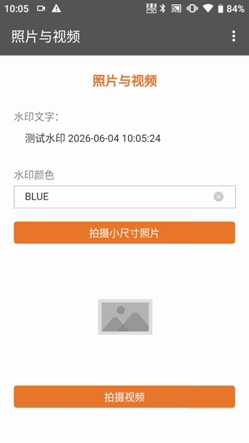
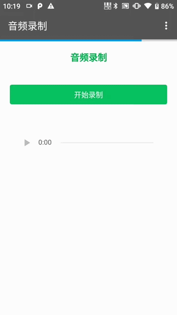
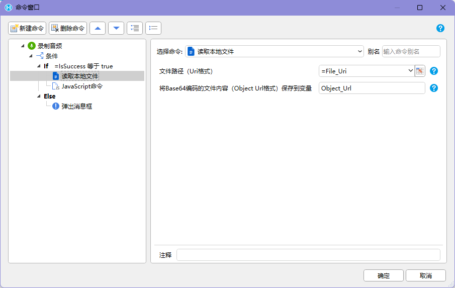

## 适用场景

拍摄能力用于在 `HAC` 中调用摄像头、麦克风和本地文件能力，完成现场照片、视频、音频采集，并把文件路径返回给活字格页面。

适合巡检拍照、入库验收、质量缺陷、现场施工、售后取证等需要“现场留痕”的业务。

## 使用前提

- 应用运行在 `HAC` 中。
- 已安装 PDA / Android 交互命令插件。
- 已授权相机、麦克风和本地文件访问权限。
- 设备有可用存储空间。
- 页面已定义拍摄成功、取消、权限不足、文件过大和上传失败时的处理方式。

拍摄类命令通常返回本地文件 `Uri`，不是文件内容。需要展示或上传时，再用【读取本地文件】转换为 `Object Url`。

## 命令速查

| 命令 | 返回结果 | 用途 |
| --- | --- | --- |
| 【拍摄照片】 | 照片 `Uri` | 调用相机拍照 |
| 【拍摄视频】 | 视频 `Uri` | 调用相机录像 |
| 【为照片添加水印】 | 水印照片 `Uri` | 给照片叠加业务水印 |
| 【录制音频】 | `mp3` 文件 `Uri` | 录制现场音频 |
| 【读取本地文件】 | `Object Url` | 读取文件内容用于展示或上传 |





## 推荐流程

照片采集并上传：

```text
进入任务页面
-> 点击“拍照”
-> 执行【拍摄照片】
-> 返回照片 Uri
-> 按需执行【为照片添加水印】
-> 执行【读取本地文件】
-> 图片单元格显示预览
-> 用户确认
-> 服务端保存文件和业务数据
```

弱网场景：

```text
拍摄完成
-> 保存文件 Uri、业务主键和采集状态
-> 页面显示“待上传”
-> 网络恢复后读取本地文件并上传
-> 上传成功后标记“已上传”
```

## 设计要点

- 拍摄按钮靠近任务对象，避免用户不知道给谁拍。
- 拍摄后显示预览、重拍、确认，不要直接上传。
- 多张照片要显示已拍数量、每张状态和上传结果。
- 明确区分“已拍摄”“已读取”“上传中”“已上传”“上传失败”。
- 小尺寸照片优先用于普通现场记录；全尺寸只用于需要细节判定的场景。
- 水印应包含操作人、时间、任务编号、地点等可追溯信息，但不要遮挡关键缺陷。
- 视频和音频要限制时长，避免文件过大。

## 异常处理

| 异常 | 常见原因 | 推荐处理 |
| --- | --- | --- |
| 相机无法打开 | 权限不足、无摄像头、相机被占用 | 提示授权或重试 |
| 用户取消拍摄 | 主动返回或关闭相机 | 保留原状态，不自动提交 |
| 文件路径为空 | 未完成拍摄、传参错误 | 提示重新拍摄并记录返回值 |
| 读取本地文件失败 | Uri 无效、文件被清理、权限不足 | 重新拍摄或重新选择文件 |
| 文件过大 | 全尺寸照片、长视频、弱网 | 压缩、缩短录制时长或稍后上传 |
| 水印失败 | Uri 无效、水印参数为空、文件不可写 | 保留原照片，允许重新加水印 |
| 上传失败 | 网络异常、服务端限制、请求过大 | 保留本地状态并提供重试 |

