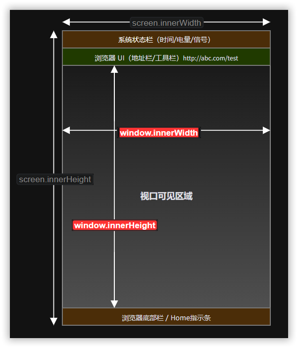
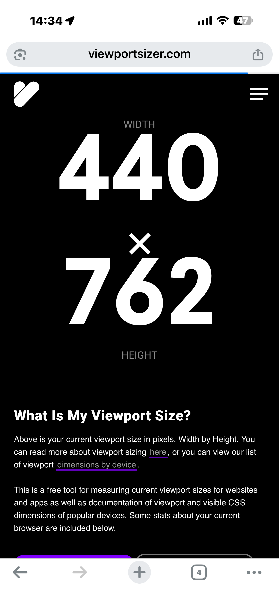

## 适用范围

适用于手机浏览器、企业微信/钉钉/飞书 `WebView`、`App` 内嵌 `H5`，以及 `PDA` 浏览器和 `PDA WebView`。

## 核心问题

移动端页面设计的第一步不是画界面，而是明确这页要解决什么任务、在哪种场景下使用、由谁使用、在什么设备上使用，交付标准是什么。

## 设计原则

- 页面目标要围绕任务完成，而不是围绕信息展示。
- 同一业务在手机和 `PDA` 上可以共用规则，但不应强行共用完全相同的交互。
- 先定义主流程，再定义异常流程和中断恢复。
- 先明确设备边界，再定义界面结构和交互细节。

## 页面大小

在设计开始前，我们需要先确认最终使用终端设备的页面大小。因此可以先用最终使用的终端移动设备访问来测试设备的显示区域具体信息，在此之前，可以先说明解释一下涉及到具体的页面参数。

> 1. `window.innerWidth`
>
>    浏览器**视口的宽度**，单位是CSS像素，代表用户实际可见的页面内容区域的**宽度**（不包括浏览器工具栏、地址栏等，但包括滚动条）。
>
> 2. `window.innerHeight`
>
>    浏览器**视口的高度**，单位 CSS 像素，代表用户实际可见的页面内容区域的**高度**（不包括浏览器工具栏、地址栏等，但包括滚动条）。
>
> 3. `window.devicePixelRatio`
>
>    物理像素与CSS像素的比值。
>
> 4. `screen.width`
>
>    设备**整个屏幕的宽度**，单位CSS像素（不是物理像素），表示屏幕的总逻辑宽度，包括系统状态栏、浏览器 UI 等所有区域。
>
> 5. `screnn.height`
>
>    设备**整个屏幕的高度**，单位CSS像素（不是物理像素），表示屏幕的总逻辑高度，包括系统状态栏、浏览器 UI 等所有区域。

假设你在手机上竖屏观看，从外到内各层的关系如下： 

> 测试网站：[viewportsizer](https://viewportsizer.com/)

📍记住一个关键点：设计布局时优先使用`window.innerWidth/innerHeight`（用户真正看到的区域），而判断设备硬件规格时使用 `screen` 系列 + `dpr`。两者不可混淆，否则容易出现内容被遮挡或留白过多的问题。

例如，下面图片中显示的就是手机端浏览器视口可见区域大小：`WIDTH 440 x HEIGHT 762`。

