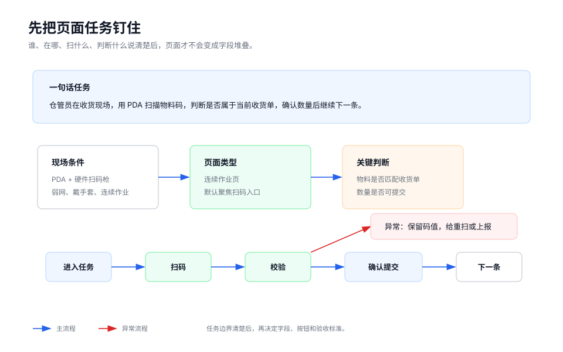
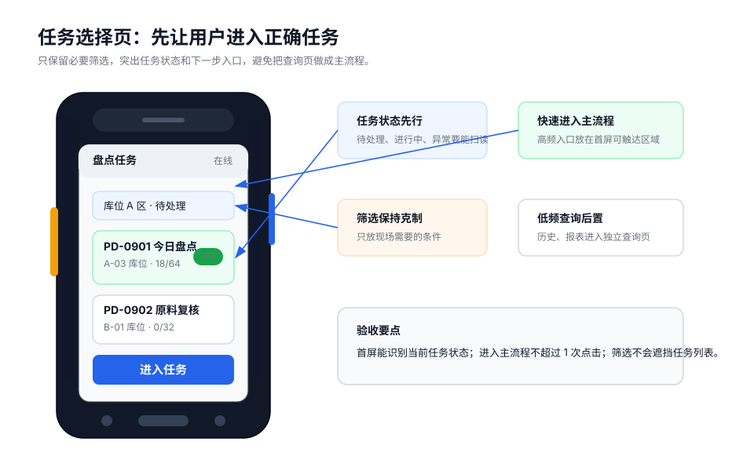

PDA 页面设计应先定义任务，再设计界面。任务定义不清时，页面容易堆积字段和按钮，现场人员难以判断下一步操作。

## 页面任务

每个页面应能用一句话说明：

```text
谁在什么现场，为了完成什么任务，需要先判断什么，再执行什么动作。
```

推荐写法：

```text
仓管员在收货现场使用 PDA 扫描物料，完成当前收货单入库；
页面需要先判断物料是否属于当前收货单，再确认数量，成功后继续处理下一条。
```

不推荐写法：

```text
展示收货单信息，支持收货操作。
```

前者定义了角色、现场、判断条件和成功后的流向；后者只描述功能范围，无法指导页面结构。



## 设计示例

任务选择页应突出任务状态和进入主流程的动作，筛选只保留现场必要条件。



## 现场条件

同一业务在办公室和现场的设计要求不同。设计前应确认以下条件：

| 条件 | 设计影响 |
| --- | --- |
| 使用角色 | 决定信息粒度、术语、操作权限和节奏。 |
| 作业地点 | 光线、噪声、网络、粉尘、温度会影响反馈和可读性。 |
| 设备型号 | 屏幕宽度、扫描头、物理按键、WebView 能力可能不同。 |
| HAC 环境 | 影响扫码桥接、设备权限、离线能力和容器兼容性。 |
| 输入方式 | 扫描头、摄像头扫码、物理按键和触屏对应不同流程。 |
| 作业频率 | 高频连续作业应减少跳转、弹层和手动输入。 |

## 页面类型

先定义页面类型，再确定内容和交互密度。

| 页面类型 | 适用场景 | 设计重点 |
| --- | --- | --- |
| 连续作业页 | 收货、盘点、复核、报工 | 扫码快、焦点稳、成功后自动进入下一条。 |
| 任务选择页 | 选择盘点单、拣货任务、巡检路线 | 状态清晰、筛选少、快速进入任务。 |
| 异常处理页 | 数量差异、破损、物料不匹配 | 原因明确、保留数据、支持恢复或上报。 |
| 查询页 | 查记录、查库存、查历史 | 筛选和分页清晰，不干扰主流程。 |

典型组合：

```text
任务选择页 -> 连续作业页 -> 异常处理页 / 查询页
```

## 主流程

连续作业页应缩短路径，避免每条记录都进出列表、详情和弹窗。

推荐流程：

```text
进入任务 -> 扫码 -> 校验 -> 输入数量 -> 确认 -> 准备下一条
```

不推荐流程：

```text
进入列表 -> 打开详情 -> 扫码 -> 填表 -> 弹窗确认 -> 返回列表 -> 再打开下一条
```

主流程应满足以下要求：

- 当前页能完成的动作不拆到多个页面。
- 每个阶段只有一个主要动作。
- 成功后自动进入下一条或返回稳定焦点。
- 不用弹层承载高频扫码、录入和提交。

## 异常流程

设计时必须同时定义失败和恢复路径。

| 异常 | 页面要求 |
| --- | --- |
| 扫错码 | 保留码值，允许重新扫码。 |
| 物料不匹配 | 显示原因，允许重扫或上报异常。 |
| 数量超范围 | 停留在数量输入，提示允许范围。 |
| 重复扫码 | 明确防抖、累计、覆盖或查看记录规则。 |
| 网络断开 | 本地暂存，显示待补传数量。 |
| 提交结果不确定 | 保留记录，允许刷新状态或稍后补传。 |

异常提示不应只说明失败，还应说明用户当前可执行的恢复动作。

## 设计产出

进入开发前，页面说明至少包含：

- 页面名称和页面类型。
- 使用角色、现场、设备、运行容器。
- 主要输入方式和默认焦点。
- 一句话页面任务。
- 主流程、异常流程和成功后的下一步。
- 数据保留、补传、重复提交规则。
- 目标 PDA / HAC / WebView 的验收方式。

## 检查清单

- 是否能用一句话说明页面任务？
- 是否确认真实设备、扫码方式、网络和 HAC 环境？
- 页面类型是否明确？
- 主流程是否避免不必要跳转和弹层？
- 异常时是否保留现场数据并给出恢复动作？
- 是否定义真机验收方式？
