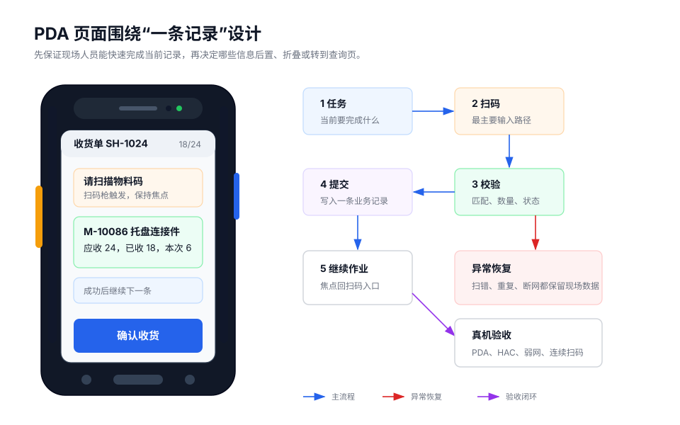

本规范适用于运行在 PDA、Android 设备、HAC 或目标 WebView 中的活字格移动端页面。重点场景包括仓储、生产、物流、门店后场、巡检等现场作业。

PDA 页面设计不应以“压缩 PC 页面”为目标，而应以“现场人员稳定完成当前任务”为目标。页面需要适应小屏幕、弱网络、旧设备、连续扫码、手套操作、强光环境和高频重复操作。

## 核心原则

| 原则 | 要求 |
| --- | --- |
| 单一任务焦点 | 每个页面只突出当前阶段最重要的判断和动作。 |
| 扫码优先 | 扫码应作为主输入路径，明确触发方式、焦点规则、反馈和异常处理。 |
| 信息分层 | 首屏展示任务、对象、状态、下一步和最近结果；低频信息后置。 |
| 操作可触达 | 高频按钮和输入区应足够大，避免精细点击和相邻误触。 |
| 状态可恢复 | 扫错、断网、超时、重复提交后，页面必须保留数据并给出恢复动作。 |
| 真机验证 | 必须在目标 PDA、HAC 或目标 WebView 中验证布局、扫码、弱网和性能。 |

## 章节导读

1. [任务与场景定义](./goals-scenarios/)
2. [信息架构](./information-architecture/)
3. [交互行为](./interaction-behavior/)
4. [视觉可读性](./visual-perception/)
5. [性能与验收](./performance/)

## 如何产出页面方案

建议按以下顺序使用本规范。前面 5 篇负责建立判断方法，完整落地示例放在[实战训练和演示](../practice/)中：

| 步骤 | 阅读章节 | 产出内容 |
| --- | --- | --- |
| 1. 定义任务 | [任务与场景定义](./goals-scenarios/) | 页面角色、现场条件、页面类型、主流程、异常流程。 |
| 2. 组织页面 | [信息架构](./information-architecture/) | 首屏信息、字段层级、主操作、最近记录、弹层边界。 |
| 3. 明确行为 | [交互行为](./interaction-behavior/) | 扫码规则、焦点规则、回车行为、数量录入、重复扫码处理。 |
| 4. 检查可读性 | [视觉可读性](./visual-perception/) | 字号、触达区域、状态表达、长文本、固定底栏、小屏验证。 |
| 5. 定义验收 | [性能与验收](./performance/) | 首屏加载、弱网离线、提交超时、旧 WebView、真机验收脚本。 |

最终交付物不应只是一张页面截图，而应是一份可以评审和验收的页面设计说明。说明中需要写清楚页面为什么存在、现场人员如何完成任务、扫码和异常如何恢复，以及在目标 PDA / HAC / WebView 中如何验证。

如果需要查看从需求到页面方案的完整写法，可以阅读[实战训练和演示](../practice/)中的采购入库案例。

| 常见问题 | 建议先查看 |
| --- | --- |
| 页面目标不清、功能边界发散 | [任务与场景定义](./goals-scenarios/) |
| 字段过多、首屏没有重点 | [信息架构](./information-architecture/) |
| 扫码无反馈、焦点丢失、回车误提交 | [交互行为](./interaction-behavior/) |
| 字号小、按钮难点、状态不明显 | [视觉可读性](./visual-perception/) |
| 弱网丢数据、旧设备卡顿、真机表现不一致 | [性能与验收](./performance/) |

## 设计前置条件

设计前应确认以下信息，并写入页面说明：

| 项目 | 必填内容 |
| --- | --- |
| 使用角色 | 仓管员、盘点员、巡检员、生产人员等。 |
| 作业现场 | 仓库、产线、门店、户外等。 |
| 设备环境 | PDA 型号、屏幕宽度、Android / WebView 版本。 |
| 运行容器 | HAC、普通浏览器或其他 Android 容器。 |
| 输入方式 | 扫描头、摄像头扫码、物理按键、数字键盘、触屏。 |
| 任务闭环 | 一条记录如何开始、确认、结束以及进入下一条。 |
| 异常恢复 | 扫错、重复、断网、提交超时、补传失败的处理方式。 |
| 验收方式 | 目标设备、连续扫码次数、断网测试和性能基线。 |

## 推荐基线

| 项目 | 基线 |
| --- | --- |
| 重点验证宽度 | `240px`、`280px`、`320px` |
| 高频按钮高度 | 不小于 `48px` |
| 普通按钮高度 | 不小于 `44px` |
| 图标点击热区 | 不小于 `40px x 40px` |
| 正文字号 | 不小于 `14px` |
| 相邻点击区间距 | 不小于 `8px` |
| 扫码反馈 | 收到码值后立即显示码值或处理状态 |
| 连续扫码验收 | 至少连续扫码 `50` 次，高频页面建议 `200` 次 |
| 弱网验收 | 断网录入、恢复补传、补传失败重试 |

## 与其他章节的关系

本部分定义 PDA 页面设计原则和通用最佳实践。

[典型场景和功能](../scenarios/)说明 HAC、扫码、定位、离线、日志、调试等能力的使用方式。

[实战训练和演示](../practice/)通过完整案例展示从需求到页面方案的设计过程。
