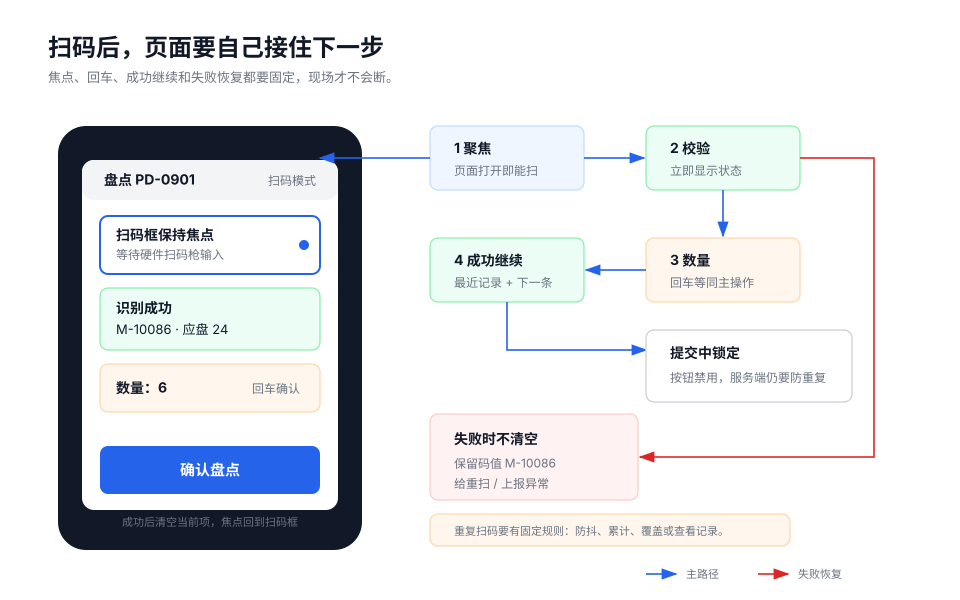
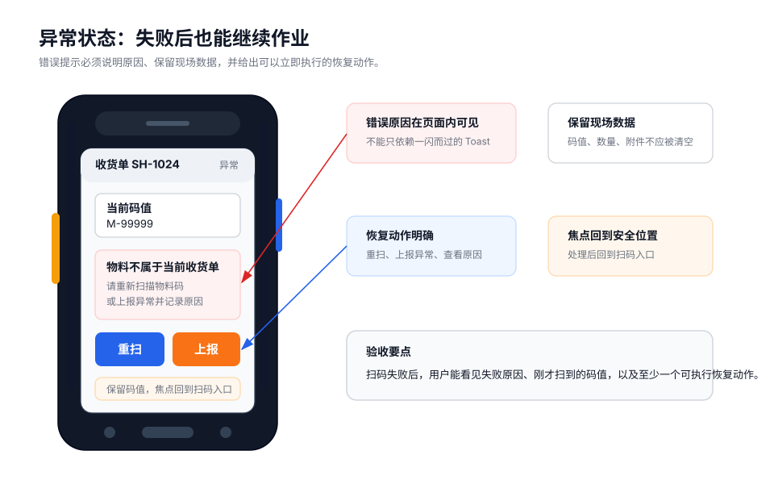

PDA 页面交互应支持连续、稳定、低打断的现场作业。扫码反馈、焦点规则、回车行为和失败恢复需要明确写入页面说明。

## 扫码输入

在仓储、物流、生产、巡检场景中，扫码通常是主输入，不是普通输入框的附加能力。

推荐流程：

```text
进入页面
-> 自动聚焦扫码入口
-> 扫描条码
-> 立即显示码值或“校验中”
-> 校验成功后带出业务数据
-> 进入数量输入或等待确认
-> 校验失败时保留码值，显示原因和恢复动作
```

页面不应要求用户每次扫码前先手动点击输入框。



## 设计示例

异常状态应保留用户刚扫描的码值，明确说明失败原因，并提供可立即执行的恢复动作。



## 焦点规则

连续作业页必须保持焦点稳定。

| 场景 | 焦点规则 |
| --- | --- |
| 页面打开 | 聚焦扫码入口。 |
| 扫库位成功 | 聚焦物料扫码入口。 |
| 扫物料成功 | 聚焦数量输入框，或直接等待确认。 |
| 数量确认后 | 进入提交中，禁用重复输入。 |
| 提交成功 | 清空当前记录，回到扫码入口。 |
| 提交失败 | 停留在需要修正的字段。 |
| 弹层关闭 | 回到打开弹层前的焦点。 |

焦点规则应由设计说明定义，避免依赖实现时临时判断。

## 回车行为

很多扫描头会在码值后追加回车。回车行为必须唯一、稳定。

- 扫码框回车：触发扫码校验。
- 数量框回车：数量有效时触发确认。
- 提交中回车：忽略，防止重复提交。
- 异常状态回车：执行安全动作，例如重新扫码。

同一个回车事件不应同时触发扫码和提交，也不应触发表单默认跳转。

## 成功反馈

连续作业页成功后应自动准备下一条。

```text
确认收货成功
-> 最近记录新增一条
-> 已收数量更新
-> 清空当前物料和数量
-> 聚焦扫码入口
-> 提示“请扫描下一件物料”
```

成功反馈应明确、短暂且不打断连续操作。高频页面不应每条记录都弹窗确认。

## 失败恢复

失败后应保留现场数据，帮助用户判断和修正。

```text
物料不属于当前收货单
当前码值：M-10086
可操作：重新扫码 / 上报异常
```

不应在失败后立即清空码值、数量或附件。错误提示应包含“发生了什么”和“现在能做什么”。

## 按钮规则

按钮文案应使用具体业务动作。

| 推荐 | 不推荐 |
| --- | --- |
| 确认收货 | 确定 |
| 确认盘点 | 提交 |
| 重新扫码 | 处理 |
| 稍后补传 | 下一步 |
| 上报异常 | 操作 |

设计要求：

- 同一阶段只保留一个主按钮。
- 次要动作弱化或放入更多入口。
- 危险动作单独确认。
- 禁用按钮必须说明原因。
- 提交中应防止重复点击和重复回车。

## 数量录入

数量录入是高频动作，应减少手动成本。

- 使用数字键盘。
- 默认带出常用值，例如 `1`、账面数量或包装数量。
- 显示单位，例如 `PCS`、`kg`、`箱`。
- 输入时显示差异。
- 超范围时立即提示。
- 回车可确认有效数量。

正常流程不强制填写长备注；异常流程再补充原因。

## 重复扫码

重复扫码需要根据业务定义处理。

| 重复情况 | 处理建议 |
| --- | --- |
| 扫描头短时间重复触发 | 前端防抖，避免重复处理。 |
| 同一物料已处理 | 提示已处理，并允许查看记录。 |
| 业务允许累计 | 合并数量并显示累计结果。 |
| 业务允许覆盖 | 要求确认并记录原因。 |
| 上一条结果不确定 | 先确认状态，避免重复提交。 |

关键业务应同时具备前端防重和服务端幂等规则。

## 检查清单

- 页面打开后是否自动聚焦扫码入口？
- 扫码后是否立即显示码值或处理状态？
- 回车行为是否唯一且稳定？
- 成功后是否自动准备下一条？
- 失败后是否保留码值、输入和恢复动作？
- 主按钮是否唯一，文案是否为具体业务动作？
- 重复扫码和重复提交是否有前后端规则？
