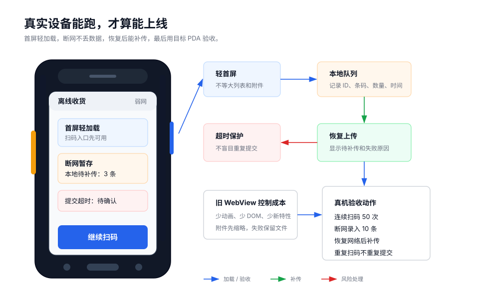

PDA 页面能不能上线，不能只看功能是否做完。它还要在真实设备、真实网络、真实数据量下稳定工作。

现场常见问题往往很具体：页面打开慢、扫码后卡住、断网丢记录、提交超时后重复生成数据、电脑浏览器正常但 HAC 或旧 WebView 异常。



## 首屏只加载当前任务需要的内容

首屏先让用户开始作业，不要等所有资料都加载完。

首屏必须有：

- 当前任务
- 当前库位或对象
- 当前状态
- 已完成 / 总数
- 扫码入口
- 待补传数量

可以延后加载：

- 完整历史记录
- 大量明细
- 操作日志
- 图片附件
- 统计报表
- 低频说明

推荐策略：

```text
先显示核心信息并允许扫码
-> 再按需加载历史、附件、明细
```

## 列表和明细要分页

PDA 不适合一次渲染大量数据。

- 任务列表分页加载。
- 作业页只显示最近几条历史。
- 完整记录进入单独页面分页查看。
- 明细很多时按库位、物料、状态筛选。
- 不要在作业页一次加载几百行。

连续作业页越轻，扫码越稳定。

## 扫码后要马上反馈

扫码后如果没有反馈，用户会重复扫、重复点。

```text
收到码值：立即显示码值或“校验中”
1 秒内：尽量给出成功或失败结果
超过 1 秒：继续显示处理中
超时：保留当前记录，提示结果待确认或稍后补传
```

即使服务端校验慢，页面也要先告诉用户“我收到了”。

## 弱网时不要丢数据

仓库、厂区、门店后场经常弱网。页面要提前设计断网处理。

建议：

- 顶部显示在线 / 离线状态。
- 断网时允许本地暂存。
- 每条本地记录有唯一 ID。
- 显示待补传数量。
- 网络恢复后自动或手动补传。
- 补传失败显示原因，可重试。

本地记录至少保留：任务号、条码原始值、数量、操作人、操作时间、补传状态和异常原因。

如果使用 HAC 离线能力，可以参考[「功能」离线模式](../scenarios/offline-model-hac/)。

## 提交超时不等于失败

用户点了“确认收货”，请求超时后，可能有三种情况：

1. 服务端没收到。
2. 服务端收到了，但前端没收到结果。
3. 服务端处理失败。

页面不要直接提示“提交失败，请重试”。更稳的提示是：

```text
提交结果暂时无法确认
当前记录已保留
请刷新状态或稍后补传
不要重复扫描同一条码
```

同时，后端或业务流程要支持幂等，避免重复记录。

## 图片和附件要轻

拍照、签名、附件上传很容易拖慢 PDA 页面。

- 列表里只显示缩略图。
- 不要首屏加载原图。
- 上传失败后保留本地文件。
- 提供重新上传或稍后补传。
- 图片上传失败不要导致整条业务记录丢失。

异常上报里，照片是证据，不要提交失败后直接清空。

## 旧 WebView 要保守

不少 PDA 的 Android 和 WebView 版本偏旧。页面实现要保守。

- 少用复杂动画、阴影、滤镜。
- 减少大量 DOM 和复杂嵌套。
- 避免一次渲染大量列表。
- 避免依赖过新的浏览器能力。
- HAC 中异常时，用远程调试和日志排查。

调试方式可以参考[调试](../scenarios/how-to-debug-hac/)和[日志](../scenarios/logs-hac/)。

## 真机验收按现场来

不要只在电脑浏览器里点几下。

建议验收动作：

```text
1. 用目标 PDA 打开页面
2. 查看实际视口宽度
3. 连续扫码 50 次
4. 输入正常数量和异常数量
5. 重复扫描同一条码
6. 断网后继续录入 10 条
7. 恢复网络后补传
8. 提交超时后刷新状态
9. 输入法弹起后检查按钮和字段
10. 长时间停留页面后继续作业
```

如果是高频盘点、收货、出库页面，建议再测 `200` 条连续记录，观察页面是否变慢。

## 检查清单

- 首屏是否只加载当前任务必须信息？
- 历史、附件、明细是否延后加载或分页？
- 扫码后是否立即反馈？
- 弱网或断网时是否保留记录并显示待补传数量？
- 提交超时是否按“结果待确认”处理？
- 图片上传失败后是否保留文件？
- 是否在目标 PDA、HAC 或目标 WebView 中做过连续扫码、断网、恢复和重复扫码测试？
