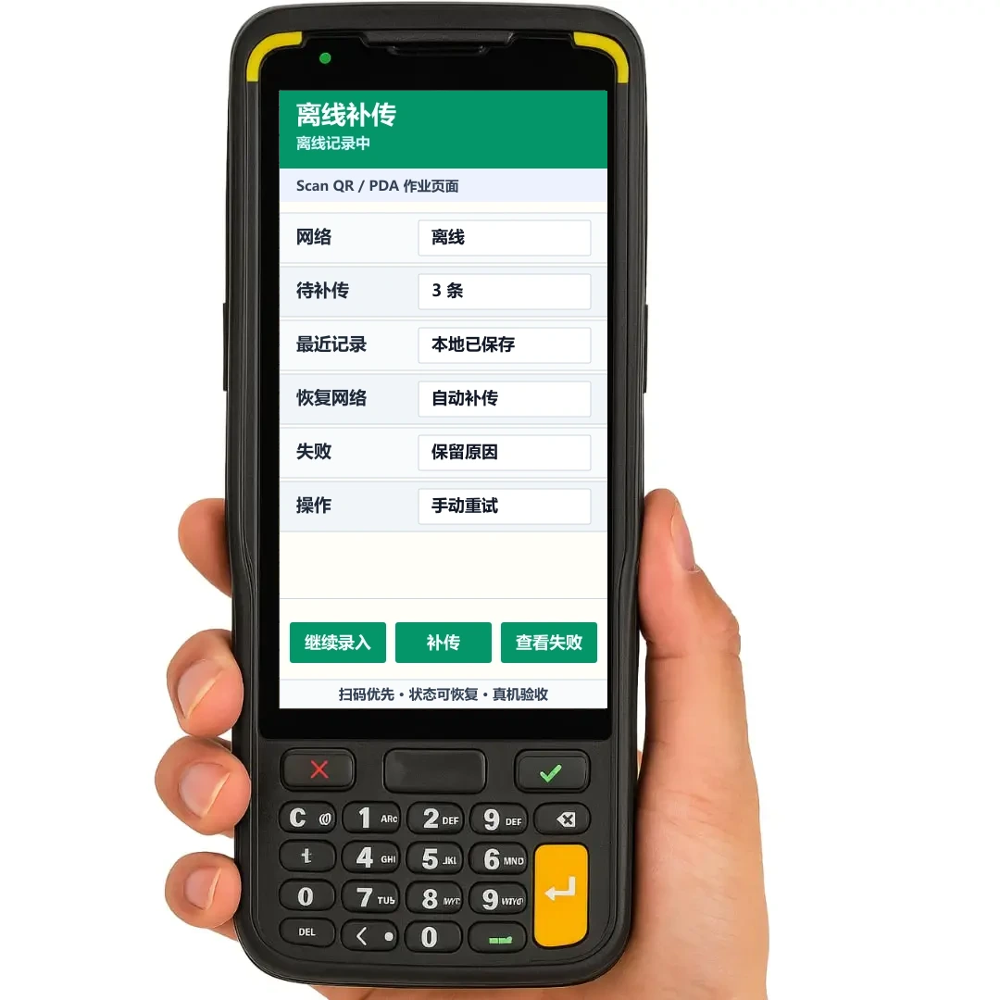

PDA 页面上线前必须在真实设备、真实网络和真实数据量下验证。仅在电脑浏览器中功能可用，不代表现场可用。

现场常见风险包括：首屏加载慢、扫码后卡顿、断网丢记录、提交超时后重复生成数据、HAC 或旧 WebView 行为异常。


## 设计示例

弱网页面应明确展示离线状态、待补传数量、失败原因和重试动作，确保断网期间继续作业且不丢数据。



## 首屏加载

首屏应优先让用户开始作业，不等待所有资料加载完成。

首屏必须具备：

- 当前任务。
- 当前库位或对象。
- 当前状态。
- 已完成 / 总数。
- 扫码入口。
- 待补传数量。

可延后加载：

- 完整历史记录。
- 大量明细。
- 操作日志。
- 图片附件。
- 统计报表。
- 低频说明。

推荐策略：

```text
先显示核心信息并允许扫码
-> 再按需加载历史、附件和明细
```

## 数据量控制

PDA 不适合一次渲染大量数据。

- 任务列表分页加载。
- 作业页只显示最近少量历史。
- 完整记录进入独立页面分页查看。
- 明细较多时按库位、物料、状态筛选。
- 作业页不得一次加载几百行明细。

连续作业页越轻，扫码和输入越稳定。

## 扫码响应

扫码后必须立即反馈，避免用户重复扫码或重复点击。

```text
收到码值：立即显示码值或“校验中”
1 秒内：尽量返回成功或失败结果
超过 1 秒：继续显示处理中
超时：保留当前记录，提示结果待确认或稍后补传
```

即使服务端校验较慢，页面也应先确认“已收到码值”。

## 弱网与离线

仓库、厂区和门店后场经常存在弱网。页面应提前定义断网策略。

- 顶部显示在线 / 离线状态。
- 断网时允许本地暂存。
- 每条本地记录有唯一 ID。
- 显示待补传数量。
- 网络恢复后支持自动或手动补传。
- 补传失败显示原因，并允许重试。

本地记录至少保留：

```text
任务号、条码原始值、数量、操作人、操作时间、补传状态、异常原因
```

使用 HAC 离线能力时，可参考[「功能」离线模式](../scenarios/offline-model-hac/)。

## 提交超时

提交超时不等于失败。可能存在三种情况：

1. 服务端未收到请求。
2. 服务端已处理，但前端未收到结果。
3. 服务端处理失败。

页面不应直接提示“提交失败，请重试”。推荐提示：

```text
提交结果暂时无法确认
当前记录已保留
请刷新状态或稍后补传
不要重复扫描同一条码
```

关键业务应设计服务端幂等规则，避免重复记录。

## 图片与附件

图片、签名和附件容易拖慢 PDA 页面。

- 列表只显示缩略图。
- 首屏不加载原图。
- 上传失败后保留本地文件。
- 支持重新上传或稍后补传。
- 附件上传失败不应导致整条业务记录丢失。

异常上报中的照片属于现场证据，提交失败后不得直接清空。

## 旧 WebView 兼容

部分 PDA 的 Android 和 WebView 版本较旧，页面实现应保守。

- 减少复杂动画、阴影和滤镜。
- 减少大量 DOM 和深层嵌套。
- 避免一次渲染大列表。
- 避免依赖过新的浏览器能力。
- HAC 中异常时使用远程调试和日志排查。

调试方式可参考[调试](../scenarios/how-to-debug-hac/)和[日志](../scenarios/logs-hac/)。

## 真机验收

验收应按现场路径执行，不应只在电脑浏览器中点击。

建议动作：

```text
1. 使用目标 PDA 打开页面
2. 查看实际视口宽度
3. 连续扫码 50 次
4. 输入正常数量和异常数量
5. 重复扫描同一条码
6. 断网后继续录入 10 条
7. 恢复网络后补传
8. 提交超时后刷新状态
9. 输入法弹起后检查按钮和字段
10. 长时间停留页面后继续作业
```

高频盘点、收货、出库页面建议增加 `200` 条连续记录测试，观察页面是否变慢。

## 检查清单

- 首屏是否只加载当前任务必要信息？
- 历史、附件、明细是否延后加载或分页？
- 扫码后是否立即反馈？
- 弱网或断网时是否保留记录并显示待补传数量？
- 提交超时是否按“结果待确认”处理？
- 图片上传失败后是否保留文件？
- 是否在目标 PDA、HAC 或目标 WebView 中完成连续扫码、断网、恢复和重复扫码测试？
