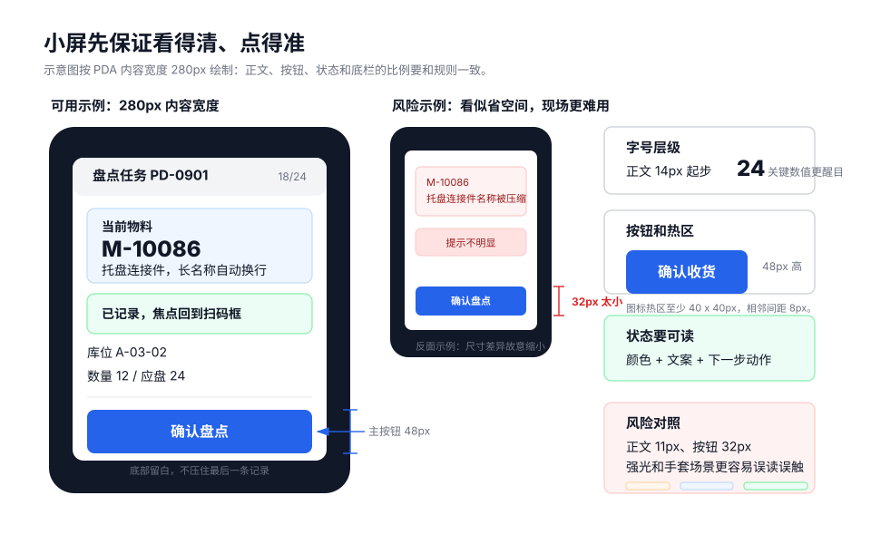
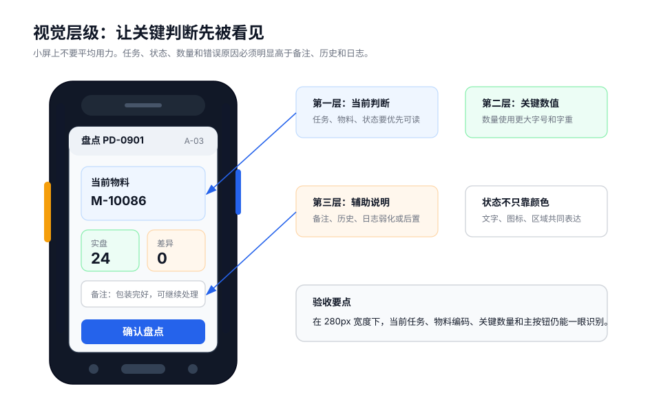

PDA 页面视觉设计的目标是提高现场判断效率，而不是追求装饰效果。页面应在小屏、强光、低亮度、旧设备和手套操作条件下保持清晰可用。



## 设计示例

小屏页面应让当前任务、物料、关键数量和主按钮先被看到，备注、历史和日志应弱化或后置。



## 字号与层级

字号不应通过持续压缩来解决字段过多的问题。字段过多时，应优先分组、折叠或后置。

| 内容 | 建议 |
| --- | --- |
| 正文 | 不小于 `14px`。 |
| 关键数量和状态 | 使用更高权重或更大字号。 |
| 辅助说明 | 可弱化，但必须保持可读。 |
| 按钮文字 | 在 `240px`、`280px` 宽度下完整可识别。 |

层级应通过字号、字重、颜色深浅和空间关系共同表达，不依赖单一手段。

## 触达区域

PDA 现场操作容错空间低，按钮和点击区应足够大。

- 高频按钮高度不小于 `48px`。
- 普通按钮高度不小于 `44px`。
- 图标按钮点击热区不小于 `40px x 40px`。
- 相邻点击区间距不小于 `8px`。
- 危险按钮不得紧贴高频主按钮。

可视图标可以较小，但实际点击热区不能过小。

## 状态表达

状态不应只依赖颜色。不同 PDA 屏幕、亮度和现场光线会削弱颜色识别。

推荐组合：

```text
颜色 + 明确文字 + 图标或区块 + 下一步动作
```

示例：

```text
成功：已记录，准备扫描下一条
错误：物料不匹配，请重新扫码或上报异常
离线：离线记录中，待补传 2 条
```

按钮禁用时也应说明原因，例如“数量超范围，不能确认”。

## 信息重点

页面应突出当前任务、扫码结果、错误原因和主操作。

| 层级 | 内容 | 视觉处理 |
| --- | --- | --- |
| 第一层 | 当前任务、扫码结果、错误原因、主按钮 | 最明显。 |
| 第二层 | 物料名称、规格、数量、差异 | 清楚可读。 |
| 第三层 | 备注、操作人、时间、历史 | 弱化或后置。 |

避免给每个字段都添加边框、阴影或卡片。过多装饰会切碎页面，降低扫读效率。

## 长文本

长物料名、长单号、长批次号需要固定规则。

- 物料编码优先完整展示。
- 物料名称可换行，必要时省略并支持查看完整。
- 数量、单位、状态不得被截断。
- 单号可显示关键后缀，但详情中必须能查看完整值。
- 错误原因不得省略到无法理解。

## 固定底栏

底部固定操作区适合 PDA，但必须避免遮挡。

- 内容底部预留底栏高度。
- 最后一条记录不得被按钮遮挡。
- 输入法弹起时，数量输入和确认按钮仍可使用。
- 底栏与内容之间应有明确边界。

如果底栏遮住错误提示或数量信息，用户可能误判页面状态。

## 弹层视觉

PDA 弹层应轻量、单层、低频。

避免：

- 弹层内放复杂表格。
- 弹层嵌套弹层。
- 主流程依赖弹层完成。
- 弹层关闭后丢失扫码焦点。

弹层适合异常上报、原因选择、覆盖确认、查看历史和查看附件。

## 小屏检查

至少检查以下宽度：

| 宽度 | 用途 |
| --- | --- |
| `240px` | 极窄设备兜底。 |
| `280px` | PDA 主验证宽度。 |
| `320px` | 常见 PDA 宽度。 |

真机重点检查：

- 当前任务、状态、扫码结果是否一眼可读。
- 主按钮文字是否完整。
- 数量输入是否被输入法遮挡。
- 长文本是否撑乱布局。
- 强光或低亮度下状态是否可分辨。
- 戴手套时是否能点中高频按钮。

## 检查清单

- 正文是否不小于 `14px`？
- 高频按钮是否不小于 `48px`？
- 点击区和相邻间距是否足够？
- 状态是否不只依赖颜色？
- 关键数量、状态、错误原因是否完整可读？
- 固定底栏和输入法是否不遮挡关键内容？
- 是否在 `240px`、`280px`、`320px` 和真实 PDA / HAC WebView 中检查？
