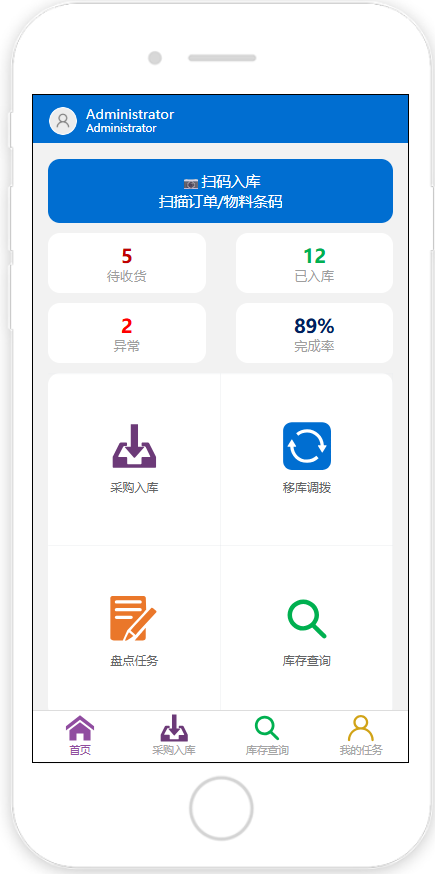
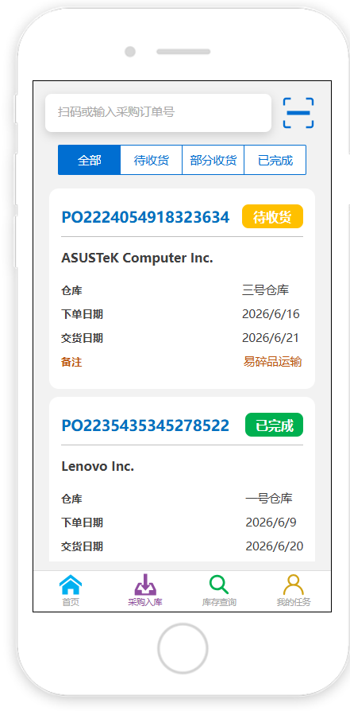
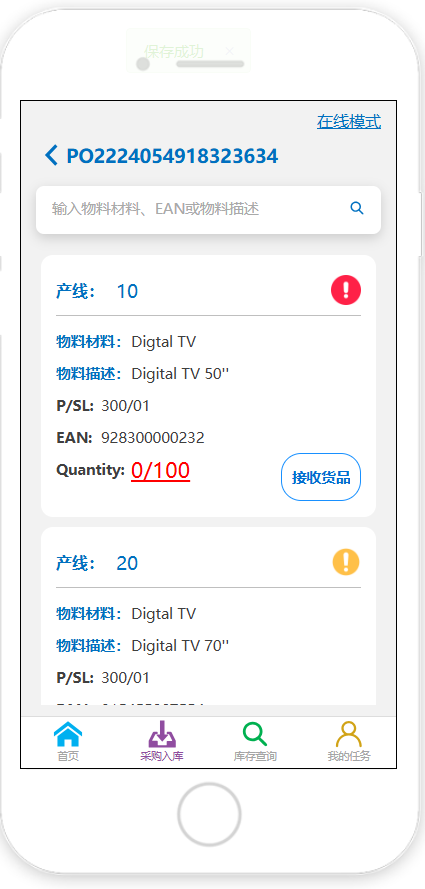

## 使用范围

本示例用于设计 `PDA + HAC + 活字格移动页面 + 硬件扫码头` 下的采购入库流程。测试设备选择盈达 `iData 50`，活字格页面宽度设置为 `240px`，页面长度不固定，由内容自然向下滚动。

页面中的交互单元格命令应使用手机端单元格命令，例如 `Vant` 组件、内置输入框、移动端按钮、移动端标签页、移动端弹层和扫码相关命令。不要直接套用桌面端大表格、大表单和密集按钮布局。

本页不是完整采购系统方案，不覆盖供应商管理、价格、对账和财务入账。文档聚焦 PDA 现场采购入库体验：从首页进入、筛选采购订单、查看 PO 明细、接收货品、离线作业和恢复在线同步。

相关能力参考：

- [扫码](../scenarios/scanner/)：接收 PDA 扫码头结果。
- [离线模式](../scenarios/offline-model-hac/)：离线作业、本地暂存和恢复在线补传。
- [交互行为](../mobile/interaction-behavior/)：定义焦点、回车、反馈和异常恢复。
- [性能与验收](../mobile/performance/)：定义真机、弱网和连续作业验收。

## 实际页面

### 首页



首页是 PDA 应用的任务入口和概览页。页面顶部显示当前用户，中部突出采购入库扫码入口，并展示四项关键指标：待收货、已入库、异常、完成率。下方以功能宫格进入采购入库、移库调拨、盘点任务和库存查询。

### 入库订单页



入库订单页用于筛选和选择 `PO`。顶部提供扫码或手动输入采购订单号的搜索入口，右侧扫描按钮可调用 PDA 扫码头读取 `PO` 条码。下方使用 `Vant` 标签页按订单状态筛选：全部、待收货、部分收货、已完成。订单以卡片展示，避免在 240px 宽度下使用横向表格。

### PO 详情页



PO 详情页是现场作业页。页面显示单个 `PO` 的货品信息，支持按物料材料、`EAN` 或物料描述搜索。该页提供在线/离线模式切换：开启离线模式后可继续接收货品和修改 `Quality` 信息；恢复在线模式后，系统自动将离线期间变更的 `Quality` 信息同步到数据库。

> 注：如果设计器页面中字段显示为 `Quantity`，而业务字段定义为 `Quality`，应在页面文案、字段名和数据库字段之间统一命名，避免实施和验收时产生歧义。

## 场景定义

```text
设备型号：盈达 iData 50
页面宽度：240px
页面长度：不固定，按内容自然滚动
页面类型：首页 + PO 列表页 + PO 详情作业页
主要用户：仓库收货员、采购管理员
实现方式：活字格移动页面，使用手机端单元格命令
主输入方式：PDA 扫码，辅以移动端输入框检索和按钮操作
核心任务：用户进入 PDA 应用，查看采购入库概览，选择或扫描 PO，进入 PO 详情后接收货品，并在离线/在线模式之间保持数据一致。
```

## 流程总览

```text
打开 PDA 应用
-> 显示首页
-> 查看待收货、已入库、异常、完成率
-> 点击“采购入库”
-> 进入 POList 入库订单页
-> 通过状态标签页筛选 PO
-> 或点击扫描按钮读取 PO 订单号并筛选
-> 点击某个 PO 订单
-> 进入 PODetails 详情页
-> 查看该 PO 的货品信息
-> 搜索物料材料、EAN 或物料描述
-> 接收货品或修改 Quality 信息
-> 可开启离线模式继续作业
-> 恢复在线模式后自动同步离线变更到数据库
```

这个流程不是单页完成所有操作，而是“入口概览 -> 订单筛选 -> 明细作业”的页面组。设计重点是让每个页面只承担一个明确任务，并保持跨页面状态清晰。

## 现场约束

| 约束 | 页面要求 |
| --- | --- |
| `iData 50` 屏幕宽度有限 | 活字格页面宽度按 `240px` 设计，避免横向滚动。 |
| PDA 现场连续操作 | 关键入口和主按钮应使用 44px 以上触达区域。 |
| PO 数量较多 | 使用扫码检索和状态标签筛选，不在首页展示全部订单。 |
| 订单状态需要快速判断 | 状态标签和卡片状态标识必须清晰可见。 |
| PO 明细可能较长 | 详情页允许纵向滚动，但单个货品卡片信息要分层展示。 |
| 弱网或断网 | PO 详情页支持离线模式，变更进入本地队列。 |
| 恢复在线后同步 | 切换在线模式时自动同步离线 `Quality` 变更，并显示同步结果。 |
| 扫码结果可能为空或不匹配 | 保留扫码值，提示未找到订单或物料，并允许重扫。 |

## 设计原则

1. 首页只做概览和入口，不承载订单明细。
2. POList 只做订单检索、状态筛选和订单选择。
3. PODetails 只做当前 PO 的货品接收、离线作业和数据同步。
4. 240px 宽度下优先使用卡片、标签页、搜索框和底部导航，避免横向表格。
5. 扫码入口必须与当前页面任务绑定：POList 扫 PO，PODetails 扫物料或 `EAN`。
6. 离线模式必须显式展示，不能只在后台静默切换。
7. 数据同步必须有可见反馈：同步中、保存成功、同步失败、待重试。

## 页面结构

| 页面 | 页面职责 | 关键内容 | 设计要求 |
| --- | --- | --- | --- |
| 首页 | 展示业务概览和功能入口 | 待收货、已入库、异常、完成率、扫码入库入口、功能宫格 | 指标突出，入口明确，避免显示订单列表。 |
| POList | 筛选和选择入库订单 | 搜索框、扫码按钮、状态标签页、PO 卡片 | 状态筛选固定在上方，订单卡片显示核心字段。 |
| PODetails | 当前 PO 货品接收 | PO 编号、在线/离线模式、物料搜索、货品卡片、接收货品按钮 | 允许纵向滚动，货品卡片需突出状态、数量和异常。 |

## 首页设计

首页的首要目标是让用户快速判断今天采购入库工作量，并进入正确功能。

| 模块 | 内容 | 规范 |
| --- | --- | --- |
| 用户区 | 当前登录用户、角色或账号 | 保持简洁，不占用过多首屏高度。 |
| 扫码入库入口 | “扫码入库 / 扫描订单/物料条码” | 作为高频入口，按钮高度建议不低于 56px。 |
| 指标区 | 待收货、已入库、异常、完成率 | 使用数字作为视觉焦点，标签作为辅助信息。 |
| 功能宫格 | 采购入库、移库调拨、盘点任务、库存查询 | 每个入口触达区域应清晰分隔，避免误触。 |
| 底部导航 | 首页、采购入库、库存查询、我的任务 | 当前页状态要明确。 |

首页指标建议：

| 指标 | 含义 | 设计要求 |
| --- | --- | --- |
| 待收货 | 当前待处理 PO 或待接收货品数量 | 使用警示色或强调色，但必须保留文字标签。 |
| 已入库 | 已完成入库数量 | 使用成功色或稳定色。 |
| 异常 | Quality 不足、超收、同步失败等异常数量 | 使用错误色，并支持进入异常列表。 |
| 完成率 | 已入库 / 总任务的比例 | 使用百分比，避免只展示进度条。 |

## POList 设计

POList 是订单选择页，目标是快速定位某个 `PO`，并让用户知道每个订单的处理状态。

| 模块 | 内容 | 规范 |
| --- | --- | --- |
| 搜索区 | PO 订单号输入框、扫码按钮 | 输入框支持手动输入；扫码按钮调用 PDA 扫码头。 |
| 状态标签 | 全部、待收货、部分收货、已完成 | 使用 `Vant` 标签页或等价手机端单元格命令。 |
| PO 卡片 | PO 编号、状态、供应商、仓库、下单日期、交货日期、备注 | 只放筛选决策所需字段，不放完整明细。 |
| 状态标识 | 待收货、部分收货、已完成 | 文案和颜色同时使用，不能只靠颜色区分。 |

PO 卡片字段建议：

```text
PO 编号
订单状态
供应商名称
仓库
下单日期
交货日期
备注 / 异常提示
```

扫码筛选规则：

| 场景 | 页面行为 |
| --- | --- |
| 扫描到有效 PO | 自动筛选并定位该订单；只有一条结果时可进入详情。 |
| 扫描到不存在的 PO | 保留扫码值，提示“未找到采购订单”。 |
| 扫描结果为空 | 保持当前列表，不清空筛选条件。 |
| 扫描结果匹配多条 | 展示匹配列表，不自动进入详情。 |

## PODetails 设计

PODetails 是采购入库的主作业页。页面应围绕当前 `PO` 的货品接收组织信息。

| 模块 | 内容 | 规范 |
| --- | --- | --- |
| 顶部栏 | 返回、PO 编号、在线/离线模式 | 在线/离线状态必须可见、可切换。 |
| 搜索区 | 物料材料、EAN、物料描述 | 支持扫码或输入，搜索框高度适合手指点击。 |
| 货品卡片 | 产线、物料材料、物料描述、P/SL、EAN、Quantity/Quality、状态图标 | 信息分层展示，数量和异常状态要突出。 |
| 操作按钮 | 接收货品 | 按钮靠近对应货品卡片，避免跨卡片误操作。 |
| 离线提示 | 离线模式、待同步数量、保存成功 | 使用常驻状态或轻提示，不依赖瞬时 Toast。 |

货品卡片应优先展示现场判断字段：

```text
产线
物料材料
物料描述
P/SL
EAN
Quantity / Quality
状态
接收货品操作
```

当货品状态异常时，应显示明确原因，例如 `Quality 不足`、`已超收`、`待同步`、`同步失败`。状态图标应配合文字说明，避免只显示感叹号。

## 在线与离线模式

PODetails 支持在线/离线切换。该能力是采购入库现场弱网场景的核心设计点。

| 模式 | 页面行为 | 数据处理 |
| --- | --- | --- |
| 在线模式 | 变更后立即同步数据库 | 成功后显示保存成功，失败时进入待同步队列。 |
| 离线模式 | 用户可继续接收货品和修改 Quality | 变更写入本地暂存，不直接请求数据库。 |
| 从离线切回在线 | 自动同步离线期间变更 | 显示同步中、成功、失败和待重试数量。 |
| 同步失败 | 保留本地记录和失败原因 | 允许手动重试，不清空用户已录入数据。 |

本地暂存至少保存：

| 字段 | 用途 |
| --- | --- |
| 本地记录 ID | 幂等提交和前端定位。 |
| PO 编号 | 归属采购订单。 |
| 物料编码 / EAN | 当前货品对象。 |
| Quality 变更值 | 离线期间修改内容。 |
| Quantity 变更值 | 如页面同时修改接收数量，需要一并保存。 |
| 操作人 | 审计。 |
| 操作时间 | 排序和追踪。 |
| 设备型号 | 标记 iData 50 等设备来源。 |
| 同步状态 | 待同步、同步中、已同步、失败。 |
| 失败原因 | 便于现场恢复。 |

同步流程：

```text
开启离线模式
-> 用户在 PODetails 继续作业
-> Quality / Quantity 变更写入本地暂存
-> 页面显示离线状态和待同步数量
-> 用户切回在线模式
-> 系统自动提交待同步记录
-> 成功：更新数据库并清空对应本地队列
-> 失败：保留记录、失败原因和重试入口
```

服务端应使用幂等键，例如 `PO 编号 + 物料编码/EAN + 本地记录 ID`，避免网络恢复后重复同步导致数据重复写入。

## 扫码与焦点

| 页面 | 扫码目标 | 成功行为 | 失败行为 |
| --- | --- | --- | --- |
| 首页 | 订单或物料条码 | 进入采购入库流程或提示选择匹配订单 | 保留码值并提示无法识别。 |
| POList | PO 订单号 | 筛选订单；唯一匹配时可进入详情 | 提示未找到订单。 |
| PODetails | 物料材料、EAN 或物料描述 | 定位对应货品卡片 | 提示该物料不属于当前 PO。 |

焦点规则：

| 场景 | 焦点位置 | 规则 |
| --- | --- | --- |
| 进入 POList | PO 搜索框或扫码按钮 | 支持直接扫码，不要求先点击输入框。 |
| POList 扫码成功 | 匹配结果 | 更新列表，不清空状态标签。 |
| 进入 PODetails | 物料搜索框 | 支持扫码定位货品。 |
| 接收货品成功 | 物料搜索框 | 便于继续扫描下一项。 |
| 离线同步中 | 无可重复提交焦点 | 防止重复点击和重复同步。 |

## 异常恢复

| 异常 | 判断规则 | 页面动作 |
| --- | --- | --- |
| PO 不存在 | POList 扫码或搜索无结果 | 保留输入值，提示重新扫描或清空筛选。 |
| PO 已完成 | 订单状态为已完成 | 允许查看详情，不默认进入接收动作。 |
| 物料不属于当前 PO | PODetails 搜索无匹配 | 保留码值，提示切换 PO 或重扫。 |
| Quality 不足 | 业务规则不允许接收 | 禁用接收货品，显示原因和处理入口。 |
| 离线保存失败 | 本地暂存写入失败 | 停止继续作业，提示重新进入页面或联系管理员。 |
| 同步失败 | 恢复在线后数据库写入失败 | 保留待同步记录，显示失败原因和重试入口。 |
| 重复扫码 | 短时间内读取相同 PO 或物料 | 防抖处理，不重复创建记录。 |
| 扫码头无响应 | HAC 未接收到扫码结果 | 提示检查扫码头配置或重新启动监听。 |

错误文案采用固定结构：

```text
发生了什么 + 当前对象 + 现在可以做什么
```

示例：

```text
未找到采购订单 PO2224054918323634，请重新扫描或检查订单状态。
```

```text
当前处于离线模式，Quality 已保存到本地。切换在线模式后将自动同步。
```

## 数据接口

| 接口 | 返回内容 | 使用页面 |
| --- | --- | --- |
| 首页指标 | 待收货、已入库、异常、完成率 | 首页 |
| PO 列表 | PO 编号、状态、供应商、仓库、下单日期、交货日期、备注 | POList |
| PO 搜索 | 按 PO 编号或扫码结果返回匹配订单 | POList |
| PO 详情 | PO 编号、货品明细、Quantity/Quality、状态 | PODetails |
| 货品搜索 | 按物料材料、EAN、描述定位货品 | PODetails |
| 接收货品 | 接收结果、最新 Quantity/Quality、同步状态 | PODetails |
| 离线队列 | 待同步记录、失败原因、重试状态 | PODetails |
| 同步提交 | 同步结果、服务端记录 ID、最新状态 | PODetails |

## 页面规格

```text
设备型号：
盈达 iData 50

设计器页面：
活字格移动页面，宽度 240px，长度不固定。

单元格命令：
优先使用手机端单元格命令，包括 Vant 标签页、移动端输入框、移动端按钮、移动端弹层、扫码命令和底部导航。

页面组：
Home：首页指标和功能入口。
POList：入库订单筛选和 PO 选择。
PODetails：单个 PO 的货品接收、离线作业和同步。

扫码入口：
Home 可作为扫码入库入口；
POList 扫描 PO 订单号；
PODetails 扫描物料材料、EAN 或物料描述。

离线策略：
PODetails 可开启离线模式；
离线期间允许继续作业；
Quality 变更写入本地暂存；
切回在线模式后自动同步数据库。
```

## 真机验收脚本

至少在盈达 `iData 50` 和 HAC 中完成以下验证：

1. 以 `240px` 页面宽度打开 Home、POList、PODetails，确认无横向滚动。
2. 首页四项指标可读，采购入库入口触达区域足够大。
3. 点击采购入库后进入 POList，状态标签页可筛选全部、待收货、部分收货、已完成。
4. 在 POList 点击扫描按钮，使用 PDA 扫码头读取 PO 订单号，确认列表正确筛选。
5. 点击 PO 卡片进入 PODetails，确认 PO 编号和货品信息正确。
6. 在 PODetails 搜索或扫描物料材料、EAN、物料描述，确认可定位货品。
7. 点击接收货品，确认 Quantity/Quality 更新规则正确。
8. 开启离线模式后继续作业，确认页面显示离线状态。
9. 离线模式下修改 Quality，确认记录写入本地暂存且不丢失。
10. 切回在线模式，确认离线变更自动同步到数据库。
11. 模拟同步失败，确认页面保留失败原因和重试入口。
12. 连续扫码 50 次，确认焦点不丢失、页面不卡顿。
13. 离开 PODetails 后继续按扫码键，确认旧页面不再响应扫码。

建议补充 `200` 次扫码或搜索压力测试，观察 POList 筛选、PODetails 卡片定位和离线队列同步是否出现明显延迟或重复提交。

## 评审清单

| 检查项 | 是否达标 |
| --- | --- |
| 是否明确测试设备为盈达 iData 50。 |  |
| 活字格页面宽度是否按 240px 设计。 |  |
| 页面长度是否允许自然滚动而非固定高度。 |  |
| 是否使用手机端单元格命令而非桌面端密集控件。 |  |
| 首页是否突出待收货、已入库、异常、完成率。 |  |
| POList 是否支持状态标签筛选。 |  |
| POList 是否支持扫码读取 PO 订单号并筛选。 |  |
| PO 卡片是否只展示选择订单所需字段。 |  |
| PODetails 是否展示当前 PO 的具体货品信息。 |  |
| PODetails 是否支持物料材料、EAN、物料描述搜索。 |  |
| 在线/离线模式是否可见、可切换。 |  |
| 离线模式下是否可继续作业。 |  |
| 切回在线模式后是否自动同步 Quality 变更。 |  |
| 同步失败是否保留原因和重试入口。 |  |
| 是否完成 iData 50 真机、弱网、离线和连续扫码验证。 |  |
