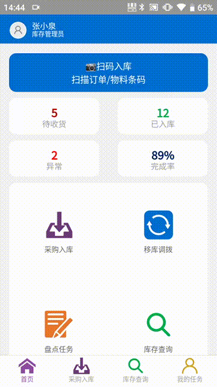

## 如何使用这个案例

这不是一个完整业务系统方案，而是一份可以照着练习和评审的页面设计演示。读完后，应能产出一份足够交给实施或开发的 `PDA` 采购入库页说明。

建议按下面顺序使用：

```text
先确认现场约束
-> 定义页面任务和成功标准
-> 拆页面模块
-> 设计扫码和数量录入流程
-> 补齐异常、离线和重复提交规则
-> 用真机验收清单检查
```

本案例会引用这些能力和规范：

- [扫码](../scenarios/scanner/)：用于持续接收 PDA 扫描头结果。
- [离线模式](../scenarios/offline-model-hac/)：用于弱网和断网时本地暂存。
- [扫码、按钮和表单怎么动](../mobile/interaction-behavior/)：用于定义焦点、回车和失败恢复。
- [弱网、旧设备和真机怎么验](../mobile/performance/)：用于定义性能和验收方式。

## 先看效果

 

## 练习目标

把一个“采购入库”需求设计成适合 PDA 现场连续收货的页面。

```text
页面名称：采购入库
页面类型：连续作业页
主要用户：采购管理员
使用设备：PDA + HAC + 硬件扫描头
主输入方式：扫描头扫码，数字键盘录入数量
最小验证宽度：280px，兼容 240px 和 320px
核心任务：按采购订单 PO 接收入库物料，先判断物料详情中的 Quality 是否足够，Quality 不足时阻断入库，否则允许接收货品入库
```

这个页面的目标不是展示完整采购订单资料，而是让采购管理员在仓库现场快速确认不同采购订单的物料是否可以入库。完整采购历史、统计报表、操作日志都应该后置。

## 现场约束

设计前先把真实现场讲清楚。采购入库现场通常不是安静办公室，页面要默认面对这些约束：

| 约束 | 对页面的影响 |
| --- | --- |
| 单手或双手持 PDA | 主操作要固定，触控目标要大 |
| 连续处理不同 PO | 成功后自动准备下一条，不反复返回列表 |
| 扫描头可能带回车 | 回车行为必须稳定，不能误提交 |
| 仓库弱网 | 支持本地暂存、待补传数量和重试 |
| 货架前光线复杂 | 状态文字要清楚，不能只靠颜色 |
| PO、物料和到货批次容易扫错 | 失败后保留码值并说明原因 |
| 同一批到货可能包含多个 PO | 页面要让当前 PO、物料和 Quality 状态足够清楚 |

## 一句话任务

> 采购管理员在仓库现场，手持 PDA，入库不同采购订单，需要先判断每个采购订单 PO 对应的物料详情中的 Quality；如果 Quality 不足，则无法接收货品入库，否则接收货品入库。

这句话决定了页面不应做成“列表 -> 详情 -> 表单 -> 返回列表”的结构，而应该做成“单页连续作业”。

## 页面成功标准

页面设计完成后至少要满足：

```text
1. 首屏能看到当前任务、库位、进度、网络状态、扫码入口和最近结果。
2. 页面进入后自动准备扫码，不要求用户先点输入框。
3. 扫码后立即显示码值或“校验中”，1 秒内尽量给出成功或失败反馈。
4. 物料匹配成功后自动进入数量录入或确认状态。
5. 提交成功后自动清空当前记录，并继续等待下一次扫码。
6. 扫错、重复、数量异常、网络失败时，页面保留现场数据并给出下一步。
7. 弱网或断网时不丢记录，显示待补传数量。
8. 在 280px 宽度下，主流程不需要横向滚动。
```

## 页面模块

推荐把页面拆成 6 个模块。

| 模块 | 放什么 | 设计要点 |
| --- | --- | --- |
| 任务状态栏 | 盘点单号、当前库位、已盘 / 应盘、在线状态、待补传数量 | 固定在顶部或首屏最上方 |
| 扫码作业区 | 当前步骤、扫码输入、扫码结果、校验状态 | 页面进入后自动聚焦，失败后保留码值 |
| 当前物料区 | 物料编码、名称、规格、单位、账面数量 | 只展示当前物料，不加载完整台账 |
| 数量区 | 实盘数量、差异数量、单位 | 数字键盘、回车确认、异常时提示范围 |
| 异常恢复区 | 错误原因、重新扫码、上报异常、覆盖数量、稍后补传 | 错误常驻页面内，不只用 Toast |
| 底部操作栏 | 重新扫码、确认盘点 | 主按钮固定，高度不低于 48px |

## 首屏草图

280px 宽度下，页面可以按下面的密度组织。

```text
┌────────────────────────┐
│ PDA 盘点        离线 2 │
│ PD-20260616-001        │
│ A-03-02   已盘 18/60   │
├────────────────────────┤
│ 请扫描物料码            │
│ [ M-10086            ] │
│ 上次：M-10072 已上传   │
├────────────────────────┤
│ 当前物料                │
│ M-10086                │
│ 托盘连接件  规格 L      │
│ 账面 24 PCS            │
│ 实盘数量                │
│ [24                 ]  │
│ 差异 0                 │
├────────────────────────┤
│ 最近记录                │
│ M-10072 18 PCS 已上传  │
│ M-10065 12 PCS 已暂存  │
├────────────────────────┤
│ [重新扫码] [确认盘点]   │
└────────────────────────┘
```

注意这里没有完整物料列表。作业页只服务当前一条记录和最近结果，完整历史应该进入“查看记录”或独立查询页。

## 主流程

```text
进入盘点任务
-> 加载任务摘要、当前库位、进度、待补传数量
-> 自动聚焦扫码入口
-> 扫描库位或确认当前库位
-> 扫描物料
-> 校验物料是否属于当前库位和当前任务
-> 带出物料信息和账面数量
-> 输入实盘数量
-> 确认盘点
-> 成功后更新最近记录和进度
-> 清空当前物料与数量
-> 自动回到扫码入口
```

如果业务要求先扫库位，再扫物料，页面要明确当前阶段。不要让用户在一个输入框里猜现在应该扫什么。

## 命令编排

HAC 中建议用持续扫码承接高频作业。

```text
页面进入
-> 检查当前是否在 HAC 中
-> 检查扫描头参数是否已配置
-> 执行【开始持续扫码】
-> 每次扫码结果进入“扫码处理子命令”

扫码处理子命令
-> 保存原始码值
-> 判断当前阶段：库位 / 物料
-> 校验条码格式
-> 调用服务端或本地缓存校验
-> 成功：更新页面状态
-> 失败：保留码值并显示原因

页面离开
-> 执行【停止持续扫码】
-> 保存当前未完成记录或清理临时状态
```

如果页面使用 UHF 盘点，流程要改成“本次读取 EPC 列表 -> 去重 -> 匹配 -> 批量确认”，不要照搬单条条码输入框。

## 焦点和回车规则

连续作业页的焦点规则要写进页面说明，不能让实现人员临场判断。

| 场景 | 焦点位置 | 回车行为 |
| --- | --- | --- |
| 页面打开 | 扫码入口 | 无 |
| 库位扫码成功 | 物料扫码入口 | 扫码校验 |
| 物料扫码成功 | 实盘数量 | 数量有效时确认盘点 |
| 数量为空或格式错误 | 实盘数量 | 阻断提交并提示原因 |
| 提交中 | 无可编辑焦点 | 忽略，防止重复提交 |
| 提交成功 | 扫码入口 | 等待下一次扫码 |
| 提交失败 | 失败字段或扫码入口 | 按恢复动作处理 |
| 弹层关闭 | 回到打开弹层前的焦点 | 不自动提交 |

扫描头如果自动带回车，扫码框回车只做扫码校验；数量框回车只做确认盘点。不要让同一个回车同时触发两个动作。

## 状态设计

页面至少要定义这些状态。

| 状态 | 页面表现 | 可执行动作 |
| --- | --- | --- |
| 等待扫码 | 显示“请扫描库位码 / 物料码” | 扫码、切换任务 |
| 校验中 | 显示当前码值和“校验中” | 禁止重复提交 |
| 物料已匹配 | 显示物料信息和数量输入 | 确认盘点、重新扫码 |
| 数量异常 | 数量区显示原因和允许范围 | 修改数量、上报异常 |
| 提交中 | 主按钮显示“提交中” | 禁止重复点击 |
| 已提交 | 最近记录新增，进度更新 | 自动进入下一次扫码 |
| 离线暂存 | 顶部显示待补传数量 | 继续扫码、查看待补传 |
| 结果待确认 | 保留当前记录 | 刷新状态、稍后补传 |
| 失败 | 错误区常驻显示原因 | 重新扫码、修改、上报异常 |

## 异常分支

异常处理要写成可执行规则，而不是只写“提示错误”。

| 异常 | 判断规则 | 页面动作 |
| --- | --- | --- |
| 库位不属于当前任务 | 库位码校验失败 | 保留库位码，提示重新扫码或切换任务 |
| 物料不在当前库位 | 物料与库位关系校验失败 | 保留物料码，允许重新扫码或上报异常 |
| 重复盘点 | 当前任务 + 库位 + 物料已存在记录 | 提示已盘点，允许查看记录或填写原因后覆盖 |
| 数量超范围 | 数量为空、负数、超阈值或精度不符 | 停在数量输入，显示允许范围 |
| 网络断开 | 提交接口不可用 | 写入本地暂存，待补传 +1 |
| 提交超时 | 未确认服务端是否入库 | 标记“结果待确认”，不鼓励重复扫码 |
| 扫描头无响应 | 未配置广播 / Intent 或未启动持续扫码 | 提示检查扫描头参数，提供重新启动监听入口 |

错误文案建议按这个格式写：

```text
发生了什么 + 当前码值 / 数量 + 用户现在能做什么
```

示例：

```text
物料 M-10086 不属于当前库位 A-03-02，请重新扫描物料码或上报异常。
```

```text
网络连接中断，当前记录已暂存。恢复网络后可在待补传列表中重试。
```

## 离线和补传

盘点页要把弱网当成常态处理。

本地暂存至少保存这些字段：

| 字段 | 用途 |
| --- | --- |
| 本地记录 ID | 补传幂等和前端列表定位 |
| 盘点单号 | 归属任务 |
| 库位码 | 归属库位 |
| 物料码 | 当前盘点对象 |
| 原始扫码值 | 排查扫描头前后缀或编码问题 |
| 实盘数量 | 盘点结果 |
| 操作人 | 审计 |
| 操作时间 | 排序和追踪 |
| 设备唯一标识 | 排查设备差异 |
| 补传状态 | 待补传、补传中、已上传、失败 |
| 失败原因 | 便于现场恢复 |

推荐补传流程：

```text
提交失败或断网
-> 写入本地暂存
-> 顶部待补传数量 +1
-> 用户继续扫码
-> 网络恢复
-> 自动或手动补传
-> 补传成功：状态改为已上传
-> 补传失败：保留原因和重试入口
```

服务端提交应使用幂等键，例如 `盘点单号 + 库位 + 物料 + 本地记录 ID`，避免超时重试后生成重复盘点记录。

## 数据接口建议

页面不应首屏加载全部盘点明细。按作业需要拆接口。

| 接口 | 返回内容 | 说明 |
| --- | --- | --- |
| 任务摘要 | 盘点单号、库位、已盘 / 应盘、状态、权限 | 页面首屏加载 |
| 库位校验 | 库位是否属于当前任务、库位名称或区域 | 扫库位后调用 |
| 物料校验 | 物料编码、名称、规格、单位、账面数量、是否已盘 | 扫物料后调用 |
| 提交盘点 | 提交结果、服务端记录 ID、最新进度 | 确认盘点后调用 |
| 待补传查询 | 本地队列或服务端未确认记录 | 进入页面或网络恢复后调用 |
| 历史记录 | 分页返回已盘记录 | 独立列表或弹层中加载 |

## 页面规格

可以把下面内容复制到页面设计说明里。

```text
页面名称：
PDA 盘点扫码

页面类型：
连续作业页

首屏必须展示：
盘点单号、当前库位、已盘 / 应盘、在线状态、待补传数量、扫码入口、最近结果、当前主按钮

默认焦点：
页面进入后聚焦扫码入口；物料匹配成功后聚焦实盘数量；提交成功后回到扫码入口

主按钮：
等待扫码时禁用或显示“等待扫码”
物料匹配且数量有效时显示“确认盘点”
提交中显示“提交中”

次操作：
重新扫码、查看记录、上报异常、切换库位

危险操作：
覆盖已盘数量、清空当前记录，需要二次确认并记录原因

离线策略：
断网时允许继续扫码，记录写入本地暂存队列，顶部显示待补传数量

离开页面：
停止持续扫码，保存未完成状态或提示用户确认
```

## 真机验收脚本

不要只在电脑浏览器里验。至少按下面脚本在目标 PDA 和 HAC 中测试。

```text
1. 打开页面，确认首屏在 280px 宽度下不横向滚动。
2. 进入页面后不点输入框，直接按扫描键，确认能收到扫码结果。
3. 连续扫码 50 条，确认页面不变慢、焦点不丢。
4. 扫错库位，确认保留码值并提示重新扫码或切换任务。
5. 扫错物料，确认保留物料码并提示上报异常。
6. 重复扫描已盘物料，确认不会重复提交。
7. 输入空数量、负数、超范围数量，确认能阻断提交。
8. 提交中连续按回车或主按钮，确认不会重复生成记录。
9. 断网后继续盘点 10 条，确认待补传数量增加且记录不丢。
10. 恢复网络，确认补传成功和失败都有状态。
11. 离开页面后按扫描键，确认旧页面不会继续响应。
12. 输入法弹起时，确认数量输入和底部按钮仍可操作。
```

高频盘点页面建议再做 `200` 条连续扫码压测，观察页面是否出现明显卡顿、记录丢失或重复提交。

## 评审清单

最终评审时用下面清单快速判断页面是否达标。

| 检查项 | 是否达标 |
| --- | --- |
| 页面任务是否能用一句话讲清楚 |  |
| 首屏是否只展示当前作业必须信息 |  |
| 是否避免列表到详情的慢流程 |  |
| 页面进入后是否自动准备扫码 |  |
| 扫码、回车、数量输入和提交行为是否唯一稳定 |  |
| 成功后是否自动准备下一条 |  |
| 失败后是否保留码值、数量和恢复动作 |  |
| 重复扫码和重复提交是否有前后端规则 |  |
| 弱网和断网时是否本地暂存并显示待补传 |  |
| 离开页面时是否停止持续扫码 |  |
| 240px、280px、320px 宽度是否都可用 |  |
| 是否完成真实 PDA、HAC、弱网和连续扫码验证 |  |
