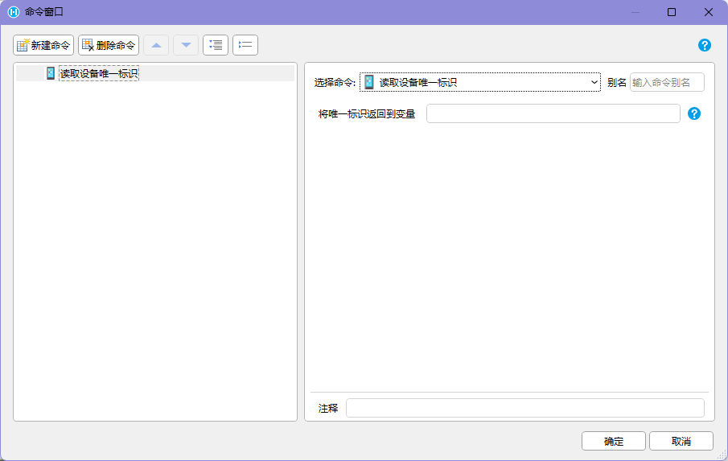
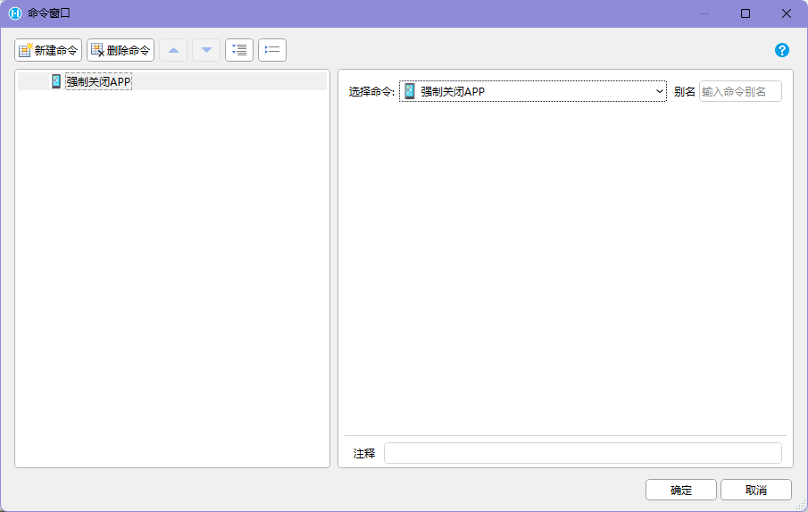
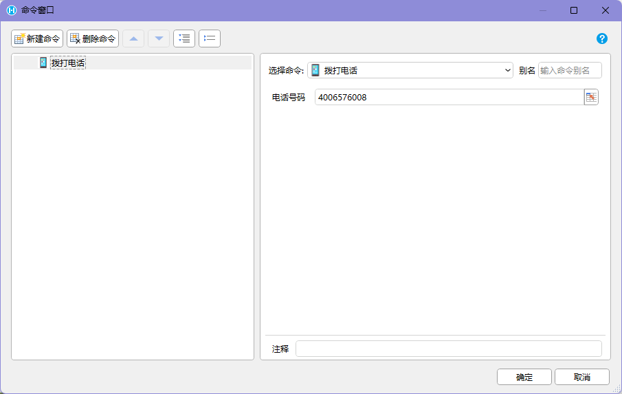
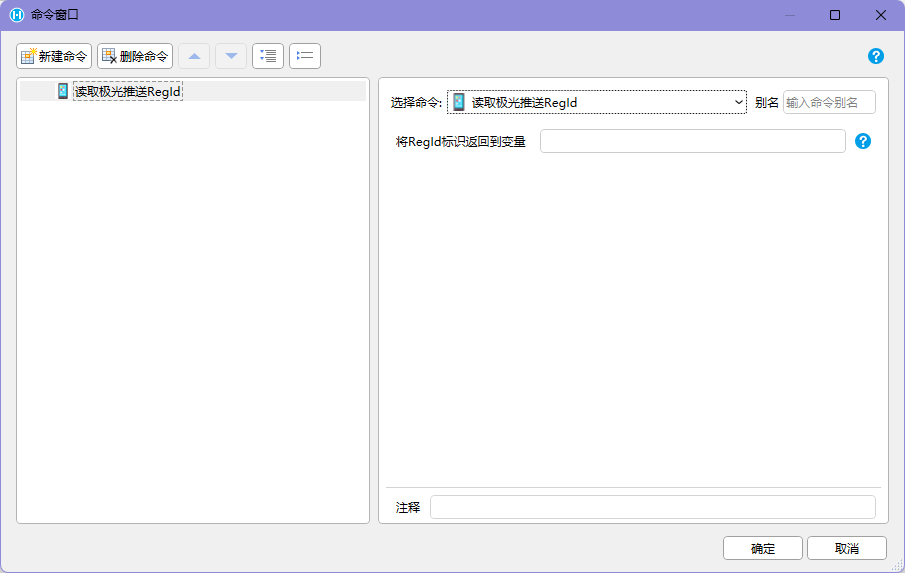
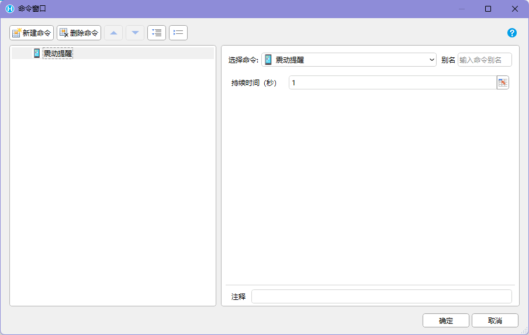
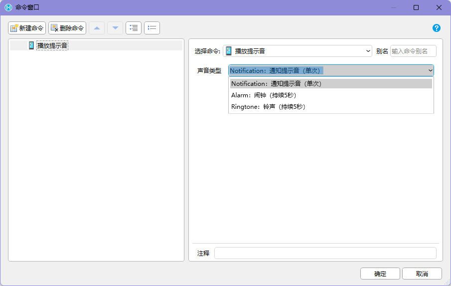
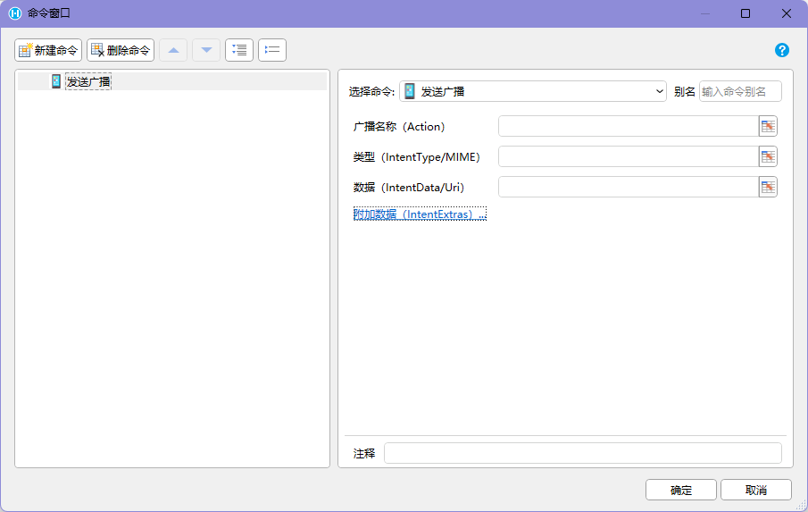
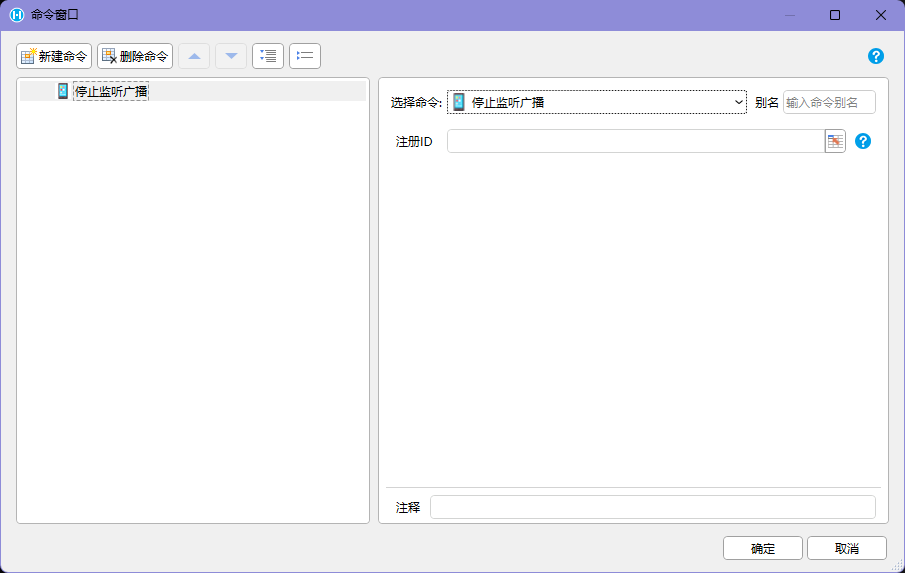

## 功能介绍

APP 交互能力用于让活字格页面在 `HAC` 中调用部分 Android 原生能力。它适合处理普通 Web 页面不方便或无法直接完成的动作，例如打开 APP 配置页、读取容器信息、读取设备标识、预览 PDF、拨打电话、触发震动和提示音，以及和 Android 系统或厂商程序通过广播交互。

这些命令都依赖 `HAC` 容器和对应插件能力。如果页面不在 `HAC` 中运行，部分命令会返回默认值，部分命令无法产生预期效果。

## 命令汇总

| 命令 | 类型 | 主要用途 |
| --- | --- | --- |
| 打开APP的内置页面 | 普通命令 | 打开配置页面或快速设置页面 |
| 读取APP信息 | 同步或异步，按插件实现为准 | 读取 APP 版本号和包名 |
| 读取APP信息到单元格 | 同步或异步，按插件实现为准 | 将 APP 版本号和包名写入目标单元格 |
| 读取设备唯一标识 | 同步或异步，按插件实现为准 | 读取设备的 SSAID / Android ID |
| 强制关闭APP | 普通命令 | 立即关闭当前 APP |
| 预览PDF文件 | 异步 | 下载并通过 APP 内置页面预览 PDF |
| 拨打电话 | 普通命令 | 弹出拨号界面并拨出电话 |
| 读取极光推送RegId | 同步或异步，按插件实现为准 | 读取极光推送注册 ID |
| 震动提醒 | 普通命令 | 触发设备震动 |
| 播放提示音 | 普通命令 | 播放通知、闹钟或铃声提示音 |
| 发送广播 | 异步 | 向 Android 系统发送 Broadcast 广播 |
| 开始接收广播 | 异步 | 监听指定 Action 的广播并回调 Extra |
| 停止监听广播 | 普通命令 | 停止指定广播监听器 |

## 打开APP的内置页面

【打开APP的内置页面】用于从活字格页面直接打开 `HAC` 的部分原生页面。

 

目前主要包含两类页面：

| 内置页面 | 用途 |
| --- | --- |
| 配置页面 | 逐项设置 APP 参数，适合现场调试或单项修改 |
| 快速设置页面 | 通过扫码一次完成所有配置，适合批量部署设备 |

推荐使用方式：

```text
进入设备配置入口
-> 点击“打开配置”
-> 执行【打开APP的内置页面】
-> 用户在原生页面完成配置
-> 返回活字格页面后重新检测关键配置或提示用户重试业务操作
```

如果页面依赖扫码、UHF、服务器地址或推送参数，建议在用户返回后重新读取或校验当前配置状态，避免页面还停留在旧状态。

## 读取APP信息

【读取APP信息】用于读取当前 `HAC` 的版本号和包名。常见用途包括：

- 判断当前页面是否运行在 `HAC` 中
- 记录问题反馈时的容器版本和包名
- 根据版本差异提示用户升级 APP
- 将 APP 信息写入设备巡检、现场签到或异常上报记录

如果当前页面没有运行在 `HAC` 中，版本号和包名均为 `N/A`。可以用这个值来判断当前运行环境。

 

推荐判断逻辑：

```text
执行【读取APP信息】
-> 读取版本号和包名
-> 如果版本号和包名都是 N/A：提示当前不在 HAC 中，设备能力不可用
-> 如果读取成功：继续执行后续设备能力命令
```

如果使用【读取APP信息到单元格】，建议准备独立单元格保存版本号、包名和读取状态，避免和业务输入混在一起。

## 读取设备唯一标识

【读取设备唯一标识】用于读取设备的 `SSAID / Android ID`，可以用来识别当前设备。

 

常见用途：

- 绑定设备和使用人、工位、门店或仓库
- 记录业务操作来源设备
- 限制某些页面只能在授权设备上使用
- 辅助排查同一账号在不同设备上的行为差异

需要注意的是，设备唯一标识适合识别设备，但不应单独作为高安全等级认证凭据。涉及权限、支付、放行、审核等关键操作时，仍应结合账号、角色、时间、位置和业务规则进行校验。

## 强制关闭APP

【强制关闭APP】会将 APP 强制关闭。该操作不会检查当前页面中是否有待提交的数据，也会中断当前正在进行的操作。

 

:::caution[谨慎使用]
强制关闭前，页面应尽量先保存业务状态，或至少明确提示用户当前操作会被中断。不要把它放在高频按钮、扫码流程的默认下一步或容易误触的位置。
:::

适合使用的场景：

- 运维页面提供“重启前关闭 APP”的辅助动作
- 当前容器状态异常，普通返回或刷新无法恢复
- 设备批量调试时，需要明确结束当前 APP 进程

不建议用于普通业务流程结束。业务流程完成后，通常应返回首页、跳转到下一任务或提示用户关闭设备，而不是直接强制关闭 APP。

## 预览PDF文件

新版本 Android 的 `WebView` 默认不提供完整的 PDF 预览能力，常见表现是 PDF 被下载到设备上，再通过设备内置应用打开，体验比较割裂。

 

【预览PDF文件】用于利用 APP 的内置页面自动完成 PDF 下载和预览。用户还可以使用设备上已经配置好的网络打印机进行文件打印。

使用时需要关注这些参数：

| 参数 | 说明 |
| --- | --- |
| PDF 文件地址 | 需要预览的 PDF 文件 URL |
| 文件名 | 保存到设备“下载”文件夹的文件名，建议带 `.pdf` 后缀 |
| 密码 | 加密 PDF 的打开密码；不加密的 PDF 留空即可 |

文件名去掉 `.pdf` 后缀后，会作为预览界面的标题使用。例如文件名为 `小文件.pdf` 时，预览标题可显示为 `小文件`。

平台限制：

- 不能做到无预览直接打印。
- 不支持配置打印机选择、打印预览、纸型设置等高级能力。
- PDF 文件会保存到设备的“下载”文件夹，文件名应便于用户查找。
- 如果 PDF 需要鉴权下载，应确认 URL 在 `HAC` 中可访问，且登录态或下载令牌没有过期。

推荐流程：

```text
用户点击“查看 PDF”
-> 页面确认 PDF 地址、文件名和密码
-> 执行【预览PDF文件】
-> APP 下载 PDF 并打开内置预览页面
-> 用户查看或通过系统能力打印
```

## 拨打电话

新版本 Android 收紧了拨打电话权限。需要拨打电话时，可以使用【拨打电话】命令。

 

命令调用后，会自动弹出拨号画面，并拨出电话。适合售后服务、现场巡检、配送联系客户、门店联络等场景。

页面设计建议：

- 在拨打前显示被呼叫对象和电话号码，避免拨错。
- 电话号码应来自可信业务数据，或在拨打前经过格式校验。
- 对外呼叫应记录操作人、时间、业务对象和号码来源。
- 如果业务只需要打开拨号界面而不立即拨出，应确认插件命令行为是否满足项目要求。

## 读取极光推送RegId

【读取极光推送RegId】用于读取极光推送的注册 ID。这个 ID 是应用和设备组合后的标识，可供推送服务使用。

 

需要注意：

- 重新安装 APP 时，`RegId` 可能会重置。
- 不同包名或不同推送配置下，`RegId` 不应混用。
- 上传 `RegId` 到服务端时，应同时记录用户、设备、APP 版本和更新时间。
- 如果用户退出登录或设备解绑，应清理服务端对应关系，避免继续推送到错误设备。

推荐流程：

```text
用户登录或设备绑定成功
-> 执行【读取极光推送RegId】
-> 将 RegId、用户、设备唯一标识和更新时间提交到服务端
-> 服务端保存最新推送目标
```

## 震动提醒

【震动提醒】用于开启手机震动提醒，可设置持续时间。

 

适合在嘈杂现场、强光环境或连续扫码场景中作为补充反馈。例如扫码成功轻震一下，异常或不匹配时使用更长震动提醒。

建议：

- 成功反馈使用短震动，避免打扰。
- 失败、重复扫码、任务不匹配等异常使用更明显的震动。
- 不要在循环或高频回调中无限触发震动。
- 如果设备不支持震动或用户关闭相关权限，应提供视觉或声音反馈作为补充。

## 播放提示音

【播放提示音】用于播放手机提示音，支持三种类型：

| 类型 | 适用场景 |
| --- | --- |
| 通知提示音 | 普通成功、完成、提醒 |
| 闹钟 | 高优先级提醒、异常等待、超时 |
| 铃声 | 需要引起用户注意的呼叫或联系场景 |

 

现场页面不要只依赖声音反馈。仓库、车间、冷库等环境可能很吵，也可能要求设备静音。关键提示建议同时提供页面状态、颜色、文字或震动反馈。

## 发送广播

【发送广播】用于向系统发送一个 `Broadcast` 广播，是异步操作。

 

插件参数和 Android `Intent` 的对应关系如下：

| 插件参数 | Android Intent |
| --- | --- |
| Action | Intent 的 Action |
| Type | Intent 的 Type |
| Uri | Intent 的 Data |
| IntentExtras | Intent 的 Extra |

`IntentExtras` 可以设置 Extra 的名称、类型和值。目前支持的类型包括 `bool`、`int`、`float` 和 `string`。

按照现有 Android 机制，广播发送是单向、异步的。APP 无法观测广播发送进度，因此插件中没有设计发送回调。

适合使用的场景：

- 通知厂商工具或系统服务执行某个动作
- 触发外部 APP 的特定能力
- 和设备厂商提供的广播接口集成

使用前应确认目标广播 Action、Type、Uri 和 Extra 的格式来自设备厂商或目标 APP 文档，不要在业务页面中硬编码未验证的参数。

## 开始接收广播

【开始接收广播】用于监听指定 `Action` 的广播，是异步操作。

 

接收到广播后，命令会以回调方式返回：

| 返回内容 | 说明 |
| --- | --- |
| 监听器注册ID | 后续执行【停止监听广播】时用于定位广播监听器 |
| Extra JSON | 广播携带的 Extra，JSON 中每个 Extra 是一个对象，包含 `name`、`type` 和 `value` |

推荐流程：

```text
进入需要监听广播的页面
-> 执行【开始接收广播】
-> 保存监听器注册ID
-> 接收到广播回调
-> 解析 Extra JSON
-> 按业务规则写入变量、单元格或触发后续命令
-> 离开页面时执行【停止监听广播】
```

如果监听广播用于接收扫码、UHF、外设状态或厂商程序回调，页面应处理重复广播、空 Extra、格式不匹配和短时间多次回调。

## 停止监听广播

【停止监听广播】用于停止特定的广播监听器，不再处理广播回调。

 

执行该命令时，需要使用【开始接收广播】返回的监听器注册 ID。建议在这些时机停止监听：

- 离开当前页面
- 当前任务完成
- 用户切换到不需要监听的模式
- 打开会打断当前流程的弹窗、拍照、签名或确认页面
- 监听到预期结果并且不需要继续接收

如果没有停止监听，旧页面可能继续处理广播回调，导致重复写入、跨页面误触发或业务状态混乱。

## 异常处理

| 异常 | 可能原因 | 推荐处理 |
| --- | --- | --- |
| APP 信息返回 `N/A` | 页面不在 `HAC` 中运行 | 提示当前设备能力不可用，或切换到浏览器兼容流程 |
| 设备唯一标识为空 | 容器不支持、系统权限限制或命令失败 | 提示重试，并记录 APP 版本、设备型号和错误信息 |
| PDF 无法预览 | URL 不可访问、文件名不合法、PDF 加密或密码错误 | 提示检查文件地址、文件名和密码，保留重新预览入口 |
| 打印能力不可用 | 设备未配置网络打印机或系统预览页不支持 | 提示用户先在设备系统中配置打印环境 |
| 电话未拨出 | 电话号码为空、格式错误或系统权限限制 | 提示检查号码，并允许复制或手动拨号 |
| 震动或提示音无效果 | 设备不支持、系统静音、音量过低或权限限制 | 同时显示视觉反馈，必要时提示检查系统设置 |
| 广播无响应 | Action、Type、Uri 或 Extra 不匹配，目标 APP 未安装 | 显示已发送但无法确认结果，并建议检查厂商配置 |
| 接收不到广播 | 未开始监听、Action 不匹配、页面已离开或监听器被停止 | 允许重新开始监听，并记录监听器注册 ID |
| 广播重复回调 | 外部程序多次发送或页面重复注册监听器 | 按业务主键去重，离开页面时停止旧监听器 |

## 页面设计注意点

- APP 交互命令通常会离开当前 Web 页面上下文或调用系统能力，执行前要明确告诉用户将发生什么。
- 强制关闭、拨打电话、发送广播这类动作应放在明确按钮后，不要由页面加载或扫码成功自动触发。
- 预览 PDF 前要显示文件名和业务对象，避免用户打开错文件。
- 读取 APP 信息、设备唯一标识、极光 `RegId` 时，建议写入独立变量或隐藏字段，并在提交服务端时一起记录。
- 广播监听类页面要保存监听器注册 ID，并在页面离开、任务完成或流程中断时停止监听。
- 关键反馈不要只依赖震动或提示音，应同时提供页面状态变化。

## 使用边界

APP 交互能力不是普通浏览器能力。使用时需要满足以下前提：

- 活字格应用运行在 `HAC` 中。
- 应用已安装并使用对应的 PDA / Android 交互命令插件。
- 设备系统、权限、厂商程序和 APP 配置支持对应能力。
- 涉及电话、PDF、推送、广播等能力时，项目应提前确认 Android 版本和设备厂商兼容性。

如果页面在普通 PC 浏览器或手机浏览器中打开，不能按这些插件命令调用 APP 原生页面和 Android 系统能力。

## 验收标准

1. 页面能通过【读取APP信息】区分 `HAC` 环境和普通浏览器环境。
2. 设备绑定、推送注册和问题反馈记录中，能保存 APP 信息、设备唯一标识或极光 `RegId` 中的必要字段。
3. PDF 预览能正确使用文件名、密码和下载地址，并能在失败时提示原因。
4. 拨打电话、强制关闭 APP、发送广播等动作有明确入口和必要确认，不会被误触发。
5. 广播监听页面能保存监听器注册 ID，并在离开页面或任务结束时停止监听。
6. 震动和提示音有视觉反馈兜底，不会在高频流程中连续无限触发。

