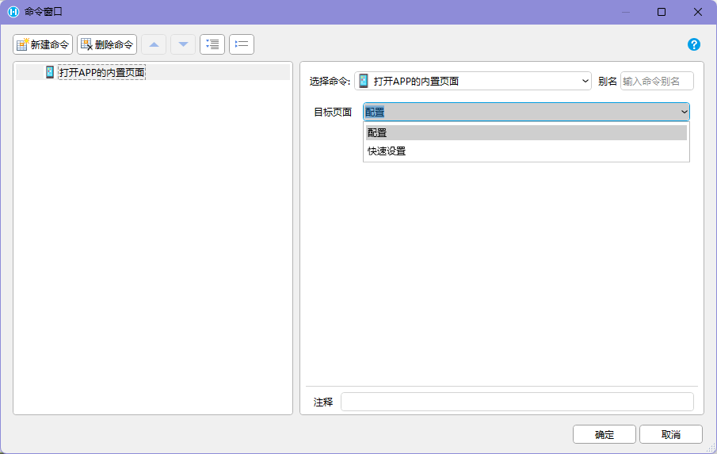
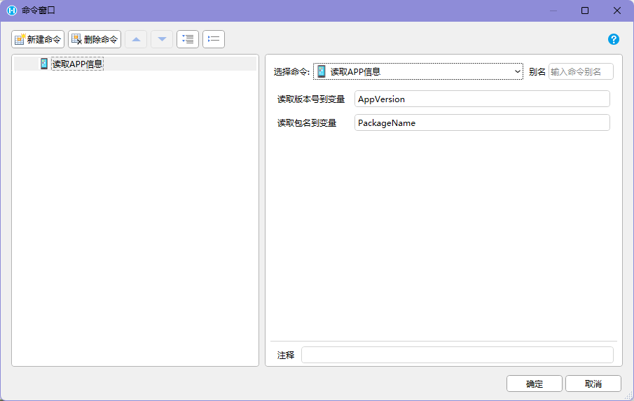
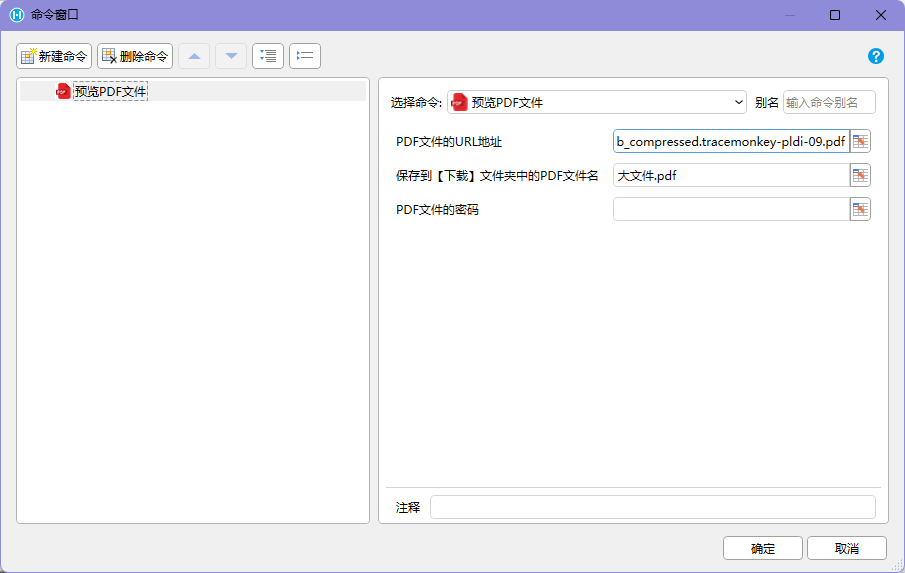
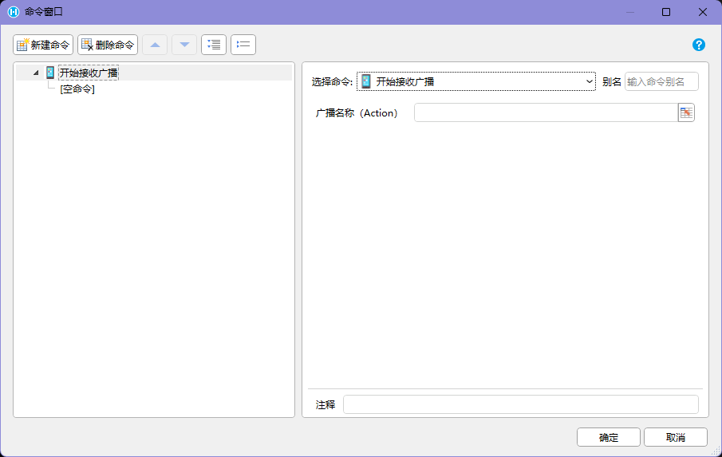

## 适用场景

APP 交互命令用于让活字格页面在 `HAC` 中调用部分 Android 原生能力，例如打开容器配置页、读取 APP / 设备信息、预览 PDF、拨打电话、震动、播放提示音、发送和接收广播。

这些命令通常会离开当前 Web 页面上下文、调用系统界面或监听外部事件。使用前要明确用户会看到什么、当前业务状态如何保存、失败后如何恢复。

## 使用前提

- 应用运行在 `HAC` 中。
- 已安装 PDA / Android 交互命令插件。
- 设备系统、权限、厂商程序和 APP 配置支持对应能力。
- 页面能识别普通浏览器环境并隐藏或禁用相关入口。
- 涉及广播时，Action、Type、Uri、Extra 来自厂商或目标 APP 文档。

## 命令速查

| 能力 | 命令 |
| --- | --- |
| 容器页面 | 打开APP的内置页面 |
| 环境信息 | 读取APP信息、读取APP信息到单元格、读取设备唯一标识、读取极光推送RegId |
| APP 控制 | 强制关闭APP |
| 文件和电话 | 预览PDF文件、拨打电话 |
| 反馈 | 震动提醒、播放提示音 |
| 广播 | 发送广播、开始接收广播、停止监听广播 |

## 推荐流程

读取环境并判断能力：

```text
执行【读取APP信息】
-> 如果版本号和包名为 N/A：提示不在 HAC 中
-> 如果读取成功：继续调用设备能力
-> 提交问题或业务记录时保存 APP 版本、包名和设备标识
```

广播监听：

```text
进入需要监听的页面
-> 执行【开始接收广播】
-> 保存监听器注册 ID
-> 接收广播回调
-> 解析 Extra JSON
-> 按业务规则写入变量或触发命令
-> 离开页面时执行【停止监听广播】
```






## 关键能力说明

| 能力 | 使用建议 |
| --- | --- |
| 打开 APP 内置页面 | 用于配置页或快速设置页；返回后重新检测关键配置 |
| 读取 APP 信息 | 判断是否在 HAC 中，并记录问题环境 |
| 读取设备唯一标识 | 可用于设备绑定和审计，但不能单独作为高安全认证凭据 |
| 强制关闭 APP | 仅用于运维或异常恢复，不作为普通业务完成动作 |
| 预览 PDF | 传入可访问 URL、文件名和密码；文件会保存到下载目录 |
| 拨打电话 | 拨打前展示对象和号码，号码必须来自可信数据或通过校验 |
| 读取极光 RegId | 绑定推送目标时记录用户、设备、APP 版本和更新时间 |
| 震动 / 提示音 | 作为视觉反馈的补充，不要作为唯一提示 |
| 发送广播 | 异步单向动作，无法确认目标 APP 是否真正处理 |
| 接收广播 | 保存监听器 ID，离开页面时必须停止 |

## 设计要点

- 原生能力入口要放在明确按钮后，不要由页面加载或扫码成功自动触发危险动作。
- PDF、电话、强制关闭、广播发送前要说明即将发生什么。
- 震动和提示音要搭配页面状态，嘈杂或静音环境下仍能理解结果。
- 广播、扫码、BLE 订阅、物理按键这类监听能力都要绑定页面生命周期。
- 读取 APP、设备、RegId 等信息时，建议写入隐藏字段或日志，不和业务输入混在一起。

## 异常处理

| 异常 | 常见原因 | 推荐处理 |
| --- | --- | --- |
| APP 信息返回 `N/A` | 不在 HAC 中运行 | 提示设备能力不可用或切换兼容流程 |
| 设备标识为空 | 容器不支持、权限限制、命令失败 | 提示重试并记录设备型号和版本 |
| PDF 无法预览 | URL 不可访问、文件名异常、密码错误 | 提示检查地址、文件名和密码 |
| 电话未拨出 | 号码为空、格式错误、权限限制 | 提示检查号码，允许复制或手动拨号 |
| 震动 / 提示音无效 | 设备不支持、系统静音、音量低、权限限制 | 同时提供视觉反馈 |
| 广播无响应 | Action / Extra 不匹配、目标 APP 未安装 | 显示已发送但无法确认结果，并提示检查配置 |
| 接收不到广播 | 未开始监听、Action 不匹配、监听已停止 | 允许重新监听并记录监听器 ID |
| 广播重复回调 | 外部程序重复发送、页面重复注册 | 按业务键去重，离开页面时停止旧监听 |

