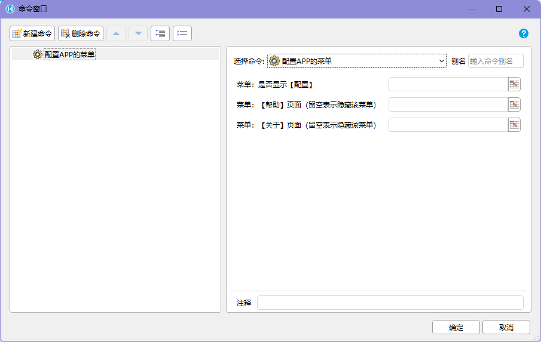
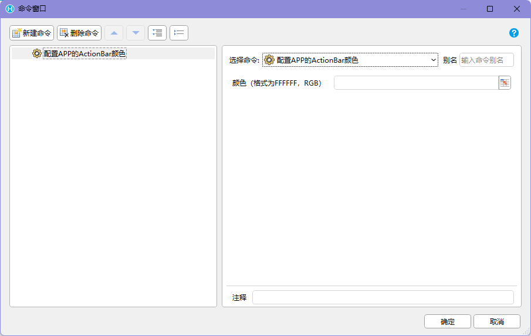
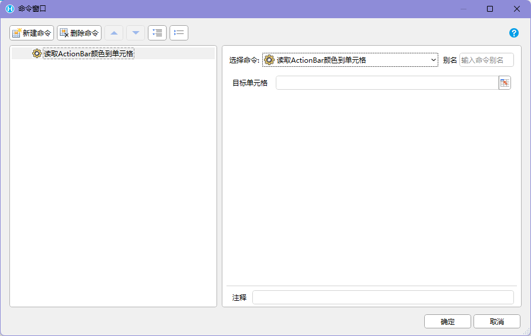

## 功能介绍

APP 个性化配置用于调整 `HAC` 的原生外观、顶部操作区、菜单入口和扫描头参数。它通常用于应用部署、品牌适配、现场设备配置和扫码能力初始化。

这些配置会保存到设备本地，在卸载应用前长期有效。配置类命令可能会影响整个 APP 的后续行为，因此更适合放在运维配置页、首次部署流程或管理员页面中，不建议放在普通业务作业流程中频繁执行。

## 命令汇总

| 命令 | 类型 | 主要用途 |
| --- | --- | --- |
| 配置APP的ActionBar | 普通命令 | 配置顶部固定区域是否显示、颜色和菜单 |
| 配置APP的菜单 | 普通命令 | 配置 APP 菜单，行为与配置 ActionBar 相同 |
| 配置扫描头参数 | 普通命令 | 配置扫描头信息，影响持续扫描到单元格等扫码命令 |
| 配置APP的ActionBar颜色 | 普通命令 | 配置 ActionBar 颜色，行为与配置 ActionBar 相同 |
| 读取ActionBar颜色 | 同步或异步，按插件实现为准 | 读取当前 ActionBar 颜色，格式为 `FFFFFF` 的 RGB |
| 读取ActionBar颜色到单元格 | 同步或异步，按插件实现为准 | 读取 ActionBar 颜色后赋值给指定单元格 |

:::caution[配置后会重新加载]
【配置APP的ActionBar】、【配置APP的菜单】和【配置APP的ActionBar颜色】这类命令会导致 APP 重新加载，因此不建议在这些命令后继续添加其他命令。需要保存的业务数据应在执行配置前完成。
:::

## ActionBar 是什么

`ActionBar` 是 APP 顶部的固定区域，通常用于显示标题、品牌色和右上角菜单入口。点击右上角的三个点，可以弹出菜单组。

通过【配置APP的ActionBar】可以配置：

- 是否显示 ActionBar。
- ActionBar 显示成什么颜色。
- 是否显示配置菜单。
- 显示哪些菜单。
- 帮助、关于等菜单跳转地址。

配置会存储在本地，在卸载应用前长期有效。

## 配置APP的ActionBar

【配置APP的ActionBar】用于统一配置 APP 顶部固定区域和菜单能力。

 

常见配置项：

| 配置项 | 说明 |
| --- | --- |
| 是否显示 ActionBar | 控制顶部固定区域是否显示 |
| ActionBar 颜色 | 控制顶部区域颜色 |
| 是否显示【配置】菜单 | 控制用户是否还能从菜单进入配置 |
| 菜单项 | 控制右上角菜单组中显示哪些入口 |
| 【帮助】菜单页面 | 帮助菜单打开的完整 URL |
| 【关于】菜单页面 | 关于菜单打开的完整 URL |

注意事项：

- 如果“是否显示【配置】菜单”设置为否，APP 会隐藏配置菜单。一旦隐藏，用户将无法从 APP 菜单中对应用进行配置。
- 【帮助】和【关于】菜单页面需要填写完整 URL，例如 `https://xxxx.xxxx.com/xxx`。
- 命令执行后 APP 会重新加载，不建议在该命令后添加其他命令。
- 该配置长期保存在本地，适合管理员确认后执行。

推荐流程：

```text
进入管理员配置页
-> 用户确认 ActionBar 显示、颜色和菜单设置
-> 页面提示配置会导致 APP 重新加载
-> 执行【配置APP的ActionBar】
-> APP 重新加载
-> 用户重新进入应用后验证顶部区域和菜单显示
```

如果需要隐藏配置菜单，建议先确认还有其他恢复配置的方式，例如快速设置二维码、设备管理流程或管理员专用入口。

## 配置APP的菜单

【配置APP的菜单】行为与【配置APP的ActionBar】相同，主要用于配置 APP 菜单相关内容。

 

适合在这些场景使用：

- 只调整菜单项，不调整业务页面。
- 设置帮助、关于、配置等菜单入口。
- 为不同客户、环境或设备角色配置不同菜单。

由于该命令行为与配置 ActionBar 相同，也应按配置类命令处理：执行前保存页面状态，执行后预期 APP 会重新加载，不在后面串联业务命令。

## 配置扫描头参数

【配置扫描头参数】用于配置扫描头信息。该配置将决定【持续扫描到单元格】等扫描头相关命令是否可以正常使用。

 

扫描头参数通常和设备厂商的广播或 Intent 设置有关，常见内容包括：

- 扫描广播 Action。
- 扫描结果 Extra key。
- 广播或 Intent 接收方式。
- 扫描头、UHF 或厂商程序的差异配置。

配置前建议先阅读[安卓容器（PDA）](./hac-android-container-pda/)中的扫码广播和设备兼容说明。

推荐流程：

```text
确认 PDA 厂商和型号
-> 在设备系统或厂商程序中开启广播 / Intent 模式
-> 确认 Action 和 Extra key
-> 执行【配置扫描头参数】
-> 进入扫码测试页面
-> 使用【开始持续扫码】或持续扫描到单元格类命令验证结果
```

如果扫描结果无法写入页面，优先检查设备系统扫描设置、APP 扫描头参数、广播 Action 和 Extra key 是否一致。

## 配置APP的ActionBar颜色

【配置APP的ActionBar颜色】用于单独配置 ActionBar 颜色，行为与【配置APP的ActionBar】相同。

 

颜色通常用于区分客户、环境或应用类型，例如：

- 生产环境和测试环境使用不同颜色。
- 不同工厂、仓库或门店使用不同颜色。
- 不同客户定制版使用不同品牌色。

颜色配置也会影响 APP 外观并触发重新加载，因此建议在管理员配置页中执行。颜色值应使用明确的 RGB 颜色，避免和页面主体背景、文字、状态色产生冲突。

## 读取ActionBar颜色

【读取ActionBar颜色】用于读取当前 ActionBar 的颜色，返回格式为 `FFFFFF` 的 RGB。

 

常见用途：

- 判断当前设备是否已经完成品牌色配置。
- 在页面中同步显示当前 APP 顶部颜色。
- 调试或验收个性化配置是否生效。
- 在配置页中回显当前颜色，避免用户重复设置。

推荐流程：

```text
进入配置页
-> 执行【读取ActionBar颜色】
-> 将返回的 RGB 值保存到变量
-> 页面显示当前颜色
-> 用户确认是否需要重新配置
```

## 读取ActionBar颜色到单元格

【读取ActionBar颜色到单元格】与【读取ActionBar颜色】能力相同，只是获取 ActionBar 颜色后会赋值给指定单元格。

 

适合在表格式配置页或调试页中使用，让开发者或运维人员直接看到当前颜色值。

## 页面设计建议

- 配置类命令应放在管理员或运维页面，不要放在普通作业页。
- 执行会重新加载 APP 的命令前，应提示用户保存当前业务数据。
- 隐藏配置菜单前，要确认仍有其他恢复配置的方式。
- 帮助和关于菜单 URL 必须填写完整地址，并确认目标页面可在设备网络环境中访问。
- 扫描头参数配置完成后，应提供测试入口，现场验证扫码结果是否能被页面接收。
- 读取 ActionBar 颜色可以用于回显当前配置，减少重复设置和误操作。

## 异常处理

| 异常 | 可能原因 | 推荐处理 |
| --- | --- | --- |
| 配置后页面重新加载导致后续命令未执行 | 配置类命令触发 APP 重载 | 不在配置命令后串联业务命令，执行前保存状态 |
| 配置菜单被隐藏后无法修改配置 | “是否显示【配置】菜单”设置为否 | 使用快速设置二维码或管理员恢复流程重新配置 |
| 帮助或关于打不开 | URL 不完整、网络不可达、证书或登录态问题 | 使用完整 `https://` URL，并在设备网络下验证 |
| ActionBar 颜色显示异常 | 颜色格式错误或和主题冲突 | 使用标准 RGB 值，并检查对比度 |
| 读取颜色为空或不符合预期 | 当前不在 HAC 中、配置未生效或命令失败 | 提示需要在 HAC 中读取，并允许重新读取 |
| 扫描头命令无结果 | 扫描头参数和设备广播配置不一致 | 参考安卓容器（PDA）文档检查 Action 和 Extra key |
| 不同设备表现不一致 | 厂商系统、扫描服务或 HAC 版本差异 | 记录设备型号、Android 版本、HAC 版本并逐机型验证 |

## 使用边界

APP 个性化配置属于 `HAC` 原生容器能力，不是普通 Web 页面能力。使用时需要满足以下前提：

- 活字格应用运行在 `HAC` 中。
- 应用已安装并使用对应的 PDA / Android 交互命令插件。
- 执行配置的用户具备管理员或运维权限。
- 扫描头参数已经和目标 PDA 厂商配置确认一致。

如果页面在普通 PC 浏览器或手机浏览器中打开，不能按这些插件命令配置 APP 顶部区域、菜单或扫描头参数。

## 验收标准

1. 配置 ActionBar 后，APP 顶部区域显示、颜色和菜单项符合预期。
2. 配置菜单被隐藏时，项目仍有明确的恢复配置方式。
3. 帮助和关于菜单使用完整 URL，并能在目标设备网络中打开。
4. 配置类命令执行后不会依赖后续命令继续完成业务。
5. 扫描头参数配置后，持续扫描到单元格等扫码命令能正常接收结果。
6. 读取 ActionBar 颜色能返回 `FFFFFF` 格式的 RGB，并能按需写入变量或单元格。

