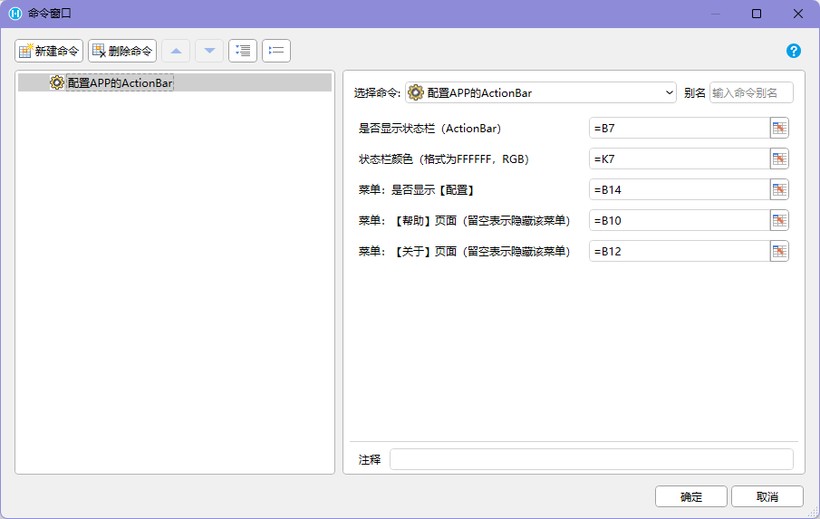
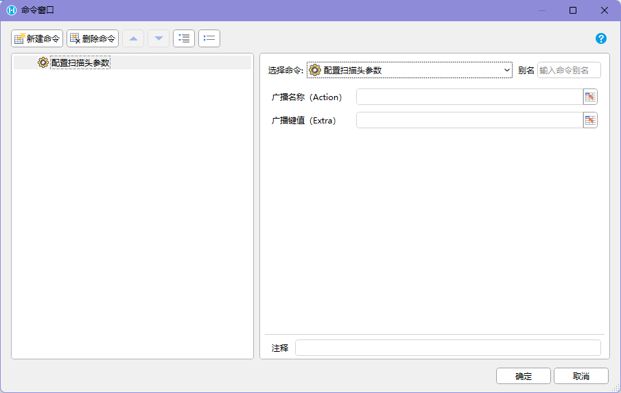
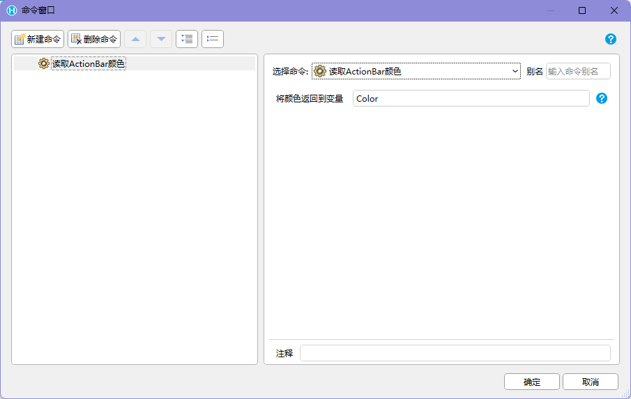

## 适用场景

APP 个性化配置用于调整 `HAC` 的顶部区域、菜单入口、颜色和扫描头参数。它适合首次部署、品牌适配、现场设备配置和管理员运维。

这些配置会保存到设备本地，通常在卸载应用前长期有效。不要把配置命令放进普通高频业务流程。

## 使用前提

- 应用运行在 `HAC` 中。
- 当前用户具备管理员或运维权限。
- 执行配置前已保存当前业务状态。
- 扫描头参数已和目标 PDA 厂商配置确认一致。
- 项目有恢复配置的方式，例如快速设置二维码或管理员入口。

## 命令速查

| 命令 | 用途 |
| --- | --- |
| 配置APP的ActionBar | 设置顶部区域显示、颜色和菜单 |
| 配置APP的菜单 | 设置菜单入口，行为与 ActionBar 配置相同 |
| 配置扫描头参数 | 设置扫描头广播 / Intent 参数 |
| 配置APP的ActionBar颜色 | 单独设置顶部区域颜色 |
| 读取ActionBar颜色 | 读取当前颜色，返回 `FFFFFF` 格式 RGB |
| 读取ActionBar颜色到单元格 | 读取后写入指定单元格 |

:::caution[配置会重新加载]
配置 ActionBar、菜单或颜色后，APP 可能重新加载。不要在这些命令后继续串联业务命令。
:::

## 推荐流程

ActionBar / 菜单配置：

```text
进入管理员配置页
-> 回显当前配置
-> 用户确认显示、颜色、菜单和 URL
-> 提示 APP 将重新加载
-> 执行配置命令
-> APP 重载后验证顶部区域和菜单
```

扫描头参数配置：

```text
确认 PDA 厂商和型号
-> 在设备系统或厂商程序中开启广播 / Intent
-> 确认 Action 和 Extra key
-> 执行【配置扫描头参数】
-> 进入扫码测试页
-> 验证持续扫码或单次扫码结果
```





## 设计要点

- 配置入口放在管理员或运维页面。
- 隐藏“配置”菜单前，必须确认还有恢复配置的方式。
- 帮助和关于菜单 URL 使用完整 `https://` 地址，并在设备网络中验证。
- ActionBar 颜色用于区分客户、环境或应用类型时，要保证文字对比度。
- 读取 ActionBar 颜色可用于配置页回显，避免重复设置。
- 扫描头参数配置完成后，必须提供扫码测试入口。

## 异常处理

| 异常 | 常见原因 | 推荐处理 |
| --- | --- | --- |
| 配置后后续命令未执行 | APP 重载 | 不在配置命令后串联业务命令 |
| 配置菜单隐藏后无法修改 | 缺少恢复入口 | 使用快速设置二维码或管理员恢复流程 |
| 帮助 / 关于打不开 | URL 不完整、网络不可达、证书或登录态问题 | 使用完整 URL，并在 PDA 网络下验证 |
| 颜色显示异常 | 格式错误或对比度不足 | 使用标准 RGB，检查亮暗主题 |
| 扫描头命令无结果 | 设备广播和 HAC 配置不一致 | 重新核对 Action、Extra key 和厂商设置 |
| 不同设备表现不一致 | 厂商系统、扫描服务或 HAC 版本差异 | 记录设备型号并逐机型验证 |

