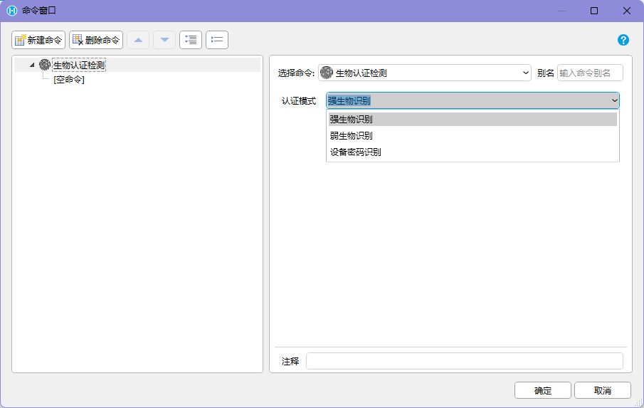
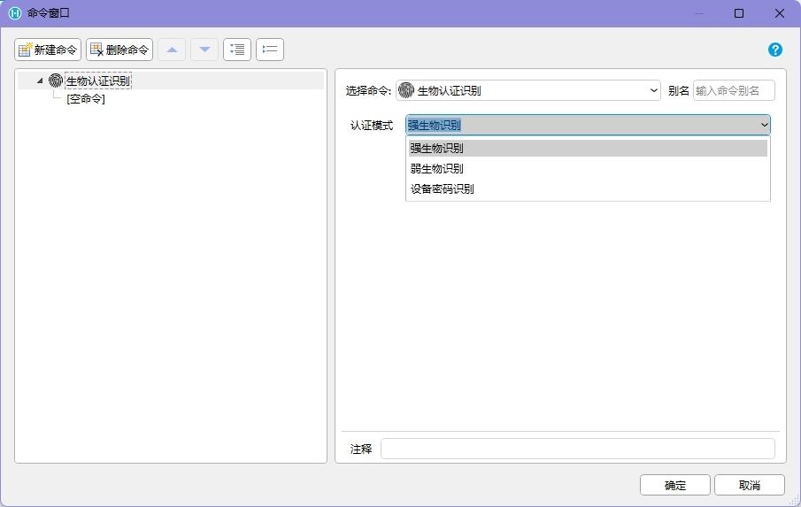

## 功能介绍

生物识别认证用于在 `HAC` 中调用 Android 设备的系统认证能力，让用户通过指纹、人脸、其他生物识别方式或设备密码完成身份确认。

它适合用在需要“当前操作人再次确认”的场景，例如：

- 高价值物料出入库前确认
- 质检不合格放行或复判确认
- 设备巡检异常关闭
- 敏感数据查看
- 管理员操作、审批、作废、冲销等关键动作

生物识别认证只确认“当前设备上通过了系统认证”，不等同于完整业务授权。关键业务仍应结合活字格账号、角色权限、业务状态、操作日志和服务端规则一起校验。

## 命令汇总

| 命令 | 类型 | 主要用途 |
| --- | --- | --- |
| 生物认证检测 | 异步 | 检测生物识别或设备密码认证是否可用，并返回检测结果和检测信息 |
| 生物认证识别 | 异步 | 调起系统认证流程，并返回认证结果 |

推荐先执行【生物认证检测】，确认当前设备和认证模式可用后，再执行【生物认证识别】。

## 认证模式

两个命令都需要选择认证模式。

| 认证模式 | 含义 | 适用建议 |
| --- | --- | --- |
| 强生物识别 | 使用安全级别更高的生物识别能力，例如满足系统强认证要求的指纹或人脸 | 用于放行、作废、敏感数据查看等高风险操作 |
| 弱生物识别 | 使用安全级别较低或设备判定为弱等级的生物识别能力 | 用于普通二次确认、便利性较高的现场操作 |
| 设备密码识别 | 使用设备锁屏密码、图案或 PIN 等系统凭据 | 作为无可用生物识别时的替代认证方式 |

不同 Android 版本、设备厂商和硬件配置对“强 / 弱”的支持可能不同。正式上线前，应在目标设备型号上验证每种认证模式的检测结果和认证表现。

## 生物认证检测

【生物认证检测】是异步操作。命令会检测当前选择的认证模式是否可用，检测完成后，将检测结果和检测信息返回至变量中，供后续子命令使用。

 

可以把它理解为：

```text
执行【生物认证检测】
-> 选择认证模式
-> HAC 调用系统能力检测当前设备是否支持
-> 返回检测结果和检测信息
-> 页面根据结果决定是否继续认证
```

建议保存的返回信息：

| 返回信息 | 用途 |
| --- | --- |
| 检测结果 | 判断当前认证模式是否可用 |
| 检测信息 | 展示失败原因，或写入问题排查日志 |

推荐页面逻辑：

```text
进入需要二次认证的操作
-> 执行【生物认证检测】
-> 检测可用：显示认证按钮或直接进入认证流程
-> 检测不可用：显示原因，并提供备用处理方式
```

常见不可用原因包括设备不支持生物识别、未录入指纹或人脸、未设置设备密码、系统安全策略不允许、当前认证模式与设备能力不匹配等。

## 生物认证识别

【生物认证识别】是异步操作。命令会开始生物识别认证，认证完成后，将认证结果返回至变量中，供后续子命令使用。

 

可以把它理解为：

```text
执行【生物认证识别】
-> 选择认证模式
-> 系统弹出认证界面
-> 用户完成指纹、人脸或设备密码认证
-> 返回认证结果
-> 页面根据结果继续执行或中断操作
```

认证成功后，页面可以继续执行关键业务命令，例如提交、审批、放行、查看敏感数据或进入管理页面。

认证失败、取消或超时时，不应继续执行关键业务动作。页面应保留当前业务状态，让用户可以重试、返回或选择有权限的备用流程。

## 推荐页面流程

对关键操作，建议采用“检测 -> 认证 -> 执行业务”的结构。

```text
用户点击关键操作
-> 页面展示操作对象和风险说明
-> 执行【生物认证检测】
-> 检测失败：提示原因，停止操作
-> 检测成功：执行【生物认证识别】
-> 认证成功：继续执行业务命令
-> 认证失败或取消：保留页面状态，不提交业务
-> 记录认证结果、操作人、设备和时间
```

如果业务要求更高安全性，建议在服务端再次校验当前用户是否有权限执行该操作。不要只因为本机生物认证成功就绕过业务权限。

## 页面展示建议

| 阶段 | 页面提示 |
| --- | --- |
| 等待检测 | 正在检测当前设备是否支持认证 |
| 检测可用 | 当前设备支持认证，请继续确认 |
| 检测不可用 | 当前设备无法使用该认证方式，请查看原因或联系管理员 |
| 等待认证 | 请按系统提示完成指纹、人脸或设备密码认证 |
| 认证成功 | 认证通过，正在继续处理 |
| 认证失败 | 认证未通过，请重试或取消操作 |
| 用户取消 | 已取消认证，当前业务未提交 |

认证流程通常会弹出系统界面。页面应避免在认证期间同时触发其他命令，尤其是提交、跳转、关闭 APP、开始扫码或打开其他系统页面。

## 异常处理

| 异常 | 可能原因 | 推荐处理 |
| --- | --- | --- |
| 检测不可用 | 设备不支持、未录入生物信息、未设置设备密码、认证模式不匹配 | 展示检测信息，并提示用户设置设备或切换认证模式 |
| 认证失败 | 指纹或人脸不匹配、设备密码错误 | 保留当前页面状态，允许重试或取消 |
| 用户取消认证 | 用户关闭系统认证界面或返回 | 不执行业务动作，提示当前操作已取消 |
| 认证超时 | 长时间未完成认证或系统认证界面超时 | 提示重新发起认证 |
| 当前不在 HAC 中 | 普通浏览器无法调用 Android 系统认证 | 提示需要在 HAC 中使用，或隐藏相关入口 |
| 认证通过但业务失败 | 服务端权限不足、网络异常、业务状态变化 | 提示业务失败原因，不把认证成功等同于提交成功 |

## 页面设计注意点

- 认证前要展示当前操作对象和后果，例如“确认作废单据 SO-001”。
- 认证成功后再执行关键业务命令，不要在认证弹出前提前提交。
- 认证失败、取消或超时时，页面要保留原始业务数据，方便用户重试。
- 不要把生物认证作为唯一权限控制，服务端仍需校验用户角色和业务规则。
- 对高风险操作，建议记录认证模式、认证结果、操作人、设备唯一标识、APP 版本、时间和业务对象。
- 如果设备现场可能多人共用，必须先确认当前活字格登录账号和现场操作人一致。
- 对低端设备或老版本 Android，应准备不可用时的备用流程，例如管理员账号确认或转 PC 端处理。

## 使用边界

生物识别认证属于 Android 系统能力调用，不是普通 Web 页面能力。使用时需要满足以下前提：

- 活字格应用运行在 `HAC` 中。
- 应用已安装并使用对应的 PDA / Android 交互命令插件。
- 当前设备支持所选认证模式。
- 设备已录入对应的生物信息，或已设置设备密码。
- 项目已经在目标 Android 版本和设备型号上验证认证弹窗、返回结果和失败表现。

如果页面在普通 PC 浏览器或手机浏览器中打开，不能按这些插件命令调用系统生物识别或设备密码认证。

## 验收标准

1. 选择强生物识别、弱生物识别、设备密码识别时，检测命令能返回明确的检测结果和检测信息。
2. 检测不可用时，页面不会继续发起关键业务操作。
3. 认证成功后，页面才会继续执行提交、审批、放行等后续命令。
4. 认证失败、取消或超时时，关键业务不会被提交，页面状态仍可恢复。
5. 认证结果、操作人、设备和业务对象能被记录，便于审计和排查。
6. 在普通浏览器环境下，页面能识别能力不可用，并提供清晰提示或隐藏入口。

