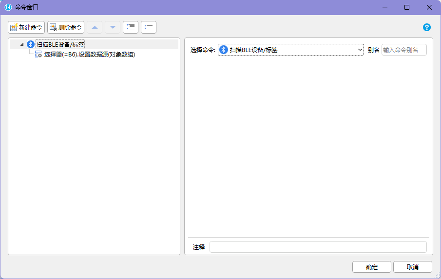
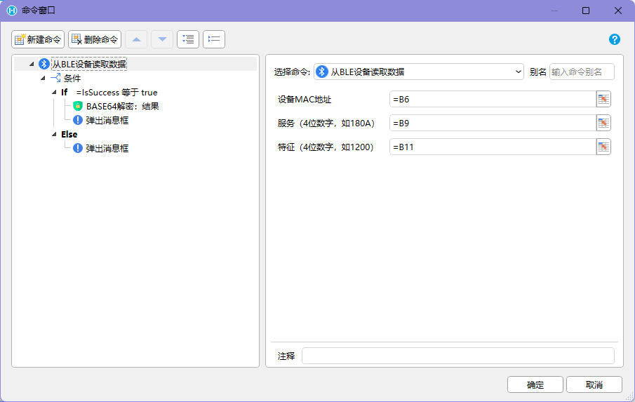
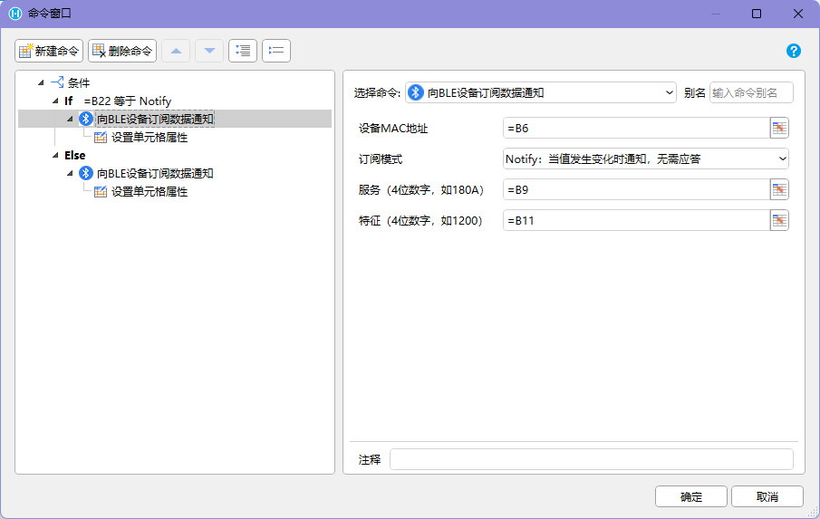
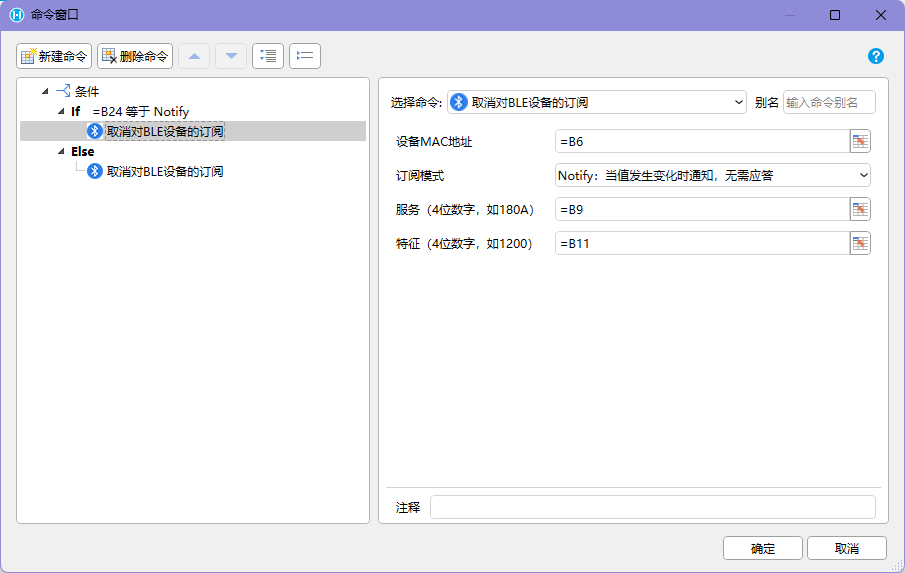
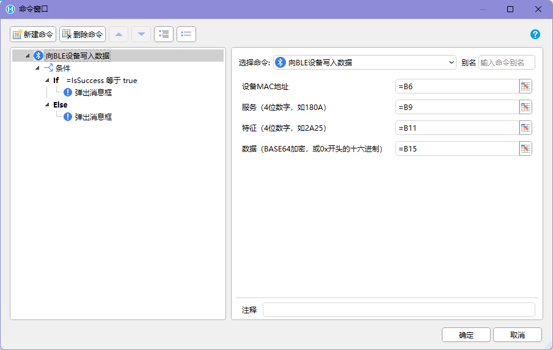

## 功能介绍

BLE 设备读写用于在 `HAC` 中调用手机或 PDA 的蓝牙能力，扫描附近的低功耗蓝牙设备或标签，并对指定设备的服务、特征进行读取、订阅或写入。

这类能力常用于：

- 资产盘点：扫描附近 BLE 标签，识别资产或工装夹具。
- 现场定位：通过 BLE 标签或信标辅助判断人员、设备或货物位置。
- 设备选择：先扫描附近设备，再让用户选择要读写的目标设备。
- 数据采集：读取温湿度、传感器、电量、状态等特征值。
- 设备控制：向 BLE 设备写入指令或配置。

BLE 和普通蓝牙打印不是同一类能力。本页介绍的是 BLE 设备/标签的数据扫描、读取、订阅和写入；蓝牙打印应按打印机协议单独设计。

## 命令汇总

| 命令 | 类型 | 主要用途 |
| --- | --- | --- |
| 扫描BLE设备/标签 | 异步 | 扫描附近 BLE 设备，返回名称和 MAC 地址列表 |
| 扫描BLE设备/标签并填充到单元格 | 异步 | 扫描附近 BLE 设备，并把结果写入单元格 |
| 从BLE设备读取数据 | 异步 | 从指定设备的服务、特征读取数据 |
| 从BLE设备读取数据到单元格 | 异步 | 读取 BLE 数据并写入单元格 |
| 向BLE设备订阅数据通知 | 异步 | 订阅特征值变化，变化时调用子命令处理 |
| 向BLE设备订阅数据通知并填充到单元格 | 异步 | 订阅特征值变化，并把结果写入单元格 |
| 取消对BLE设备的订阅 | 普通命令 | 取消指定特征值变化订阅 |
| 向BLE设备写入数据 | 异步 | 将 Base64 数据写入指定设备的服务、特征 |
| 向BLE设备写入数据并填充到单元格 | 异步 | 写入 BLE 数据，并把写入结果写入单元格 |

## 使用前提

使用 BLE 相关命令前，需要确认：

- 应用运行在 `HAC` 中。
- 设备支持 BLE，并已开启蓝牙。
- Android 系统已授予蓝牙扫描、连接或定位相关权限。
- 目标 BLE 设备处于可发现、可连接或可通信状态。
- 已明确目标设备的服务 UUID、特征 UUID、读写权限和数据格式。
- 如果需要解析二进制数据，项目已准备好对象、集合或字符串处理逻辑。

BLE 在现场容易受距离、遮挡、金属环境、电池电量、设备休眠和厂商协议影响。正式使用前，应在目标 PDA 和目标 BLE 设备上做真机测试。

## 扫描BLE设备/标签

【扫描BLE设备/标签】是异步操作。命令会调用手机或 PDA 上的蓝牙，读取附近的 BLE 设备，并返回包含名称、MAC 地址的列表。

 

常见用途：

- 盘点附近 BLE 标签。
- 通过 BLE 设备列表辅助定位。
- 在读写 BLE 信息前，让用户选择目标设备。

如果后续需要把扫描结果作为页面下拉列表、列表或选择控件的数据源，通常需要配合“操作单元格命令 -> 设置数据源”使用。

推荐流程：

```text
用户点击“扫描设备”
-> 执行【扫描BLE设备/标签】
-> 返回设备名称和 MAC 地址列表
-> 页面展示可选设备
-> 用户选择目标设备
-> 保存目标设备 MAC 地址
-> 后续读取、订阅或写入该设备
```

扫描列表中可能存在名称为空、名称重复、MAC 地址相近或设备短时间消失的情况。页面上应优先使用 MAC 地址作为设备唯一标识，并允许用户重新扫描。

## 从BLE设备读取数据

【从BLE设备读取数据】是异步操作。命令会调用手机或 PDA 上的蓝牙，从特定设备读取指定服务、特征的数据。

 

读取前通常需要准备：

| 参数 | 说明 |
| --- | --- |
| 设备 MAC 地址 | 扫描结果中选中的目标设备地址 |
| 服务 UUID | BLE 服务标识 |
| 特征 UUID | 需要读取的特征标识 |
| 数据解析方式 | 按原始整数数组或 Base64 数据继续处理 |

数据读取结果分为两种形式：

| 结果形式 | 说明 | 适用建议 |
| --- | --- | --- |
| 原始数据版 | 逗号分隔的整数数组 | 适合按字节位置解析简单状态、数值或标志位 |
| Base64 加密版 | Base64 形式的数据文本 | 适合传递二进制数据，推荐搭配【字符串加解密】插件处理 |

使用时推荐搭配【对象与集合操作】和【字符串加解密】插件，把读取到的数据拆分、解码、转换并写入业务字段。

推荐流程：

```text
用户选择目标 BLE 设备
-> 页面准备服务 UUID 和特征 UUID
-> 执行【从BLE设备读取数据】
-> 返回原始数据或 Base64 数据
-> 页面解析数据
-> 展示设备状态、电量、传感器值或业务信息
```

## 向BLE设备订阅数据通知

【向BLE设备订阅数据通知】是异步操作。命令会调用手机或 PDA 的蓝牙，订阅指定特征值的变化。发生变化时，插件会调用子命令进行处理。

 

按照 BLE 协议，订阅支持两种模式：

| 订阅模式 | 说明 | 适用场景 |
| --- | --- | --- |
| Notify | 设备主动上报数据变化，不要求接收端确认 | 高频状态、传感器数据、实时变化值 |
| Indicate | 设备上报数据变化，并要求接收端确认 | 更重视可靠性的状态或关键数据 |

推荐流程：

```text
进入实时监控页面
-> 选择目标 BLE 设备
-> 执行【向BLE设备订阅数据通知】
-> 保存订阅关系或监听状态
-> 特征值变化时触发子命令
-> 子命令解析数据并刷新页面
-> 离开页面时执行【取消对BLE设备的订阅】
```

订阅类页面要特别注意生命周期。离开页面、切换设备、任务完成或异常中断时，应取消旧订阅，避免继续收到回调后写入旧页面或重复处理数据。

## 取消对BLE设备的订阅

【取消对BLE设备的订阅】用于取消对特征值变化的订阅。

 

建议在这些时机执行：

- 离开当前页面。
- 用户切换到另一个 BLE 设备。
- 当前监控任务完成。
- 打开拍照、PDF 预览、拨打电话等会打断当前流程的系统页面。
- 订阅异常，需要重新订阅。

如果没有及时取消订阅，可能出现旧设备继续回调、页面重复刷新、数据写入错误对象或耗电增加等问题。

## 向BLE设备写入数据

【向BLE设备写入数据】是异步操作。命令会调用手机或 PDA 上的蓝牙，将数据写回到特定设备的指定服务、特征。

 

写入数据通过 Base64 加密，使用时推荐搭配【字符串加解密】插件，把业务指令、字节数组或二进制内容编码成插件需要的格式。

写入前通常需要确认：

- 目标设备 MAC 地址正确。
- 服务 UUID 和特征 UUID 正确。
- 目标特征支持写入。
- 写入数据已经按设备厂商协议编码。
- 当前设备连接状态稳定。
- 写入动作是否需要用户确认。

推荐流程：

```text
页面生成业务指令
-> 使用字符串处理或加解密插件转换为 Base64
-> 执行【向BLE设备写入数据】
-> 等待写入结果
-> 成功：提示已写入或继续读取状态确认
-> 失败：保留指令和目标设备，允许重试
```

对会改变设备状态的写入动作，例如开关设备、修改阈值、清零、重置或放行，应在页面上展示操作对象和指令含义，避免误写。

## 页面设计建议

BLE 页面通常不要一进入就自动读写。更稳妥的结构是先扫描、再选择、再通信。

```text
进入 BLE 页面
-> 检查蓝牙和权限状态
-> 扫描附近设备
-> 用户选择目标设备
-> 页面显示设备名称、MAC 地址和业务对象
-> 根据业务执行读取、订阅或写入
-> 操作结束后取消订阅或释放当前状态
```

如果扫描结果用于盘点，可以显示“已发现数量、已匹配数量、未匹配数量、最近发现时间”。如果用于设备选择，应显示名称和 MAC 地址，必要时还要显示信号强度、业务绑定对象或最后通信时间。

## 异常处理

| 异常 | 可能原因 | 推荐处理 |
| --- | --- | --- |
| 扫描不到设备 | 蓝牙未开启、权限不足、距离太远、设备休眠或电量不足 | 提示开启蓝牙和权限，靠近设备后重新扫描 |
| 扫描到多个同名设备 | BLE 名称重复或为空 | 使用 MAC 地址区分，并结合业务绑定关系展示 |
| 读取失败 | 服务 UUID 或特征 UUID 错误、设备断开、特征不支持读取 | 保留目标设备信息，提示检查 UUID 或重新连接 |
| 数据无法解析 | 字节格式不符合协议、Base64 解码失败、版本不一致 | 展示原始数据，记录设备型号和协议版本 |
| 订阅无回调 | 订阅模式不匹配、特征不支持 Notify/Indicate、设备未上报 | 允许切换订阅模式或重新订阅 |
| 重复收到回调 | 页面重复订阅、旧订阅未取消、设备高频上报 | 取消旧订阅，按时间或业务键去重 |
| 写入失败 | 目标特征不支持写入、Base64 格式错误、连接中断 | 提示失败原因，允许重新编码或重试写入 |
| 写入成功但设备无变化 | 指令格式错误、设备协议不匹配、写入后需额外确认 | 写入后读取状态确认，并记录写入内容 |

## 使用边界

BLE 能力属于 Android 设备能力调用，不是普通 Web 页面能力。使用时需要满足以下前提：

- 活字格应用运行在 `HAC` 中。
- 应用已安装并使用对应的 PDA / Android 交互命令插件。
- 设备蓝牙开启，并授予相关权限。
- 目标 BLE 设备或标签支持所需的扫描、读取、订阅或写入能力。
- 项目已掌握目标设备的服务 UUID、特征 UUID、数据格式和协议说明。

如果页面在普通 PC 浏览器或手机浏览器中打开，不能按这些插件命令调用 Android 蓝牙能力。

## 验收标准

1. 扫描命令能返回附近 BLE 设备或标签的名称和 MAC 地址列表。
2. 页面能用 MAC 地址区分设备，并支持重新扫描和重新选择。
3. 读取命令能从指定服务、特征获取数据，并能处理原始整数数组或 Base64 数据。
4. 订阅命令能按 Notify 或 Indicate 模式接收特征变化，并在离开页面时取消订阅。
5. 写入命令能按设备协议写入 Base64 数据，并在失败时保留重试入口。
6. 蓝牙关闭、权限不足、设备断开、UUID 错误和数据解析失败时，页面有明确提示和恢复路径。

