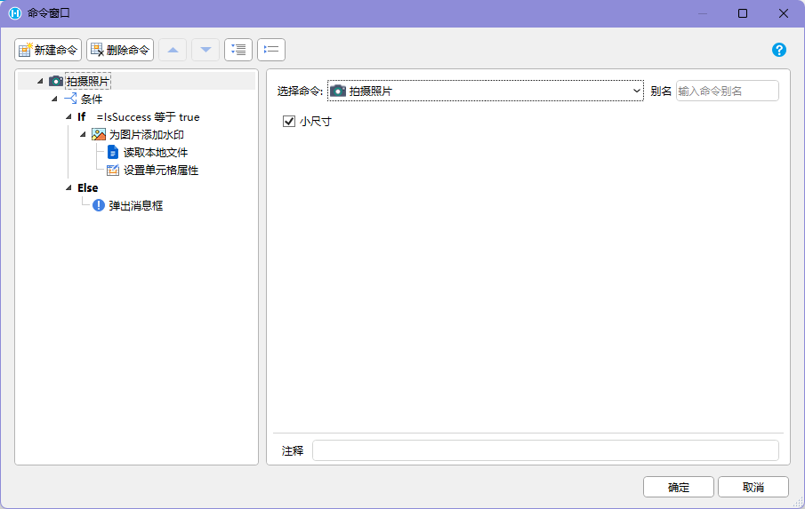
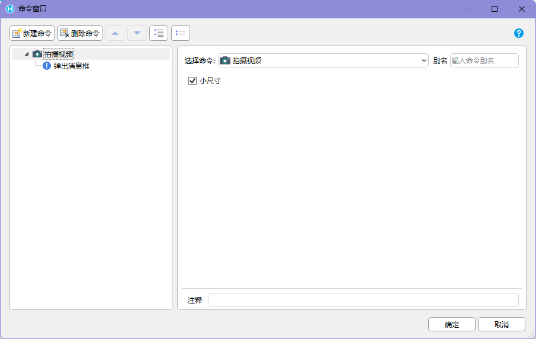
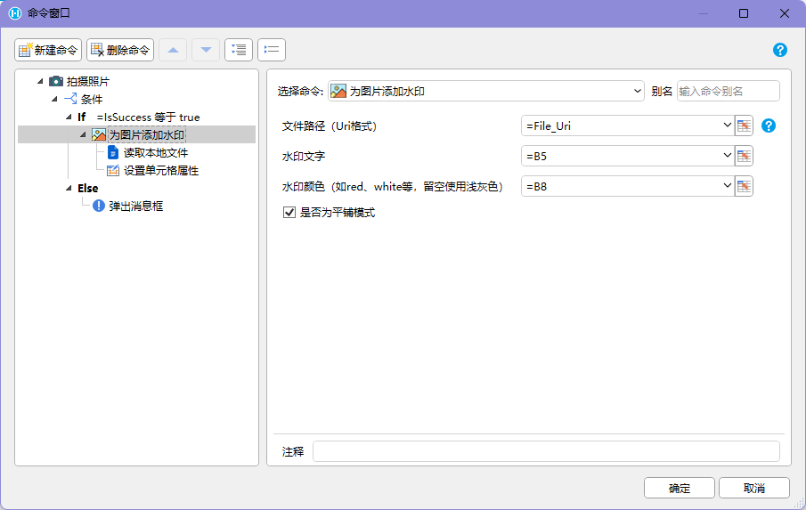
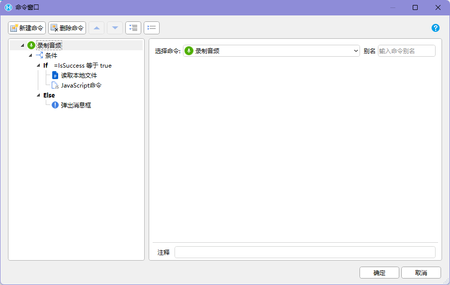

## 功能介绍

拍摄功能用于在 `HAC` 中调用 Android 设备的摄像头和麦克风，完成现场照片、视频和音频采集，并把生成的本地文件路径返回给活字格页面。

这类能力常用于需要“现场留痕”的业务，例如：

- 巡检拍照：记录设备状态、异常位置和维修前后对比
- 入库验收：拍摄货物外观、包装破损或随货单据
- 质量检查：拍摄缺陷照片，并叠加时间、人员或位置水印
- 现场施工：录制处理过程视频或口述说明音频
- 售后服务：采集现场证据后上传到服务端

拍摄类命令返回的通常不是文件内容，而是本地文件的 `Uri` 格式路径。后续如果要把照片显示到图片单元格中，或把照片、视频、音频作为参数传给服务端命令，需要再配合【读取本地文件】命令把文件内容转换为可传递的文本。

## 适用前提

使用拍摄能力前，需要确认以下条件：

- 应用运行在支持该能力的 Android 容器中，例如 `HAC`
- 活字格应用已安装并使用对应的 PDA / Android 交互命令插件
- 设备已授权相机、麦克风和本地文件访问权限
- 设备有可用存储空间，且业务允许把采集文件临时保存在本机
- 页面已设计好拍摄成功、拍摄取消、权限不足和文件读取失败时的处理方式

:::caution[重要]
如果只是在普通 PC 浏览器中访问页面，无法按这些插件命令的方式调用 Android 原生拍摄和录音能力。
:::

## 命令汇总

| 命令 | 类型 | 返回结果 | 主要用途 |
| --- | --- | --- | --- |
| 【拍摄照片】 | 异步 | 照片文件的 `Uri` 路径 | 调用相机拍摄现场照片 |
| 【拍摄视频】 | 异步 | 视频文件的 `Uri` 路径 | 调用相机录制现场视频 |
| 【为照片添加水印】 | 异步 | 添加水印后的照片文件 `Uri` 路径 | 给照片叠加业务水印 |
| 【录制音频】 | 异步 | `mp3` 文件的 `Uri` 路径 | 录制现场音频说明 |
| 【读取本地文件】 | 同步或异步，按插件实现为准 | `Object Url` 格式文本 | 读取本地文件内容并转换为可展示或上传的数据 |

拍摄照片、拍摄视频、为照片添加水印和录制音频都属于需要用户操作或系统处理的命令，页面上应按异步流程处理返回结果。

### 测试效果
 
 

## 拍摄照片

【拍摄照片】命令会打开设备相机进行拍照。拍摄完成后，命令把照片文件路径的 `Uri` 作为参数调用子命令。



推荐流程：

```text
点击“拍照”
-> 执行【拍摄照片】
-> 用户完成拍摄
-> 命令返回照片文件 Uri
-> 把 Uri 保存到变量或单元格
-> 如需展示或上传，继续执行【读取本地文件】
```

照片尺寸可以根据业务需求选择：

| 模式 | 适用场景 | 建议 |
| --- | --- | --- |
| 小尺寸照片 | 巡检记录、验收留痕、列表预览、弱网提交 | 根据设备不同，最长边不超过 `720px`、`960px` 或 `1000px` |
| 全尺寸照片 | 质量判定、缺陷放大查看、证据留存 | 只在确实需要高清细节时使用 |

现场业务通常优先使用小尺寸照片。全尺寸照片会增加读取、预览和上传耗时，在弱网或低端 PDA 上更容易造成卡顿。

## 拍摄视频

【拍摄视频】命令会打开设备相机进行录像。具体操作方式与【拍摄照片】类似，录制完成后返回视频文件的 `Uri` 路径，并将该路径作为参数调用子命令。



推荐流程：

```text
点击“录像”
-> 执行【拍摄视频】
-> 用户完成录制
-> 命令返回视频文件 Uri
-> 把 Uri 保存到变量或单元格
-> 如需播放或上传，继续执行【读取本地文件】
```

视频文件通常比照片更大，页面设计时需要控制使用场景：

- 限制单次录制时长，避免生成过大的本地文件
- 在上传前显示“正在读取”或“正在上传”状态
- 弱网环境下建议支持稍后上传或重新上传
- 如果只是记录简单说明，优先考虑【录制音频】

## 为照片添加水印

【为照片添加水印】命令用于给指定照片叠加水印。照片路径使用 `Uri` 格式，通常来自【拍摄照片】命令。



如果要处理上一次操作的照片，可以把“文件路径”留空，由命令使用最近一次拍摄或处理的照片。为了避免误用旧照片，业务页面仍建议在界面上显示当前照片的预览或文件状态。

水印支持两种模式：

| 水印模式 | 表现 | 适用场景 |
| --- | --- | --- |
| 居中模式 | 在照片中间叠加一组水印 | 单张证据照片、质检照片、签收照片 |
| 45 度角平铺模式 | 以 45 度角重复铺满照片 | 防止截图复用、外发照片防篡改 |

推荐流程：

```text
执行【拍摄照片】
-> 返回照片文件 Uri
-> 执行【为照片添加水印】
-> 传入照片 Uri、水印内容和水印模式
-> 返回添加水印后的照片 Uri
-> 如需展示或上传，继续执行【读取本地文件】
```

水印内容建议至少包含业务可追溯信息，例如操作人、时间、任务编号、客户或地点。涉及隐私或外发照片时，不要把敏感信息明文叠加到照片中。

## 录制音频

【录制音频】命令用于调用设备麦克风录制音频。录制完成后，命令会把音频压缩为 `mp3` 格式，并将文件路径的 `Uri` 作为参数调用子命令。



推荐流程：

```text
点击“录音”
-> 执行【录制音频】
-> 用户完成录音
-> 命令压缩为 mp3
-> 返回音频文件 Uri
-> 把 Uri 保存到变量或单元格
-> 如需播放或上传，继续执行【读取本地文件】
```

录音页面要明确显示当前状态，避免用户不知道是否已经开始录制：

| 阶段 | 页面提示 |
| --- | --- |
| 等待录制 | 点击录音后开始采集现场说明 |
| 正在录制 | 正在录音，请靠近麦克风 |
| 压缩中 | 正在处理音频，请稍候 |
| 录制成功 | 已生成音频文件 |
| 录制取消 | 未保存音频 |
| 权限不足 | 当前设备未授权麦克风权限 |

## 读取本地文件

【读取本地文件】命令用于读取本地文件内容。文件路径使用 `Uri` 格式，通常来自【拍摄照片】、【拍摄视频】、【为照片添加水印】或【录制音频】等命令。


如果要读取上一次操作的照片，可以把“文件路径”留空。对正式业务流程，仍建议显式传入当前文件 `Uri`，这样更容易排查用户拍错、重拍或多文件连续处理时的问题。

命令会把文件内容转换为 `Object Url` 格式的文本后返回到变量中。它的形态类似：

```text
data:image/jpeg;base64,/9j/4AAQSkZJRgABAQAAAQABAAD/2wBDAAEBAQE...
```

这段文本包含两部分：

- `MIME`：说明文件类型，例如 `image/jpeg`、`video/mp4`、`audio/mpeg`
- `base64`：文件二进制内容的文本编码

读取后的 `Object Url` 常用于：

- 写入图片单元格，直接展示拍摄照片
- 写入音视频播放单元格，播放本地采集的音频或视频
- 作为参数调用服务端命令，由服务端保存为附件或业务文件

需要注意，`base64` 文本会比原始文件更大。读取全尺寸照片或视频时，页面内存、传输耗时和服务端请求大小都需要提前评估。

## 推荐页面流程

照片采集并上传的页面可以按下面的流程设计：

```text
进入任务页面
-> 点击“拍照”
-> 执行【拍摄照片】
-> 返回照片 Uri
-> 执行【为照片添加水印】
-> 返回水印照片 Uri
-> 执行【读取本地文件】
-> 返回 Object Url
-> 图片单元格显示预览
-> 用户确认
-> 调用服务端命令保存文件和业务数据
```

如果现场网络不稳定，可以先保存文件 `Uri` 和业务主键，等网络恢复后再读取文件并上传。页面上要显示“未上传”“上传中”“已上传”“上传失败”等状态，避免用户误以为拍摄完成就已经保存到服务端。

## 异常处理

拍摄类功能不要只显示“失败”。现场用户需要知道下一步能做什么。

| 异常 | 可能原因 | 推荐处理 |
| --- | --- | --- |
| 相机无法打开 | 未授权相机权限、设备无摄像头、相机被占用 | 提示检查权限或重启相机，允许稍后重试 |
| 用户取消拍摄 | 用户主动返回或关闭相机 | 保留原照片状态，不自动提交 |
| 文件路径为空 | 未完成拍摄、上次文件不存在、传参错误 | 提示重新拍摄，并记录当前命令返回值 |
| 读取本地文件失败 | Uri 无效、文件被清理、权限不足 | 提示重新拍摄或重新选择文件 |
| 文件过大 | 全尺寸照片、长视频、网络较差 | 提示压缩、缩短录制时长或改用小尺寸 |
| 水印失败 | 图片 Uri 无效、水印参数为空、文件不可写 | 保留原照片，允许重新添加水印 |
| 麦克风不可用 | 未授权麦克风权限、设备硬件异常 | 提示授权或更换设备 |
| 上传失败 | 弱网、服务端限制、请求体过大 | 保留本地文件状态，允许重试上传 |

## 页面设计注意点

- 拍摄按钮应靠近当前任务信息，让用户明确正在给哪个对象留痕。
- 拍摄完成后要显示预览、重拍和确认动作，避免拍错对象后直接上传。
- 同一任务需要多张照片时，应显示已拍数量和每张照片的状态。
- 上传前后要区分“已拍摄”和“已保存到服务端”，不要把两个状态混在一起。
- 弱网场景下，建议支持本地暂存和重试上传。
- 涉及质量、安全或售后证据时，应记录操作人、拍摄时间、设备、任务编号和上传结果。
- 使用水印时，水印不能遮挡关键缺陷区域；必要时允许用户重拍或切换水印模式。

## 使用边界

拍摄、录音、水印和读取本地文件都属于 Android 设备能力调用，不是普通 Web 页面能力。

使用时需要注意：

- 普通 PC 浏览器无法按插件命令调用设备相机、麦克风和本地文件 `Uri`。
- 不同 Android 设备的相机分辨率、文件路径格式和权限策略可能不同。
- 小尺寸照片的最长边限制会受设备能力影响，常见目标是 `720px`、`960px` 或 `1000px`。
- 文件 `Uri` 只表示本机路径，不等于文件已经上传到服务端。
- 要展示或上传文件内容，通常需要先执行【读取本地文件】。
- `Object Url` 中包含文件的完整二进制内容，写入变量、单元格或服务端参数时要考虑大小限制。

## 验收标准

一个拍摄页面至少应满足以下标准：

1. 拍摄、录像、录音命令完成后，页面能保存返回的文件 `Uri`。
2. 需要展示或上传文件时，页面会继续执行【读取本地文件】并处理返回的 `Object Url`。
3. 用户取消、权限不足、文件读取失败和上传失败时，页面有明确提示和重试入口。
4. 照片水印模式、内容和处理后的文件路径可被业务流程追踪。
5. 页面能区分本地已采集、已读取、上传中、已上传和上传失败状态。
