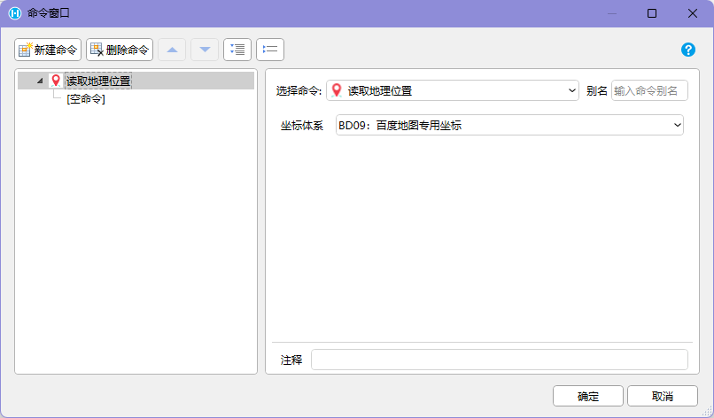
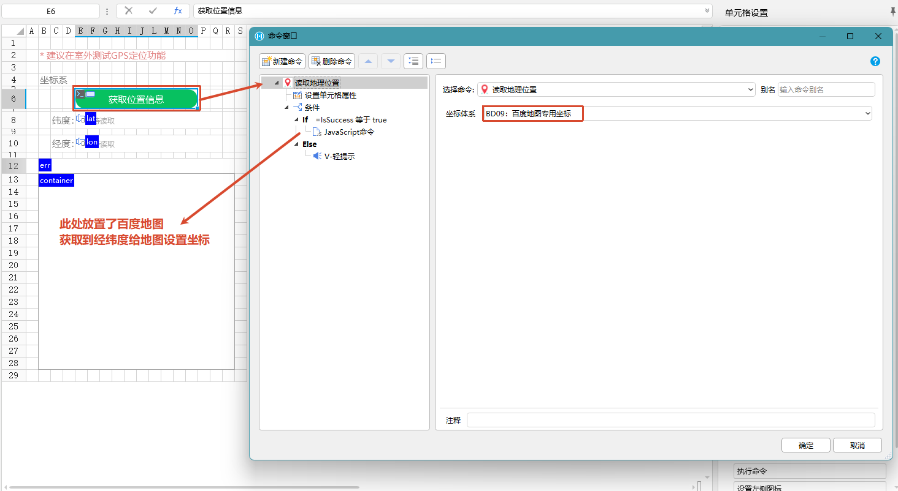

## 适用场景

定位用于在 PDA 或 Android 设备上获取当前位置，并写入活字格页面。常见于现场签到、物流跟踪、巡检打卡、门店拜访和异常上报。

如果业务只需要用户选择地址，可以使用普通表单；如果需要证明“设备当时在现场”，应使用定位命令并记录操作人、设备和时间。

## 使用前提

- 应用运行在 `HAC` 中。
- 已安装 PDA / Android 交互命令插件。
- 设备已开启定位服务，并授予定位权限。
- 现场网络、GPS 信号或基站 / Wi-Fi 定位可用。
- 已明确业务使用的坐标系。

## 命令速查

| 命令 | 类型 | 建议 |
| --- | --- | --- |
| 【读取地理位置】 | 异步 | 推荐使用，便于处理等待和失败状态 |
| 【读取地理位置到单元格】 | 同步 | 适合简单表格式页面 |

命令会优先读取 GPS 数据，也可能使用网络定位。常见输出包括：

```text
Latitude   纬度
Longitude  经度
IsSuccess  是否成功
Error      错误信息
```

坐标系：

| 坐标系 | 适用地图 |
| --- | --- |
| WGS84 | Google Map 等国外地图 |
| GCJ02 | 高德、腾讯等国内地图 |
| BD09 | 百度地图 |




## 推荐流程

```text
用户点击“获取位置”
-> 页面显示定位中
-> 执行【读取地理位置】
-> 成功：写入经纬度、坐标系、时间和设备信息
-> 失败：显示错误信息并允许重试
-> 提交业务时一并保存定位结果
```

## 设计要点

- 不要在页面加载时频繁自动定位，除非业务确实需要。
- 定位中要给出等待状态，避免用户重复点击。
- 位置用于考勤、巡检或签收时，应记录坐标系、定位时间、操作人和设备。
- 坐标只表示设备位置，不等同于业务对象已被真实检查。
- 定位失败时应提供重试或备用流程，例如扫码确认现场对象。

## 异常处理

| 异常 | 常见原因 | 推荐处理 |
| --- | --- | --- |
| 定位失败 | 权限未开、定位服务关闭、信号弱 | 提示开启权限和定位服务，允许重试 |
| 定位很慢 | 室内、冷启动、网络差 | 显示等待状态，必要时允许跳过并记录原因 |
| 坐标偏移 | 坐标系选择错误 | 按地图类型选择 WGS84、GCJ02 或 BD09 |
| 当前不在 HAC 中 | 普通浏览器无法调用插件命令 | 隐藏入口或提示在 HAC 中使用 |

## 验收标准

1. 目标设备上能成功弹出权限或读取定位结果。
2. 经纬度、是否成功、错误信息能写入指定变量或单元格。
3. 页面能处理权限不足、定位失败和重试。
4. 使用地图展示时，坐标系选择正确。
5. 业务记录中能追溯操作人、设备、时间和定位结果。
