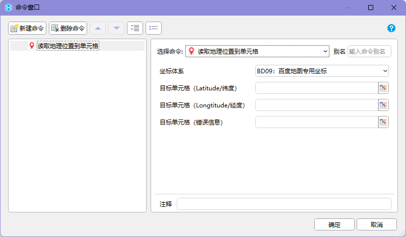

## 功能介绍

定位功能用于在移动设备上获取当前位置，并把位置信息写入活字格页面。它主要面向物流自动跟踪、人员现场签到等需要记录现场位置的业务场景。

在这些场景中，定位速度和定位精度会直接影响最终用户的使用体验。因此，`PDA（Android）交互命令`插件没有只依赖普通网页能力，而是尽可能利用 Android 平台的系统能力，通过原生代码实现获取当前地理位置的方法。

插件将这个原生定位能力封装为【读取地理位置】和【读取地理位置到单元格】插件命令，活字格开发者可以在页面命令中直接使用。

## 命令行为

- 【读取地理位置】命令是<u>**异步**</u>命令。**🌟推荐使用**
- 【读取地理位置到单元格】命令是<u>**同步**</u>命令。

|  |  |
| :---: | :---: |

命令执行后，会通过 `GPS` 或网络连接读取地理位置，并优先读取 `GPS` 数据。读取到地理位置后，命令会自动将经度和纬度填充到目标单元格。

可以把执行过程理解为：

```text
执行【读取地理位置】命令
-> 通过 GPS 或网络连接获取当前位置
-> 优先读取 GPS 数据
-> 获取成功后返回地理位置
-> 将经度和纬度写入目标单元格
```

## 输出结果

该命令的输出结果是**地理位置坐标、读取结果和错误信息**，并写入开发者指定的目标单元格。

通常需要准备四个目标单元格：

```text
Latitude 经度
Longitude 纬度
IsSucess 是否读取成功
Error 错误信息
```

定位成功后，经度和纬度会分别填充到对应单元格，后续即可在活字格页面或业务流程中继续使用这些坐标数据。

我们提供了相应的示例工程Demo，运行测试效果：


定位坐标体系提供：

- WGS84：用于国外的地图软件，如Google Map
- BD09：用于百度地图
- GCJ02：用于除百度外的其他国产地图，如高德地图等

## 所属插件

插件命令来自 `PDA（Android）交互命令`插件。

该插件是 `PDA` 解决方案的一部分，适用于安装有 Android 或鸿蒙系统的手机、`PDA` 设备，并需要配合 `HAC` 使用。

除获取地理位置外，该插件还提供以下能力：

- 扫码，支持广播模式
- 获取地理位置
- 定制 `APP` 配置

## 使用边界

这个功能不是普通网页里的地图展示能力，而是 `HAC` 运行环境下的设备能力调用。

因此，使用该功能时需要同时满足两个前提：

- 活字格应用使用了 `PDA（Android）交互命令`插件
- 应用运行在配合 `HAC` 的 Android 或鸿蒙设备上

如果只是普通浏览器访问页面，则不能按这个插件命令的方式调用 Android 原生定位能力。

