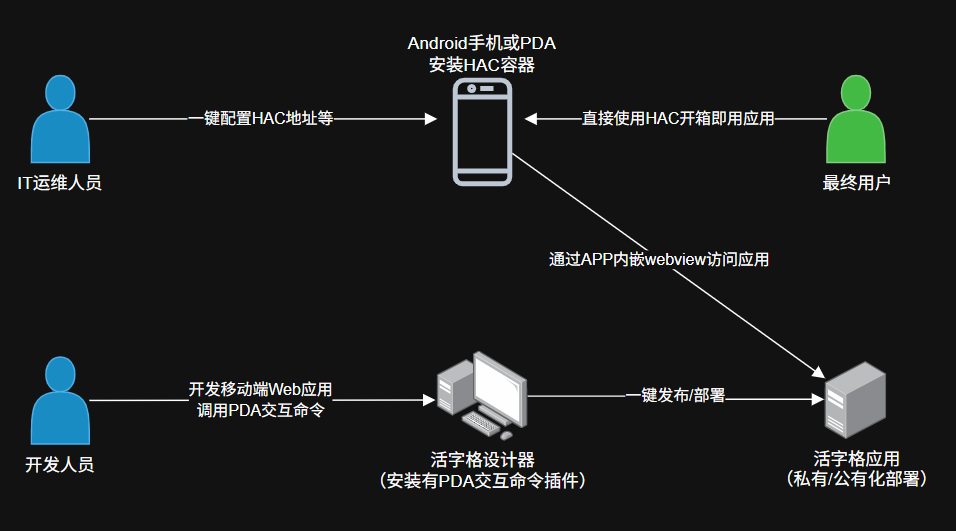

## 场景定义

`PDA` 设备，使用场景常见于仓储、物流、门店、巡检、生产线等现场作业，页面通常配合扫码枪、物理按键、数字键盘和弱网环境使用。

它和普通手机浏览器的主要区别不在业务规则，而在使用环境和设备能力：

- 屏幕更小，常见宽度可能是 `240px`、`280px`、`320px`
- 系统和 `WebView` 版本可能较旧
- 输入以扫码枪、回车、物理按键和数字录入为主
- 网络环境不稳定，可能需要离线暂存和补传
- 用户通常需要连续高频作业，而不是偶尔查看

## 适用业务

- 仓库收货、上架、拣货、出库、复核
- 库存盘点、库位调整、批次追溯
- 物流签收、分拣、装车、交接
- 门店收货、调拨、退货、库存核对
- 设备巡检、生产报工、工序流转

## HAC是什么

HAC(Huozige Android Container)，简称活字格安卓容器，活字格安卓容器通常运行在 `PDA` 设备上，是一款开源的、在安卓系统上针对活字格开发的应用运行容器。我们可以将在活字格中开发的移动端页面，发布部署后，就可以直接配置在`HAC APP`中，最终用户就可以通过`HAC APP`直接使用、访问活字格发布的应用。

## 下载与安装

- 运行环境：**Android版本 >= 8.0，运行内存 >= 2GB**
- HAC APP：[点击下载](https://github.com/kadbbz/HAC_lowcode_app_for_android_based_on_webview/releases)
- HAC 插件：[点击下载](https://marketplace.grapecity.com.cn/ApplicationDetails?productID=SP2209070004)
- 配置码生成器：<a href="https://hac.app.hzgcloud.cn/config" target="_blank" rel="noopener noreferrer">一键生成和导出配置码</a>

## 使用方法

1. 开发人员在活字格设计器上安装【PDA交互命令】插件
2. 开发人员在开发应用时，使用该插件提供的功能
3. 开发人员将应用发布到公有化或私有化部署的服务器
4. IT运维人员在浏览器中打开配置码生成器，输入步骤3中发布的应用的URL地址，以及其他配置信息，生成配置码并将其导出为PDF
5. IT运维人员在PDA上安装HAC（应用名：业务平台）
6. IT运维人员打开HAC，点击扫码图标，扫描步骤4生成的PDF文件中的二维码
7. 确认无误后，将PDA交给业务人员使用

| **厂商**                               | **广播名称（Action）**                      | **广播键值（Extra）** |
| :------------------------------------- | :------------------------------------------ | :-------------------- |
| 东大集成（Q9等老产品，扫描头）         | com.android.server.scan                     | scannerdata           |
| 东大集成（小码哥等新产品，扫描头/UHF） | com.android.server.scannerservice.broadcast | scannerdata           |
| 优博讯（扫描头）                       | android.intent.ACTION_DECODE_DATA           | barcode_string        |
| 优博讯（UHF）                          | com.ubx.scan.rfid                           | rfid_data             |
| 盈达iData                              | android.intent.action.SCANRESULT            | value                 |
| 成为（扫描头）                         | com.scanner.broadcast                       | data                  |
| 成为（UHF）                            | com.rscja.scanner.action.scanner.RFID       | data                  |
| 商米                                   | com.sunmi.scanner.ACTION_DATA_CODE_RECEIVED | data                  |
| 斑马/Zebra                             | 参考配置教程                                | 参考配置教程          |
> 注意：典型厂商的扫描头广播名称和键值（默认值，用户或管理员可能做过修改）。
> 需要在厂商提供的设置程序中，将扫码模式修改为“广播”或“Intent”，才能正常使用。扫描头和`UHF`的广播通常需要在不同的`APP`中单独配置。以优博讯的`DT50U`为例，`RFID`在`RFIDWedge`应用中配置，扫描头在【设置】APP中“扫描设置”菜单里配置。如果遇到困难，请联系设备厂商寻求技术支持。

## 支持设备

除了常见的安卓手机外，我们使用一些主流`PDA`设备进行兼容性测试，结果如下所示：

|                    **设备型号**                    | **基础功能** | **照片上传** | **文件上传** | **摄像头扫码** | **扫描头扫码** |  **RFID扫码**  |
| :------------------------------------------------: | :----------: | :----------: | :----------: | :------------: | :------------: | :------------: |
| 东大集成 Q9/Q9C/Q7/小码哥A/小码哥5G/UTOUCH/UTOUCH2 |      √       |      √       |      √       |       √        |       √        | UTouch/UTOUCH2 |
|        优博讯 DT40/DT50/DT50U（Android 11）        |      √       |      √       |      √       |       √        |       √        |     DT50U      |
|           盈达 P50/iData50（Android 9）            |      √       |      √       |      √       |       √        |       √        |                |
|               成为 C72（Android 11）               |      √       |      √       |      √       |       √        |       √        |       √        |

蓝牙打印机的兼容性测试结果：

| 设备型号    | 功能验证 |
| ----------- | -------- |
| 德佟DP30    | √        |
| 佳博GP-M322 | √        |

## 常见问题

- 方案仅能用在PDA上吗，可以在手机上使用吗？
> HAC是Android的原生应用，在版本不低于8.0，运行内存不低于2GB的Android设备上均可运行。考虑到内置对Android应用的支持，鸿蒙OS上也可以安装使用HAC。 

- HAC和官方的Android APP有什么区别？
> 在执行效果上，两者差异不大，均可以用来“打包”使用活字格开发的Web应用。在技术上，HAC采用Java开发，开放源代码。开发者无需掌握ReactNative框架，只要会Java和Android原生APP开发就可以接手进行扩展开发，最大化利用Android开发生态中的各类资源和开源类库。

- 我可以直接在HAC中展示PC端页面吗？
> 如果使用的终端是主流的平板电脑或高性能手机，这样做是可以的。但是，使用Cortex-A53低功耗CPU的PDA的处理能力通常远低于手机，您需要在开发时做好性能优化，这意味着PDA的页面设计与其他设备不同。

- 我可以定制应用的名称和图标吗？
> 可以，但这个事情需要一定的动手能力。

- 一台PDA上可以安装两个HAC吗？
> 不能。你需要获取源代码，修改包名、图标、应用名称等信息后分别打包成不同的应用后安装。

- 我可以将应用的首页地址和扫描器的参数内置进APP，无需配置，开箱即用吗？
> 可以。你需要做的事情是从码云获取HAC的最新代码，修改strings.xml中app_default_entry、feature_scanner_broadcast_name、feature_scanner_extra_key_barcode_broadcast、feature_uhf_broadcast_name、feature_uhf_extra_key_barcode_broadcast的值，然后自行编译。这一操作的原理是，如果app_default_entry不为空，APP会跳过配置页面，在第一次打开时，直接进入Web页面。

- 我该如何启用UHF/RFID的广播功能？
> 如果您手头有PDA的说明文档，请在文档中查找关于“RFID设置”或“UHF”设置的章节。通常情况下，设备厂商会提供一个设置程序，如东大集成的UHF或优博讯的RFIDWEDGE。在这个程序中，您首先需要打开广播功能，然后配置广播的action和包含有您需要的属性（如EPC）的extra的key。如果您的设备在厂商的服务期内，也可以直接对接厂商客服，比如这样说：“我现在使用的软件用广播的方式读取UHF的扫描结果，软件配置界面上要求提供广播Action和Extra key，如com.rscja.scanner.action.scanner.RFID和data，你们的设备该如何启用广播，从哪里看到或修改这两个值？”

- 我可以通过这个方案获取当前的位置信息吗？
> 可以。你可以通过标准的H5方法（getCurrentLocation）获取地理位置，或采用插件中提供的“获取地理位置”命令，获取指定坐标系的地理位置坐标。考虑到Android的机制，我们推荐您采用后者，响应速度更快。

- 什么时候该启用硬件加速？
> 这里的硬件加速主要是提升渲染速度，如果你的应用运行在较新的手机上，硬件加速可以让页面刷新更流畅，如果运行在PDA上，推荐关闭硬件加速。当然，任何时候，如果你发现页面展示有问题，比如有一部分区域是模糊的，请关闭硬件加速。

- HAC启动时提示WebView版本过低怎么办？
> 活字格适配的WebView主版本为87或更新（VersionName中的第一段，如88.0.3359.158的主版本是88），您可以在APP内置的【设置】界面上看到当前设备中WebView的版本。我们强烈推荐您联系设备厂商，升级WebView组件，否则可能会遭遇页面渲染错误、操作卡顿或无法加载的问题；如果因为设备原因确实无法升级，可在【设置】界面上勾选“跳过WebView兼容性检查”，临时使用旧版本WebView，但此时活字格和插件将很难保证完美兼容。
