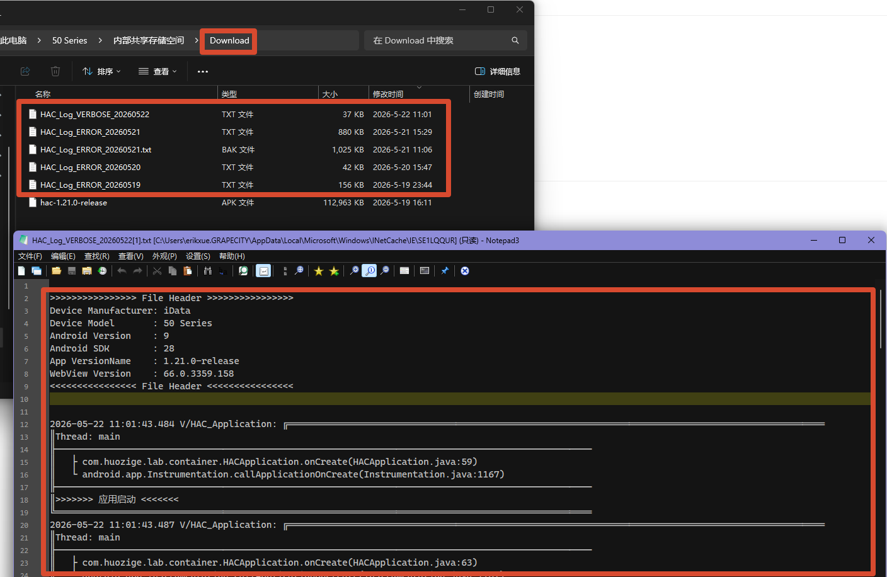
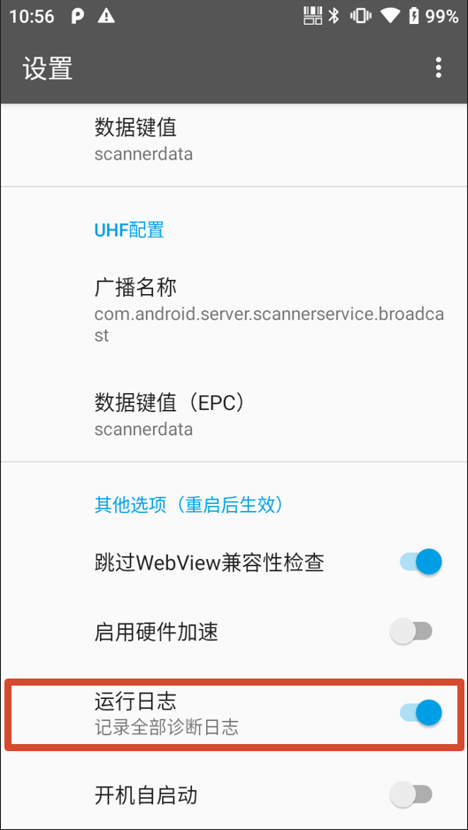

HAC 在运行过程中会记录关键逻辑节点和异常信息。遇到页面异常、设备兼容性问题、扫码或本地能力调用异常时，运行日志可以帮助开发和支持人员更快定位问题。

日志适合用于问题复现后的辅助分析。**日常使用中不建议长期打开详细日志**，以免影响性能或占用设备存储空间。

## 日志机制

HAC 会在重要逻辑节点和异常捕获处追加日志记录。和活字格服务端命令日志不同，HAC 运行在 Android 设备上，涉及设备、系统版本、WebView、本地能力调用和页面运行状态等多种因素，因此日志中会包含更多运行环境信息。

日志条目通常会附带当前运行线程和调用堆栈信息，便于开发人员判断异常发生的位置和调用链路。

## 文件位置

HAC 日志文件默认保存在设备的 `Download` 文件夹中。

 

日志文件名以 `HAC_LOG` 或类似前缀开头，例如：

```text
HAC_Log_ERROR_20240112.txt
```

日志文件按天拆分，默认保留最近 `7` 天。排查问题时，优先收集问题发生当天的日志文件；如果问题跨天复现，也应一并收集相邻日期的日志。

## 日志级别

综合性能、存储空间和问题调查便利性，HAC 日志分为两个常用级别：

- `error`：默认级别，只记录错误和异常相关信息
- `verbose`：诊断级别，会记录更详细的运行过程信息

默认情况下，HAC 只记录 `error` 日志。只有在需要配合排查问题时，才建议临时启用 `verbose` 日志。

## 启用诊断日志

如果需要开启更详细的日志记录，可以在 HAC 内置的“设置”页面中勾选“启用全部诊断日志”。

 

启用后，HAC 会记录更详细的运行过程信息，便于开发人员分析问题。

:::caution[重要]
日志记录策略需要杀掉 HAC 进程后重新启动才能生效。也可以直接重启设备，确保配置已经生效。
:::

问题调查结束后，建议关闭“启用诊断日志”，再重新启动 HAC。这样可以避免长期记录详细日志带来的性能影响，也能降低日志文件占满设备存储空间的风险。

## 查看与转存

可以通过以下方式获取日志：

- 在设备文件管理器中打开 `Download` 或 `Downloads` 文件夹，找到 HAC 日志文件。
- 使用 USB 数据线把日志文件复制到电脑。
- 使用蓝牙、文件传输工具或企业内部工具转存日志。
- 在设备上使用 Android 内置的 HTML 查看程序或文本查看程序直接打开日志文件。

向开发或支持人员反馈问题时，建议同时提供：

- 问题发生时间
- 复现步骤
- 设备型号
- Android 版本
- WebView 版本
- HAC 版本
- 问题发生当天的 HAC 日志文件

这些信息可以帮助日志和实际操作过程对齐，减少反复确认环境信息的时间。

## 排查建议

如果问题和 HAC 内部加载的 Web 页面有关，可以先通过远程调试查看页面运行状态，再结合 HAC 日志分析本地容器侧的问题。

常见组合排查方式：

- 页面按钮无响应：先看 DevTools `Console` 是否有脚本错误，再查看 HAC 日志中是否有本地能力调用异常。
- 扫码结果没有写入页面：检查扫码广播配置、页面事件响应和 HAC 日志中的扫码处理记录。
- 文件、照片或定位能力异常：查看页面请求、Android 权限状态和 HAC 日志中的异常堆栈。
- 只在某一台 PDA 上异常：记录设备型号、系统版本、WebView 版本，并收集该设备的 HAC 日志。

如果还需要调试 HAC 中加载的 Web 页面，可以参考[调试](./how-to-debug-hac/)。
