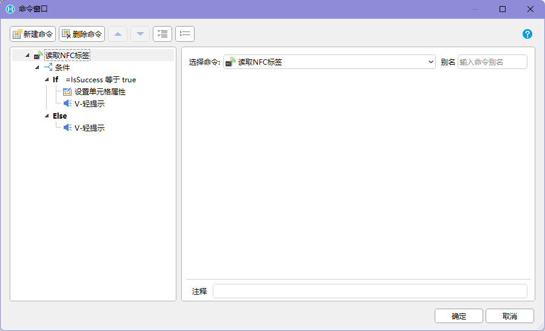
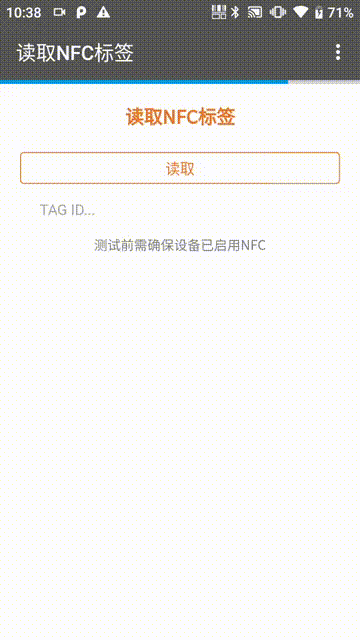

## 适用场景

NFC 用于让 Android 手机或 PDA 贴近标签后读取标识信息，并写入活字格页面。它适合“必须到现场、必须贴近对象”的确认场景，例如设备巡检、资产盘点、工位确认、货架检查和物流交接。

如果业务需要快速处理大量物料，扫码通常更高效；如果业务需要证明人员到达具体对象旁边，NFC 更合适。

## 使用前提

- 设备支持 NFC。
- Android 系统已开启 NFC。
- 应用运行在 `HAC` 中。
- 已安装 PDA / Android 交互命令插件。
- NFC 标签格式和业务系统约定一致。
- 现场人员知道设备 NFC 感应区域的位置。

## 命令速查

| 命令 | 类型 | 建议 |
| --- | --- | --- |
| 【读取NFC标签】 | 异步 | 推荐使用，便于处理状态和失败 |
| 【读取NFC标签到单元格】 | 同步 | 适合简单表格式页面 |

常见返回字段：

```text
TagId      标签唯一标识
IsSuccess  是否读取成功
Error      错误信息
```




## 推荐流程

```text
进入页面
-> 提示“请将 PDA 靠近 NFC 标签”
-> 用户贴近标签
-> 执行【读取NFC标签】
-> 成功：保存 TagId
-> 按业务规则查询和校验对象
-> 匹配成功：进入下一步
-> 匹配失败：显示原因并允许重新读取
```

## 设计要点

- 页面进入后直接提示贴近标签，不要先让用户找输入框。
- 读取中显示状态，避免用户过早移开设备。
- 读取成功后展示标签值和匹配到的业务对象。
- 标签不匹配时保留读取值，便于现场排查。
- 对同一标签短时间重复触发做防抖。
- 备用入口如手动输入或扫码要有权限和审计，避免绕过现场确认。

## 异常处理

| 异常 | 常见原因 | 推荐处理 |
| --- | --- | --- |
| 设备不支持 NFC | PDA 或手机无 NFC 模块 | 提示更换设备或使用备用方式 |
| NFC 未开启 | 系统设置关闭 NFC | 引导到系统设置开启 |
| 未读取到标签 | 距离远、角度不对、标签损坏 | 提示贴近后重试 |
| 标签格式不支持 | 标签不是项目约定格式 | 提示更换标签或联系管理员 |
| 标签不匹配 | 标签不属于当前任务 | 显示当前标签值，允许重读 |
| 重复读取 | 同一标签短时间多次触发 | 防抖并避免重复提交 |
| 业务校验失败 | 后台无对应对象或状态不可用 | 显示业务原因和恢复动作 |

## 验收标准

1. 目标设备能开启 NFC 并读取项目标签。
2. 页面能保存 `TagId`、读取结果和错误信息。
3. 标签匹配、标签不匹配、读取失败都有明确状态。
4. 重复读取不会造成重复提交。
5. 普通浏览器或不支持 NFC 的设备上有清晰提示或隐藏入口。
