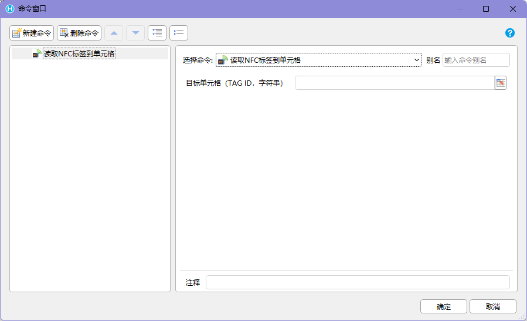

## 功能介绍

读取 NFC 标签用于让 Android 手机或 PDA 靠近 NFC 标签后，读取标签中的标识信息，并把结果写入活字格页面或变量中。

这个能力常用于需要“近距离确认对象”的现场业务，例如：

- 设备巡检：靠近设备上的 NFC 标签，确认当前巡检对象
- 资产盘点：读取资产标签，带出资产编号和资产信息
- 工位确认：读取工位标签，确认当前生产或报工位置
- 门店陈列检查：读取货架或区域标签，确认当前检查区域
- 物流交接：读取周转箱、托盘或交接点标签，确认作业对象

NFC 和扫码的使用体验不同。扫码通常可以隔一段距离识别条码；NFC 必须让设备靠近标签，距离很短，通常适合“必须到现场、必须贴近对象”的确认场景。

## 适用前提

使用 NFC 读取能力前，需要确认以下条件：

- 设备本身支持 NFC。
- Android 系统已开启 NFC 功能
- 应用运行在支持该能力的 Android 容器中，例如 `HAC`
- 活字格应用已安装并使用对应的 PDA / Android 交互命令插件
- NFC 标签格式和业务系统约定一致

如果设备没有 NFC 模块，或系统中关闭了 NFC，页面无法通过普通浏览器能力直接读取 NFC 标签。

## 建议页面流程

NFC 读取页面不建议做成普通“输入框 + 提交”表单。用户更自然的操作是打开页面后直接贴近标签。

推荐流程：

```text
进入页面
-> 页面提示“请将 PDA 靠近 NFC 标签”
-> 用户贴近标签
-> 系统读取标签
-> 页面显示读取中
-> 读取成功：写入标签编号或标签内容
-> 业务校验：判断标签是否属于当前任务
-> 成功后进入下一步
-> 失败时保留读取结果并显示原因
```

示例：设备巡检页面可以这样设计：

```text
打开巡检任务
-> 页面提示“请读取设备 NFC 标签”
-> 读取到设备编号
-> 系统校验是否为当前巡检设备
-> 匹配成功后展示巡检项
-> 不匹配时提示当前设备不属于该任务，并允许重新读取
```

## 页面展示建议

读取 NFC 标签时，页面要让用户知道当前处于哪个阶段。

| 阶段 | 页面提示 |
| --- | --- |
| 等待读取 | 请将设备靠近 NFC 标签 |
| 正在读取 | 正在读取 NFC 标签，请保持贴近 |
| 读取成功 | 已读取标签：`TAG-0001` |
| 标签不匹配 | 标签不属于当前任务，请重新读取 |
| 读取失败 | 未读取到 NFC 标签，请确认设备 NFC 已开启 |
| 设备不支持 | 当前设备不支持 NFC，请更换设备或使用备用方式 |

如果业务允许，可以提供备用入口，例如手动输入编号、扫码、选择对象。但备用入口要有权限和审计记录，避免绕过现场确认。

## 命令行为

- 【读取NFC标签】命令是<u>**异步**</u>命令。**🌟推荐使用**
- 【读取NFC标签到单元格】命令是<u>**同步**</u>命令。

|  |  |
| :---: | :---: |

## 返回结果

不同插件版本或项目实现返回字段可能不同。设计页面时，主要返回下面几类结果：

```text
TagId：标签唯一标识
IsSuccess：是否读取成功
Error：错误信息
```

实际页面不一定要展示所有字段，但建议把关键字段记录下来，便于排查现场问题。

业务上通常用稳定的 `TagId` 或业务写入的唯一编号去匹配后台数据。

### 测试效果
 

## 命令使用建议

如果插件提供“读取 NFC 标签”类命令，建议优先把读取结果写入变量，再按业务需要写入单元格或触发后续命令。

推荐命令编排：

```text
读取 NFC 标签
-> 判断是否读取成功
-> 成功：根据 TagId 查询业务对象
-> 匹配：进入当前任务操作
-> 不匹配：显示原因，允许重新读取
-> 失败：显示错误信息和备用动作
```

如果项目提供“读取 NFC 标签到单元格”类命令，可以直接把标签编号、读取结果和错误信息写入页面上的目标单元格，再由单元格值变化或后续命令触发业务校验。

## 异常处理

NFC 读取失败时，不要只提示“读取失败”。要告诉用户可能原因和下一步。

常见异常：

| 异常 | 可能原因 | 推荐处理 |
| --- | --- | --- |
| 设备不支持 NFC | PDA 或手机没有 NFC 模块 | 提示更换设备或使用备用方式 |
| NFC 未开启 | 系统设置中关闭了 NFC | 提示到系统设置开启 NFC |
| 未读取到标签 | 距离太远、角度不对、标签损坏 | 提示重新贴近标签 |
| 标签格式不支持 | 标签不是系统约定格式 | 提示更换标签或联系管理员 |
| 标签不匹配 | 标签不属于当前任务 | 显示当前读取结果，允许重新读取 |
| 重复读取 | 同一个标签短时间多次触发 | 防抖，避免重复提交 |
| 业务校验失败 | 后台无对应对象或对象状态不可用 | 显示业务原因和恢复动作 |

错误文案示例：

```text
未读取到 NFC 标签，请将 PDA 背部靠近标签后重试。
```

```text
已读取标签 TAG-0001，但该标签不属于当前巡检任务，请重新读取正确设备。
```

```text
当前设备不支持 NFC，请更换支持 NFC 的 PDA，或使用扫码备用入口。
```

## 和扫码的区别

| 项目 | NFC | 扫码 |
| --- | --- | --- |
| 操作距离 | 需要贴近标签 | 可隔一定距离扫描 |
| 现场确认 | 更适合确认用户到达指定对象 | 更适合快速识别物料或单据 |
| 标签成本 | 需要 NFC 标签 | 使用条码或二维码 |
| 读取内容 | 标签 ID、NDEF 内容或项目约定数据 | 条码字符串 |
| 常见风险 | 设备不支持、NFC 未开启、标签损坏 | 光线、污损、重复扫码 |

如果业务要求“必须到设备旁边才能操作”，NFC 更适合。如果业务要求快速连续处理大量物料，扫码通常更高效。

## 页面设计注意点

- 页面进入后直接提示用户靠近 NFC 标签，不要先让用户找输入框。
- 读取中要显示状态，避免用户过早移开设备。
- 读取成功后要显示读取结果和业务对象，方便用户核对。
- 标签不匹配时要保留读取到的标签值，便于现场排查。
- 同一个标签短时间重复触发时要做防抖，避免重复提交业务记录。
- 如果 NFC 只是确认对象，不要把完整业务流程都放在 NFC 读取弹层里。
- 弱网场景下，读取结果可以先本地暂存，业务校验或提交失败时再重试。

## 使用边界

读取 NFC 标签属于 Android 设备能力调用，不是普通 Web 页面能力。

使用时需要注意：

- 普通 PC 浏览器无法读取 Android NFC 标签。
- 不支持 NFC 的手机或 PDA 无法使用该能力。
- 某些设备的 NFC 感应区域不在屏幕中心，现场培训时要说明贴近位置。
- NFC 标签可能存在不同格式，项目应提前统一写入规则。
- 如果标签用于安全或身份识别，应避免把敏感信息明文写入标签。

## 排查建议

遇到 NFC 读取异常时，建议按下面顺序排查：

1. 确认设备型号是否支持 NFC。
2. 确认 Android 系统 NFC 开关已打开。
3. 使用系统或厂商工具确认该标签能被设备读取。
4. 确认 HAC 和插件版本支持 NFC 读取能力。
5. 确认页面命令已正确保存读取结果和错误信息。
6. 确认标签内容或 `TagId` 能在业务表中查到对应对象。
7. 如果只在某台设备异常，收集设备型号、Android 版本、WebView 版本、HAC 版本和 HAC 日志。

调试 HAC 中的页面行为，可以参考[调试](./how-to-debug-hac/)；排查容器侧异常，可以参考[日志](./logs-hac/)。
