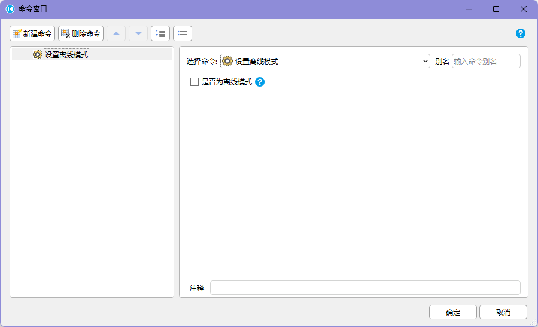
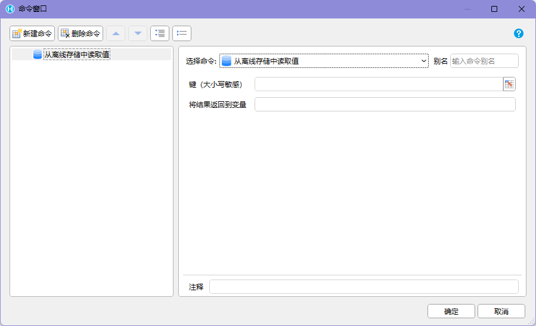
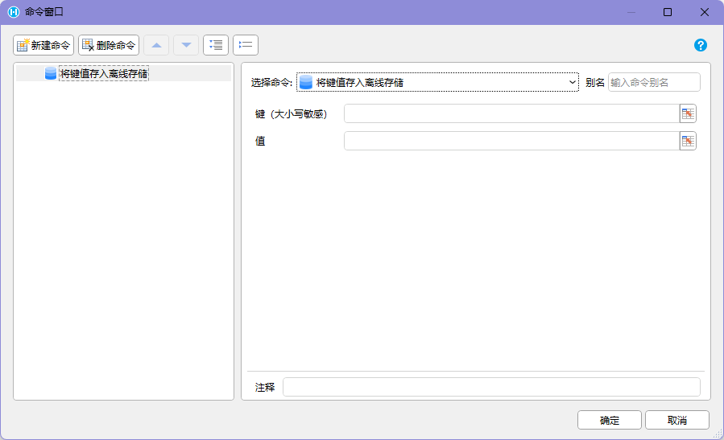
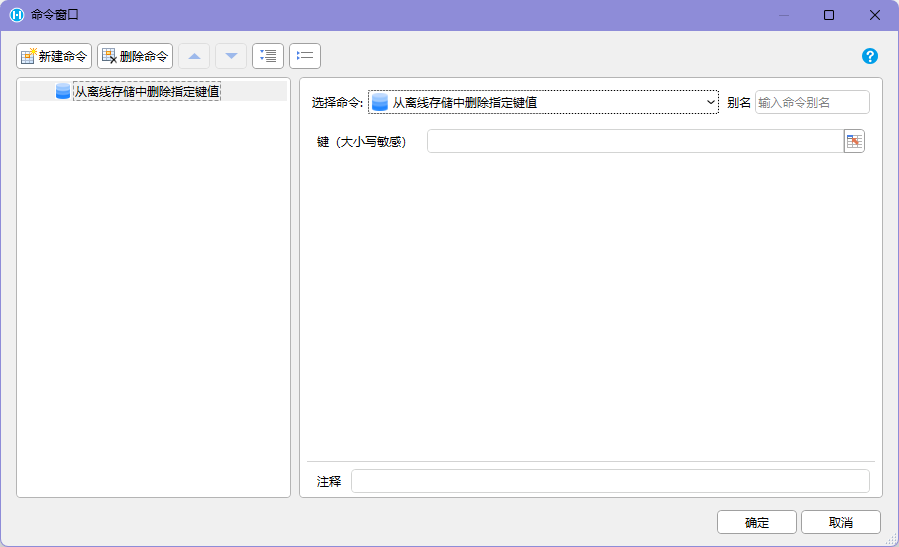
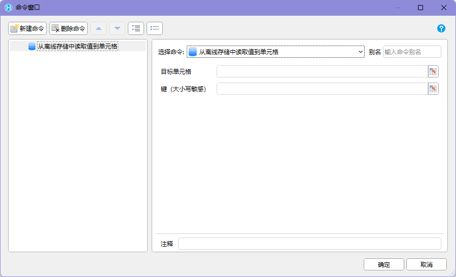

## 功能介绍

离线模式用于在 `HAC` 中控制页面的离线使用状态，并配合离线存储命令保存和读取本地数据。

该能力由`PDA（Android）交互命令`插件提供。开发者可以通过【设置离线模式】命令开启或关闭离线模式，并使用离线存储相关命令在手机本地存储中读写数据。

在离线模式下，页面导航功能会被禁用，用于避免用户在离线状态下误操作。需要注意的是，当前活字格应用内的页面跳转不受该限制影响。

## 设置离线模式

【设置离线模式】命令用于开启或关闭离线模式。



```text
开启离线模式
-> 页面导航功能禁用
-> 当前活字格应用内的页面跳转不受限制

关闭离线模式
-> 恢复正常页面导航能力
```

这个命令适合用于进入离线业务流程前后，明确控制用户所处的运行状态。

## 离线存储

离线模式功能还包含一组离线存储命令，用于在手机存储中保存、读取和删除键值数据。

缓存数据存放在手机的存储中，设备关机后依然保留。

### 从离线存储中读取值

【从离线存储中读取】命令用于从离线存储中读取指定键的值，并将读取结果存放到变量中。



如果没有找到指定键值，返回结果为：

```text
DATA_NOT_FOUND
```

基本流程如下：

```text
指定键
-> 从离线存储中读取
-> 找到数据：将值存放到变量
-> 未找到数据：返回 DATA_NOT_FOUND
```

### 将键值存入离线存储

【将键值存入离线存储】命令用于将指定值保存到离线存储中。



当传入的值为对象时，插件会自动将其序列化为 `JSON` 字符串后再存储。

基本流程如下：

```text
指定键和值
-> 写入手机本地存储
-> 如果值为对象，自动序列化为 JSON 字符串
-> 关机后数据依然保留
```

这个命令适合保存后续需要继续读取的本地缓存数据。

### 从离线存储中删除指定键值

【从离线存储中删除指定键值】命令用于从离线存储中删除指定键。



基本流程如下：

```text
指定键
-> 从离线存储中删除该键
```

当某个缓存数据已经不再需要，或需要重新写入新数据前，可以使用该命令清理旧键值。

### 从离线存储中读取值到单元格

【从离线存储中读取到单元格】命令用于从离线存储中读取指定键的值，并在读取完成后填充到单元格中。



如果没有找到指定键值，返回结果为：

```text
DATA_NOT_FOUND
```

基本流程如下：

```text
指定键和目标单元格
-> 从离线存储中读取
-> 找到数据：填充到目标单元格
-> 未找到数据：返回 DATA_NOT_FOUND
```

它和【从离线存储中读取】命令的区别在于：前者把结果存放到变量中，后者直接把结果填充到单元格中。

## 命令汇总

| 命令 | 功能 |
| --- | --- |
| 设置离线模式 | 开启或关闭离线模式 |
| 从离线存储中读取 | 读取指定键的值，并存放到变量中 |
| 将键值存入离线存储 | 将指定键值保存到手机本地存储中 |
| 从离线存储中删除指定键值 | 删除离线存储中的指定键 |
| 从离线存储中读取到单元格 | 读取指定键的值，并填充到目标单元格 |

## 使用边界

离线模式和离线存储命令属于 `HAC` 运行环境下的设备能力调用。

使用该功能时需要满足以下前提：

- 活字格应用使用了`PDA（Android）交互命令`插件
- 应用运行在配合 `HAC` 的 Android 或鸿蒙设备上
- 需要在命令中明确指定键、值、变量或目标单元格

如果只是普通浏览器访问页面，则不能按这些插件命令的方式调用手机本地离线存储能力。
