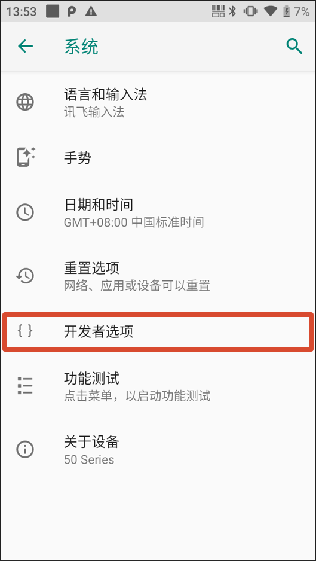
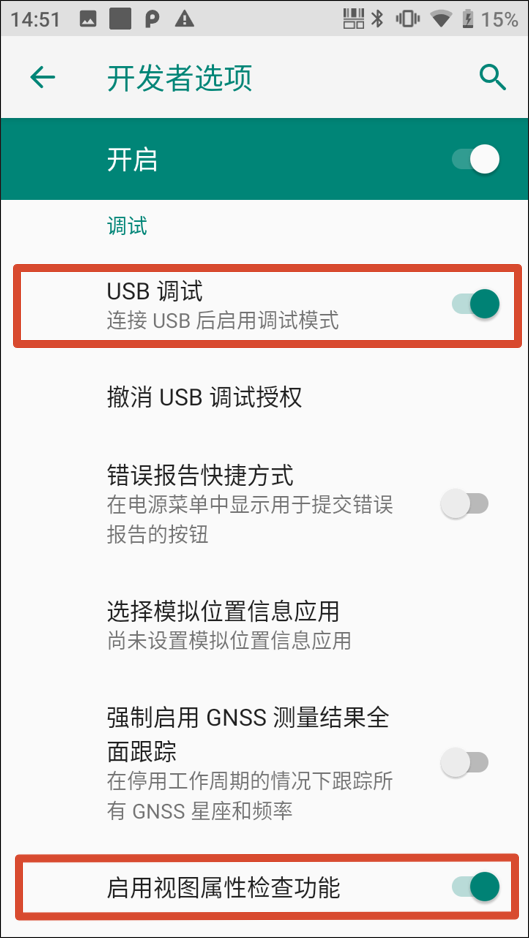

HAC 本质上是包含 `WebView` 的 Android 原生应用。页面白屏、按钮无响应、样式错位、接口失败、扫码结果没有写入页面时，优先用 `Chrome DevTools` 查看运行时状态。

## 准备工作

- 电脑已安装 Chrome；
- Android 手机或 PDA 已安装 HAC；
- 使用可传输数据的 USB 线连接设备；
- HAC 中已打开需要调试的活字格页面；
- PDA 厂商 USB 驱动已安装，设备 USB 模式不是“仅充电”。

## 开启 USB 调试

1. 在设备“关于手机 / 关于设备”中连续点击版本号，开启开发者选项；
2. 打开“USB 调试”；
3. 如有“启用视图属性检查功能”，一并开启；
4. 用 USB 线连接电脑；
5. 设备弹出授权提示时选择允许。

|  |  |
| :---: | :---: |

## 连接 DevTools

1. 电脑打开 Chrome；
2. 在地址栏输入以下地址；

   ```text
   chrome://inspect/#devices
   ```

3. 勾选 `Discover USB devices`；
4. 打开 HAC 并进入目标页面；
5. 在 `Remote Target` 中找到对应 `WebView`，点击 `inspect`。

## 排查顺序

| 面板 | 重点看什么 |
| --- | --- |
| Console | JavaScript 报错、能力不兼容、扫码后脚本异常 |
| Network | 接口状态码、资源加载、证书、跨域、超时 |
| Elements | 小屏布局、遮挡、透明、弹窗和底部按钮位置 |
| Application | 登录态、Local Storage、Session Storage、缓存数据 |

建议先看 `Console` 和 `Network`，再查样式和本地缓存。不要一开始就猜设备问题。

## 常见问题

| 问题 | 处理建议 |
| --- | --- |
| Chrome 看不到设备 | 换数据线或 USB 口，切换为文件传输，重新授权 USB 调试，安装厂商驱动 |
| 能看到设备，看不到 HAC 页面 | 确认 HAC 在前台并已进入实际业务页面，刷新 `chrome://inspect` |
| 点击 inspect 后断开 | 保持 HAC 前台运行，重试；WebView 过旧时联系厂商升级 |
| 浏览器正常，HAC 异常 | 检查 WebView 版本、移动端布局、接口地址、证书、设备网络和插件能力 |

## 反馈问题时收集

- 复现步骤和问题发生时间；
- 设备型号、Android 版本、WebView 版本、HAC 版本；
- 网络环境和服务器地址类型；
- DevTools Console / Network 关键错误；
- 同一页面在 PC 浏览器和 HAC 中的表现差异。

需要容器侧日志时，继续参考[日志](./logging/)。
