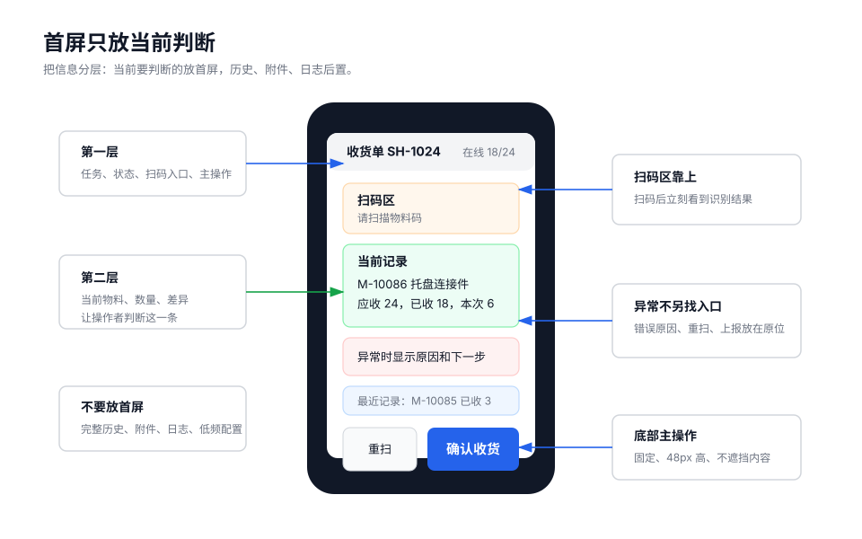
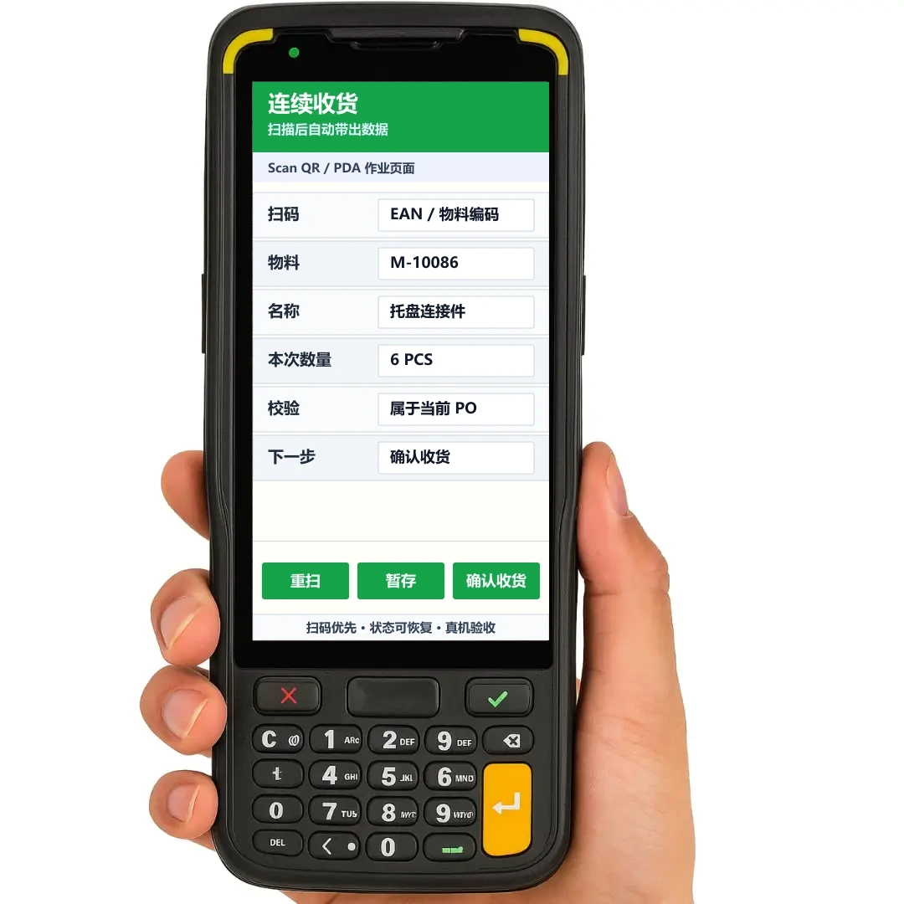

PDA 页面应围绕当前任务组织信息。首屏只承担当前判断和下一步操作，低频信息后置。

## 首屏内容

首屏优先回答以下问题：

```text
当前任务是什么？
当前对象是什么？
当前状态是否正常？
下一步需要扫什么或点什么？
上一条处理结果是否成功？
```

以盘点页为例，首屏应优先展示：

- 当前盘点单、库位和在线状态。
- 已盘 / 应盘数量。
- 扫码入口或扫码状态。
- 当前物料、数量和差异。
- 最近一次成功或失败结果。
- 当前阶段的主操作。

完整清单、操作日志、附件、备注和统计报表应后置。



## 设计示例

连续作业页应将扫码入口、当前记录、数量输入和确认动作组织在同一视图内，减少跳转和弹层。



## 页面骨架

连续作业页建议采用以下结构：

```text
顶部状态区：任务、位置、在线/离线、进度
扫码作业区：当前步骤、扫码入口、扫码结果
当前记录区：物料、规格、数量、单位、差异
异常与最近结果区：错误原因、恢复动作、最近记录
底部操作区：重扫、暂存、确认收货/确认盘点
```

该结构用于确定优先级，不是固定模板。实际页面应根据业务删减，而不是先堆满再压缩。

## 字段层级

字段应按现场判断顺序排列，不按数据库字段顺序排列。

| 层级 | 内容 | 展示方式 |
| --- | --- | --- |
| 第一层 | 当前任务、当前对象、状态、主操作、错误原因 | 首屏直接展示 |
| 第二层 | 名称、规格、数量、单位、差异 | 当前记录区展示 |
| 第三层 | 操作人、时间、完整历史、备注、附件、日志 | 折叠、弹层或详情页展示 |

不影响当前记录判断的字段，不应占用首屏主要位置。

## 主操作

高频主操作建议固定在底部，避免滚动查找。

常见布局：

```text
左侧：重扫 / 暂存 / 返回
右侧：确认收货 / 确认盘点 / 确认出库
```

设计要求：

- 一个阶段只保留一个最明显的主操作。
- 主按钮高度不小于 `48px`。
- 危险操作与主按钮保持距离，并增加确认。
- 底部操作区不得遮挡内容。
- 输入法弹起时，数量输入和主操作仍可使用。

## 最近记录

连续扫码时，最近结果用于确认上一条是否成功，不承担完整历史查询。

- 最近 `1` 条结果必须明显展示。
- 最近 `3` 条记录可列表展示。
- 完整历史进入独立查询页或低频弹层。

作业页不应无限追加历史记录，避免影响扫码稳定性和当前判断。

## 异常信息

异常信息应出现在出错位置附近，并保留现场输入。

推荐格式：

```text
物料不属于当前收货单
当前码值：M-10086
可操作：重新扫码 / 上报异常
```

不应只使用短暂 Toast 表达错误。Toast 可以辅助反馈，但不能替代页面内可见的错误原因和恢复动作。

## 表格与摘要

PDA 小屏不适合复杂横向表格。

不推荐：

```text
物料编码 | 名称 | 规格 | 批次 | 库位 | 应收 | 已收 | 待收 | 状态 | 操作
```

推荐改为摘要结构：

```text
M-10086 托盘连接件
规格：L   库位：A-03-02
应收 24   已收 18   待收 6
状态：待收货
```

需要比较大量数据时，应使用独立查询页，并提供筛选和分页。

## 弹层

弹层只用于低频或阻断性动作：

- 异常上报。
- 原因选择。
- 覆盖确认。
- 查看完整历史。
- 查看图片或附件。

不应把扫码、数量录入、确认提交等主流程放入弹层。弹层关闭后应恢复到打开前的焦点。

